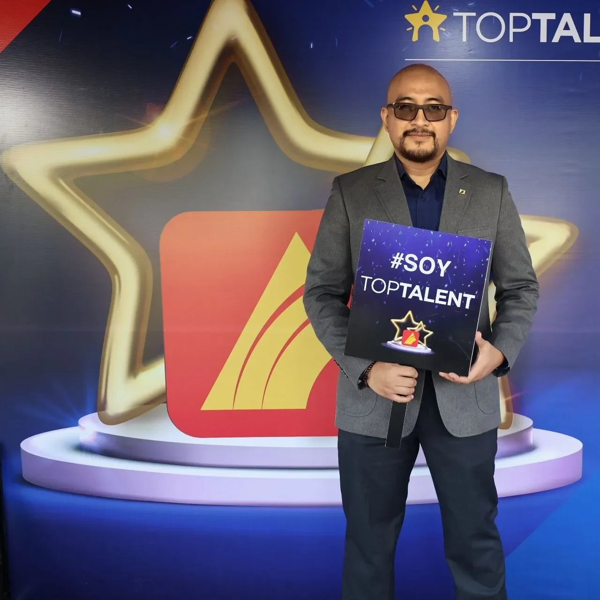
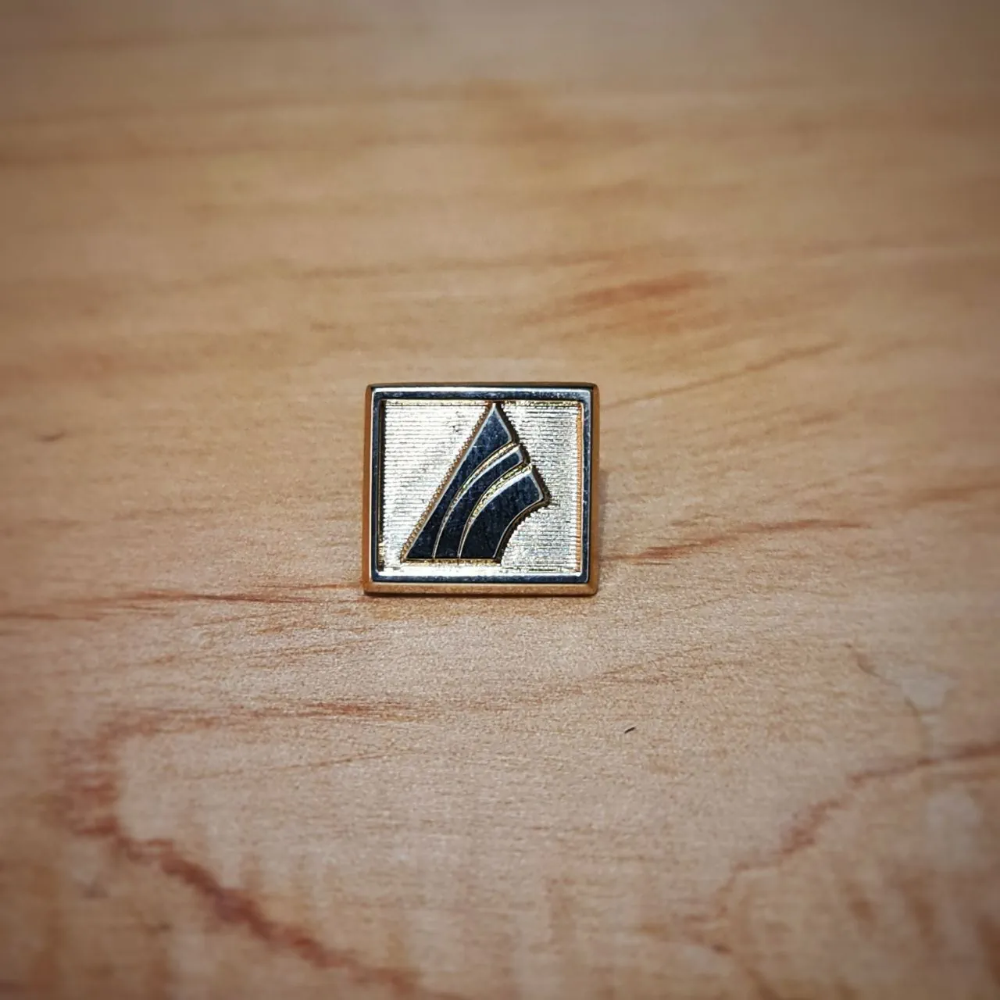
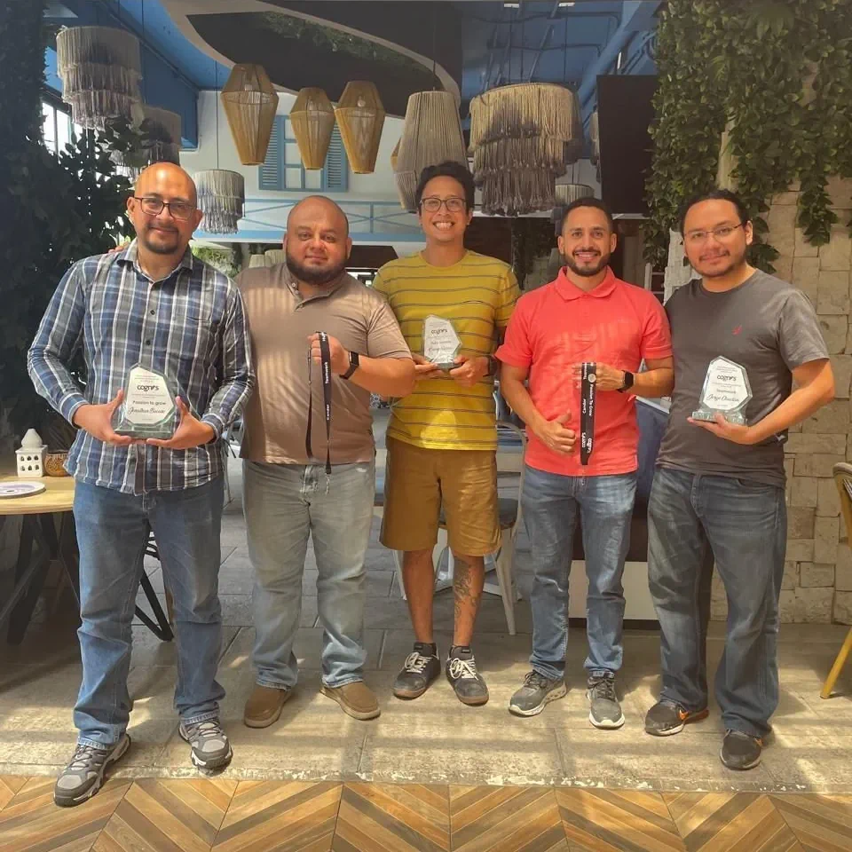
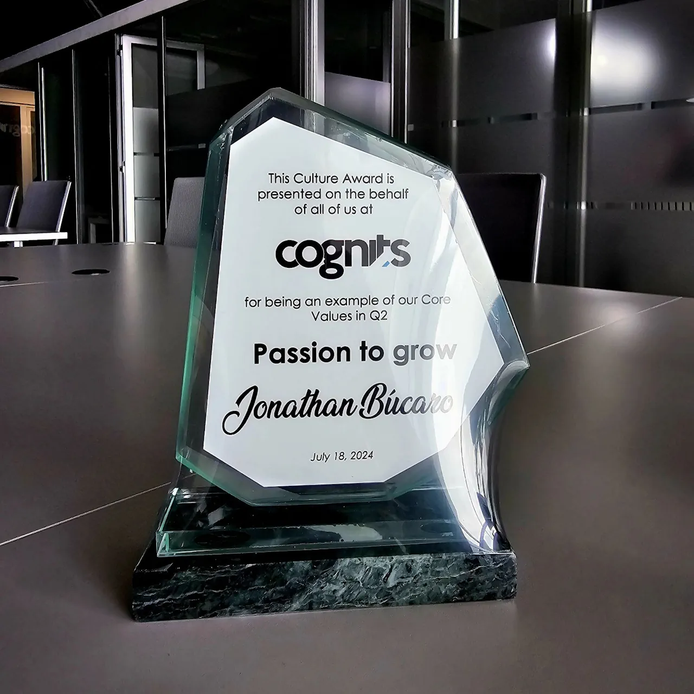
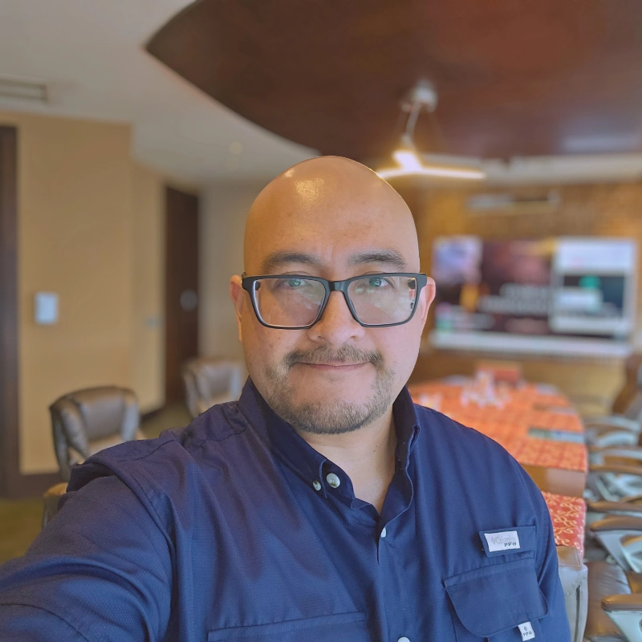

Hello! My name is Jonathan Búcaro, and I am a Systems Engineer based in Guatemala 🇬🇹. Throughout my professional career, I have been dedicated to developing technology solutions that bring value and efficiency to business operations.

For thirteen years at **Banco G&T Continental**, I worked primarily in the financial sector, participating in projects that demanded high standards of reliability, scalability, and regulatory compliance. During this time, I grew professionally from programmer to serving as a Technical Lead.

  

    
    
  

  <em>Recognitions at Banco G&T Continental, Top Talent 2022-2023</em>

In various roles, I coordinated development teams, led the modernization of critical systems, and facilitated the technological transition from legacy environments to modern platforms. I have a particular interest in optimizing processes, automating tasks, and ensuring that teams have the right knowledge and tools to achieve their goals.

In recent years, I have expanded my experience by collaborating with companies in other sectors, including multinational food corporations and the fintech industry. This has allowed me to adapt to new challenges, integrating solutions in cloud-oriented environments and applying my expertise across different industries.

I worked as a Full Stack Engineer contractor at Cognits for two years, specializing in developing services with C# and .NET, while building APIs
and microservices using Java (Spring Boot) and TypeScript. All applications were deployed on AWS. Recently, I contributed to fintech process audits and cloud-based solution implementations.

  

    
    
  

  <em>'Passion to Grow' award, Cognits 2024 Q2, with the team.</em>

This progression led to a full-time promotion at Cognits, where I now collaborate with leadership to analyze client requirements and develop strategic business proposals. This shift from hands-on development to strategic partnership has deepened my understanding of how technology drives business value.

  

    
  

  <em>2025 - Selfie after receiving the notice of becoming a full time employee.</em>

To strengthen my impact in this evolved role, I've earned certifications in agile methodologies (Scrum, Kanban) and key technologies. With Cognits' recent acquisition by HTEC, I'm well-positioned to apply this expertise across a larger, dynamic organization and continue delivering meaningful solutions.

I'm always open to connecting with fellow professionals. Let's discuss technology, projects, or industry insights on <a href="https://www.linkedin.com/comm/mynetwork/discovery-see-all?usecase=PEOPLE_FOLLOWS&followMember=jonathanbucaro" target="_blank" rel="nofollow">LinkedIn ➡️</a>.
