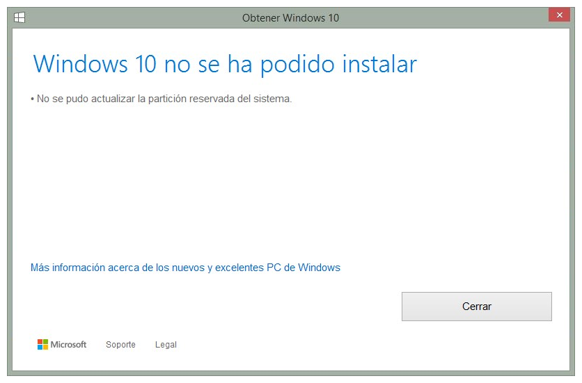
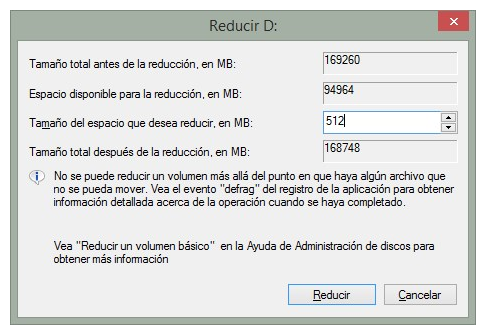
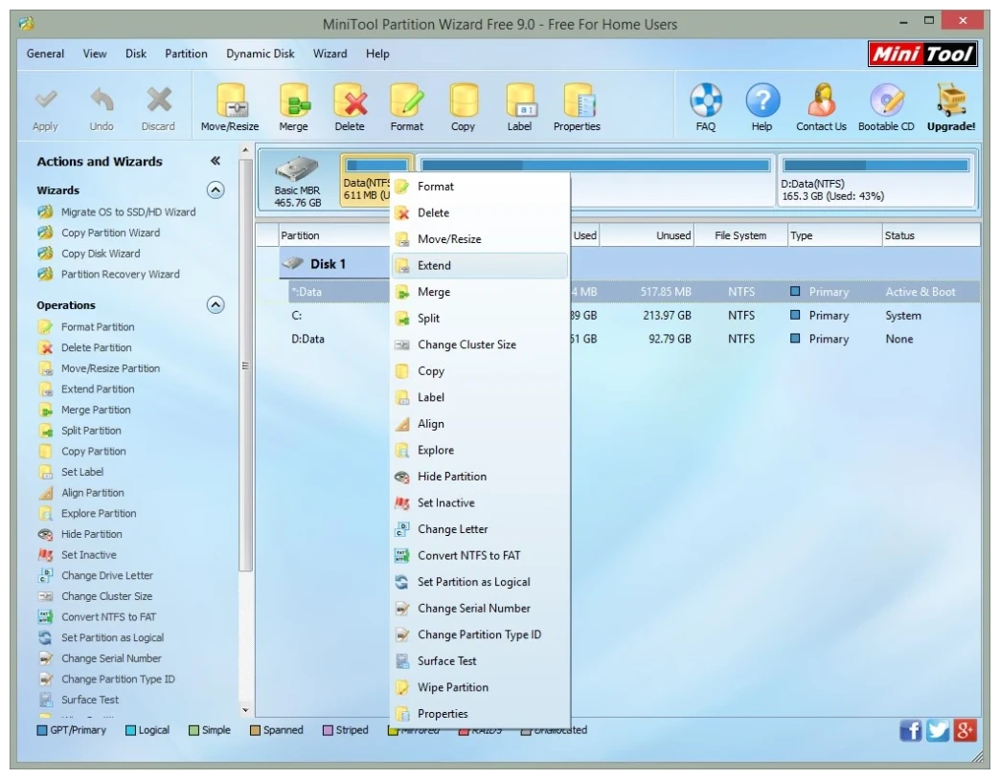
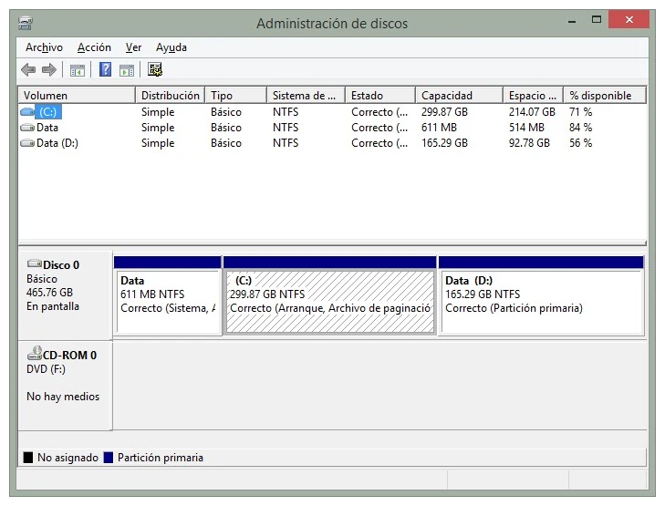

Me encontraba actualizando mi equipo de Windows 8 a Windows 10, este equipo lo he actualizado continuamente desde Windows 7. Al momento de iniciar la actualización a Windows 10 se presentó el siguiente mensaje de error.

>  Windows 10 no se ha podido instalar – No se pudo actualizar la partición reservada del sistema.




Si te ha mostrado el mensaje de error, te sugiero revisar la partición del sistema de tu equipo. Verifica que el tamaño de la misma sea mayor a 350MB, de lo contrario el error persistirá.

Puedes usar el programa de Administración de discos, ejecutando el siguiente comando:

```cmd
diskmgmt.msc
```

Si existiera espacio entre la partición de sistema y la partición C, puedes dar clic derecho a la partición de sistema y en el menú contextual, seleccionar la opción `extender volumen…`.

En mi caso no existía espacio entre la partición del sistema y la partición `C`, por lo que tuve que reducir el espacio de la partición `C` en 512 MB (más vale prevenir) y luego utilizar la herramienta <a href="http://www.partitionwizard.com/download.html" rel="nofollow, noreferrer">MiniTool Parition Wizard Free</a> para extender la partición del sistema con el espació no asignado que obtuve de reducir la particion `C`.

> ¡Advertencia, realiza el siguiente procedimiento bajo tu propio riesgo!

Ejecuta el administrador de discos y escoge una partición, haz Clic derecho y en el menú contextual escoge la opción `Reducir`. Ten cuidado al momento de reducir el tamaño de tu partición, ya que por defecto el valor que aparece es el máximo posible a reducir. En mi caso ingresé el valor de 512. Por ejemplo (utilizando la información de mi partición D):




Procede a descargar, instalar y ejecutar MiniTool Partition Wizard, en la pantalla principal se mostrarán las particiones del disco, en donde deberás seleccionar la partición del sistema, luego dar clic derecho y en el menú contextual, seleccionar la opción Extend.



En la siguiente ventana, escoge la partición con espacio sin asignar y luego seleccionar el tamaño máximo.

El programa mostrará un mensaje que hay hay procesos que actualmente están utilizando la partición C. Del listado de opciones, selecciona la opción de reiniciar el equipo. Al reiniciar, se ejecutará el programa Mini Tool Partition Wizard, el cual estará modificando el tamaño de las particiones.

Una vez finalizado el proceso, verifica el tamaño de la partición del sistema con el programa de Administración de discos.



Finalizados estos pasos, podrás renaudar la instalación de Windows 10 por medio de la actualización de tu sistema operativo.

---
Foto de <a href="https://unsplash.com/es/@jsycra?utm_source=unsplash&utm_medium=referral&utm_content=creditCopyText" target="_blank" rel="nofollow, noreferrer">Siyuan</a> en <a href="https://unsplash.com/es/fotos/R6anqQkl3hE?utm_source=unsplash&utm_medium=referral&utm_content=creditCopyText" target="_blank" rel="nofollow, noreferrer">Unsplash</a>
  