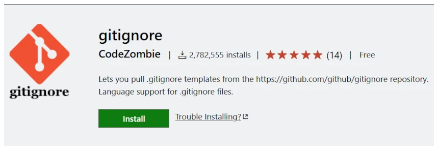
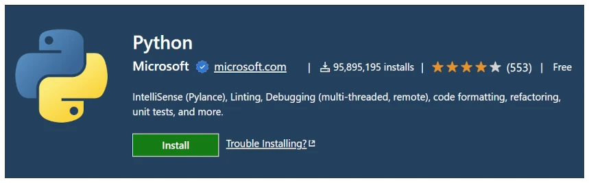

## 📌 Requisitos

+ <a href="/blog/guia-habilitar-wsl2">Poseer WSL2 instalado preferiblemente la distribución Ubuntu LTS</a>, al momento de la escritura de este artículo es la 20.04. Esta guía fue verificada contra la nueva versión LTS 22.04.
+ Visual Studio Code instalado en Windows con la extensión <a href="https://marketplace.visualstudio.com/items?itemName=ms-vscode-remote.remote-wsl" target="_blank">Remote – WSL Extension</a>.
+ Ingresa a tu distribución WSL y actualiza los repositorios e instalar las últimas actualizaciones.

```bash
sudo apt update
sudo apt upgrade -y
```

+ La distribución de Ubuntu ya tiene Python instalado, por lo que solo es necesario instalar pip.

```bash
sudo apt install -y python3-pip
```

+ Asegurate de tener instalado Git.

```bash
sudo apt install -y git
```

## 🐍 Configuración de ambiente básico

### venv

Venv es una herramienta para crear ambientes virtuales aislados de Python, estos permiten tener versiones de paquetes específicos para uno o varios proyectos en un ambiente separado.

Tomo como referencia el video de YouTube de Corey Schafer titulado **Tutorial de Python: VENV (Mac & Linux) – Cómo usar ambientes virtuales con el módulo incorporado venv**.

<p><iframe src="https://www.youtube.com/embed/Kg1Yvry_Ydk?si=ihh0sjYlC7G4oj80" loading="lazy" frameborder="0" allowfullscreen></iframe></p>

Personalmente, prefiero crear el ambiente virtual dentro de la carpeta de mi proyecto y asignarle el nombre .venv

Ventajas:
+ Ambiente aislado para cada proyecto.
+ No es necesario recordar que ambiente posee que paquete o versión.
+ Facilita la detección del intérprete en Visual Studio Code.

Desventajas:
+ Se debe de repetir el proceso en cada proyecto.

Para poder conocer cómo es que funciona el uso de venv, ingresa al directorio Home y crea una nueva carpeta llamada `hello-world`, esta será la carpeta del proyecto.

```bash
cd ~
mkdir hello-world
```

Crea un nuevo ambiente virtual, en este ejemplo se creará el ambiente llamado .venv

```bash
python3 -m venv hello-world/.venv
```

Activa el ambiente virtual recién creado utilizando el comando `source [ruta_ambiente]/bin/activate`

```bash
source hello-world/.venv/bin/activate
```

De haber realizado los pasos anteriores de manera satisfactoria, en la línea de comandos aparecerá entre paréntesis el nombre de tu ambiente virtual.

Como referencia, para desactivar el ambiente virtual utiliza el comando deactivate.

```bash
deactivate
```

Algo que debes de tomar en cuenta al crear un nuevo ambiente virtual es actualizar `pip`. Cuando el ambiente virtual se encuentra activo, puedes utilizar los comandos `python` y `pip` en lugar de `python3` y `pip3`.

```bash
python -m pip install --upgrade pip
```

Si tienes dudas, en cualquier momento puedes comprobar que se está utilizando la versión de `python` y de `pip` de tu ambiente virtual utilizando el comando `which`.

```bash
which python; which pip
```

```text
/home/hola/hello-world/.venv/bin/python
/home/hola/hello-world/.venv/bin/pip
```

### Git

La configuración de git es bastante sencilla, básicamente debes asignar un usuario y correo electrónico, los cuales serán asociados a tus cambios en el historial de versiones.

```text
git config --global user.name "nombre de usuario"
git config --global user.email "tu@correo.com"
```

Puedes verificar tu configuración con el siguiente comando

```bash
git config --list
```

#### .gitignore

El archivo `.gitignore` actúa como un archivo de configuración, el cual le indica a `Git` que excluya ciertos tipos de archivos o carpetas en el control de versiones. Uno de estos directorios debería ser el correspondiente al ambiente virtual creado con el comando `venv`.

En <a href="https://github.com/github/gitignore" target="_blank">GitHub existe un repositorio</a> de archivos `.gitignore` en donde la configuración correspondiente a <a href="https://github.com/github/gitignore/blob/master/Python.gitignore" target="_blank">Python</a> toma en consideración diversos nombres de carpetas estándar para ambientes virtuales, entre ellos la carpeta `.venv`.

Manualmente, puedes descargar el archivo con el siguiente comando.

```bash
curl https://raw.githubusercontent.com/github/gitignore/master/Python.gitignore -o .gitignore
```

En caso prefieras usar `wget` usa el siguiente comando en vez.
```bash
wget -O .gitignore https://raw.githubusercontent.com/github/gitignore/master/Python.gitignore
```

Existe una extensión de Visual Studio Code llamada <a href="https://marketplace.visualstudio.com/items?itemName=codezombiech.gitignore" target="_blank">gitignore por CodeZombie</a> para poder descargar el archivo `.gitignore` de algún lenguaje que se encuentre en el repositorio de GitHub, esto con el comando `Ctrl+Shift+P` y luego empezar a escribir `Add gitignore`.

<div class="gallery-box">
  <div class="gallery">
    
  </div>
  <em>Extensión gitignore de CodeZombie para Visual Studio Code</em>
</div>

#### Repositorio local

Procede a inicializar el repositorio de Git

```bash
git init
```

Crea un archivo `README.md` en la carpeta raíz, esta es una buena práctica en donde podremos indicar un resumen del proyecto, documentar requerimientos, colocar una guía de instalación, indicar la forma de uso o colocar referencias.

```bash
touch README.md
```

Por el momento la estructura de tu proyecto será similar a la siguiente:

```text
    ~/hello-world/
        +--.git\                       (Git)
        +--.venv\                      (Entorno virtual de Python)
        +--.gitignore
        +--README.md
```

Manualmente, crea una carpeta para el nombre del paquete, en este caso tendrá el mismo nombre que el proyecto, pero el nombre utilizará guion bajo en lugar de guion.

```bash
mkdir hello_world
```

Crea un archivo `__main__.py` el cual tendrá la lógica del paquete en caso de que este llegue a extenderse.

```bash
touch hello_world/__main__.py
```

La nueva estructura del proyecto será similar a la siguiente:

```text
    ~/hello-world/
        +--.git\                       (Git)
        +--.venv\                      (Entorno virtual de Python)
        +--hello_world\                (Paquete)
        +--hello_world\__main__.py     (Punto de entrada del paquete)
        +--.gitignore
        +--README.md
```

Crea tu primer `commit`, el cual corresponderá al inicio del proyecto. En mi caso me es de mucho agrado utilizar la convención <a href="https://gitmoji.dev/" target="_blank">Gitmoji</a>, por lo que esta será la utilizada para el mensaje del `commit` inicial.

Procede a agregar los archivos `.gitignore`, `README.md` y `__main__.py`.

```bash
git add .
```

Agrega un mensaje al confirmar el `commit`.

```bash
git commit -m ":tada:" -m "Begin a project."
```

### Visual Studio Code

Con el ambiente virtual activado, procede a ejecutar Visual Studio Code de tal forma que el editor abra el contenido de la carpeta de tu proyecto.

```bash
code .
```

Se abrirá el editor Visual Studio Code mostrando el contenido de la carpeta del proyecto.

#### Instalar extensiones

Instala el pack de extensiones <a href="https://marketplace.visualstudio.com/items?itemName=ms-python.python" target="_blank">Python</a> de `Microsoft` asegurandote de instalar dentro de WSL2. La instrucción dirá algo simiar a `Install in WSL: Ubuntu-20.04` o `Install in WSL: Ubuntu-22.04`, por ejemplo.  

<div class="gallery-box">
  <div class="gallery">
    
  </div>
  <em>Extensión Python de Microsoft para Visual Studio Code</em>
</div>

Una vez terminada la instalación, cierra Visual Studio Code y ejecuta nuevamente el comando.

```bash
code .
```

Se abrirá Visual Studio Code, al momento que abras el archivo `__main__.py` en el editor, Visual Studio Code tomará como ambiente virtual la carpeta `.venv`. Puedes verificar que entorno virtual se encuentra en uso y cambiarlo de acuerdo a tus necesidades ejecutando `Ctrl+Shift+P` y escribe `Python: Select Interpreter`. Se mostrará una lista desplegable e indicará el ambiente que actualmente se encuentra en uso, adicionalmente mostrará que el ambiente recomendado corresponde a la carpeta `.venv`.

## 🐍 Comprobación del ambiente

Abre el archivo `__main__.py` desde el Explorador de Visual Studio Code e ingresa el siguiente código.

```python
print("Hello World!")
```

Ejecuta el siguiente comando para ejecutar el código.

```bash
python -m hello_world
```

Podrás observar en consola el mensaje.

```text
Hello World!
```

## 🐍 Configura Visual Studio Code para que puedas Debugear

Al ser un editor de código y no un IDE, Visual Studio Code necesita de un archivo de configuración para habilitar la depuración.

Ejecuta `Ctrl+Shift+P` y escribe `Debug: Add Configuration`. Te mostrará una lista desplegable con distintas opciones posibles de proyectos, en esta ocasión escoge la opción `Module`.

Visual Studio Code solicitará el nombre del módulo, en este caso ingresa el texto `hello_world`. Se creará un archivo `lauch.json` dentro de una nueva carpeta `.vscode` con un contenido similar al siguiente.

```json
{
    // Use IntelliSense to learn about possible attributes.
    // Hover to view descriptions of existing attributes.
    // For more information, visit: https://go.microsoft.com/fwlink/?linkid=830387
    "version": "0.2.0",
    "configurations": [
        {
            "name": "Python: Module",
            "type": "python",
            "request": "launch",
            "module": "hello_world",
            "justMyCode": true
        }
    ]
}
```

Posicionate en la primera línea del archivo `__main__.py` y presiona la techa `F9` para agregar un punto de Debug, esto detendrá la ejecución en este punto al momento de iniciar la depuración.

Presiona `F5` para iniciar la depuración del programa.

## 🎁 Bonus: Agrega tus cambios a Git

Debido a que se introdujeron dos cambios distintos, en el proyecto, es necesario crear dos `commits`.

```bash
git add hello_world/__main__.py
```

```bash
git commit -m ":sparkles: Hello World module"
```

```bash
git add .vscode/lauch.json
```

```bash
git commit -m ":wrench: Debug config for Visual Studio Code"
```

Felicidades, has logrado configurar un ambiente de Python en WSL2 🎉.

---
Foto de <a href="https://unsplash.com/es/@davidclode?utm_source=unsplash&utm_medium=referral&utm_content=creditCopyText" target="_blank" rel="nofollow, noreferrer">David Clode</a> en <a href="https://unsplash.com/es/fotos/vb-3qEe3rg8?utm_source=unsplash&utm_medium=referral&utm_content=creditCopyText" target="_blank" rel="nofollow, noreferrer">Unsplash</a>
