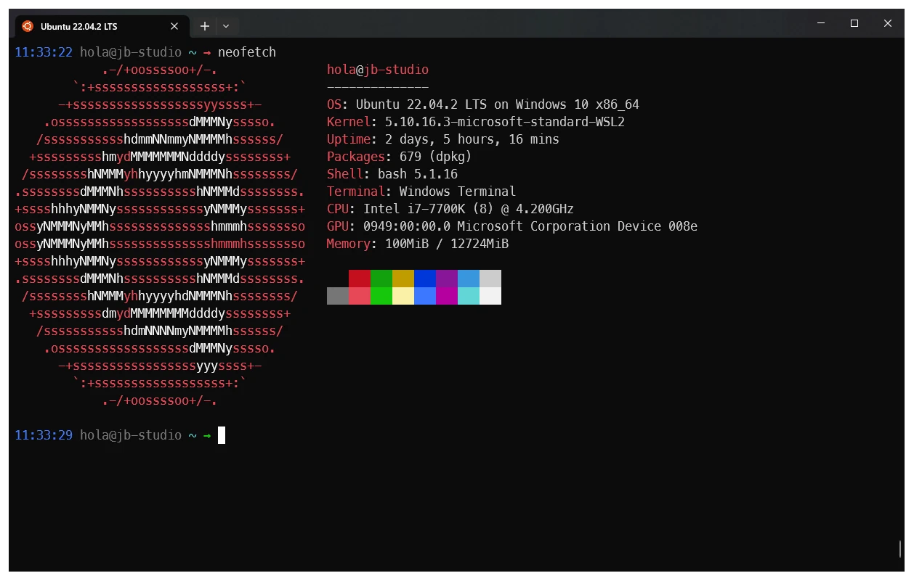
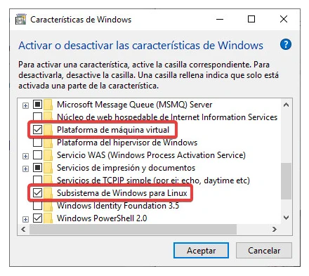
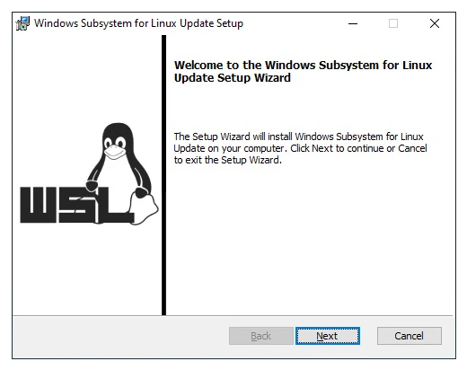
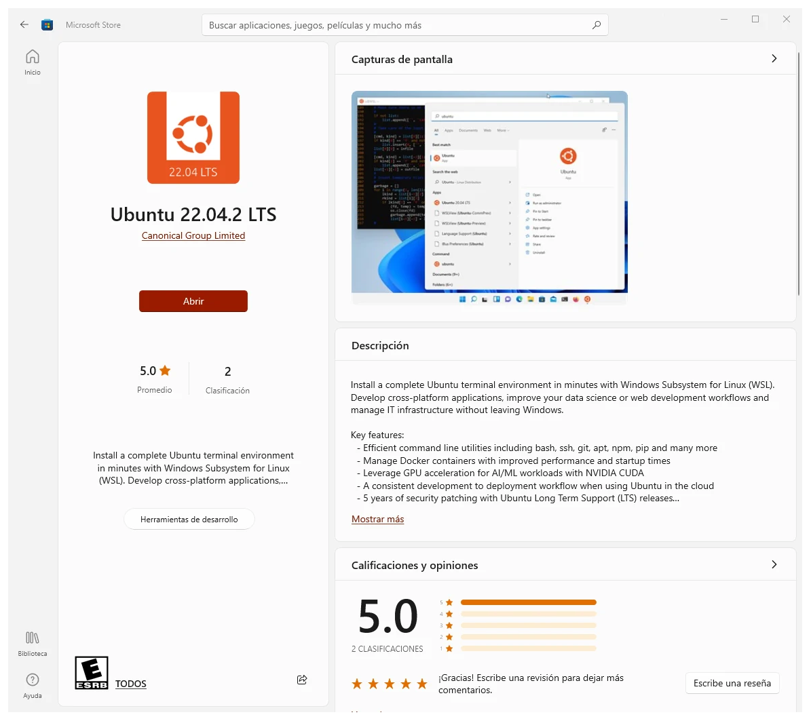
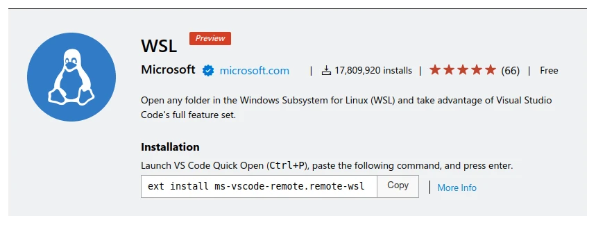

Windows Subsystem for Linux (WSL) es una característica introducida en Windows 10 que permite ejecutar aplicaciones de Linux directamente en Windows mediante el uso de una capa intermedia. WSL2 ofrece mejoras significativas en comparación con la primera versión, como por ejemplo, una mayor velocidad y compatibilidad con aplicaciones de Linux más complejas.

<div class="gallery-box">
  <div class="gallery">
    
  </div>
  <em>Ubuntu 22.04 LTS en WSL2</em>
</div>

## 📌 Requisitos

Sistema operativo actualizado, como mínimo Windows 10 con la actualización Windows May 2020 cuya versión es 2004 o superior. Puedes validar este dato escogiendo la opción `Configuración` desde el ícono de la tuerca en el menú de Inicio, luego selecciona la opción `Sistema` y posteriormente `Acerca de`. En la parte inferior se encontrará un panel con las `Especificaciones de Windows`.

Adicionalmente WSL2 requiere que el soporte a la virtualización de hardware se encuentre habilitada en el Bios. Usualmente se encuentra bajo la opción llamada `Virtualization Technology` o `VTx`.

## 🛠 Configuración e Instalación

### Instala Windows Terminal

Este paso no es extrictamente necesario, sin embargo, será de utilidad en el futuro. Puedes descargar la terminal de Windows desde la <a href="https://apps.microsoft.com/store/detail/windows-terminal/9N0DX20HK701" target="_blank" rel="nofollow, noreferrer">Tienda de Microsoft ➡</a>.

### Instala WSL

Según la guía de <a href="https://learn.microsoft.com/en-us/windows/wsl/install-manual" target="_blank">Microsoft ➡</a>, es necesario habilitar las opciones `Virtual Machine Platform` y `Windows Subsystem for Linux`. Puedes acceder a estas configuraciones desde el `Panel de control` en la sección de `Programas` y en la opción `Activar o desactivar las características de Windows`.

Marca las casillas `Plataforma de máquina virtual` y `Subsistema de Windows para Linux` y da clic en el botón Aceptar.

<div class="gallery-box">
  <div class="gallery">
    
  </div>
  <em>Panel de Control - Activar o desactivar las características de Windows</em>
</div>

Reinicia tu equipo para completar la instalación de WSL.

### Paquete de actualización del kernel de Linux

<a href="https://learn.microsoft.com/en-us/windows/wsl/install-manual#step-4---download-the-linux-kernel-update-package" target="_blank">Descarga ➡</a> la última versión del kernel de Linux de acuerdo a la arquitectura de tu procesador, x64 o ARM64.

<div class="gallery-box">
  <div class="gallery">
    
  </div>
  <em>Actualización del kernel de WSL</em>
</div>

### Configurar WSL 2 como la versión por defecto

Abre una ventana de PowerShell y ejecuta el siguiente comando para configurar WSL 2 como la versión por defecto cuando se instale una nueva distribución Linux.

```Pow erShell
wsl --set-default-version 2
```

## Instala una distribución de tu elección

Puedes instalar desde la Tienda de Microsoft una distribución de Linux. Existen diversas versiones incluyendo <a href="https://apps.microsoft.com/store/detail/debian/9MSVKQC78PK6">Debian ➡</a>, <a href="https://apps.microsoft.com/store/detail/ubuntu-22042-lts/9PN20MSR04DW">Ubuntu ➡</a>, <a href="https://apps.microsoft.com/store/detail/kali-linux/9PKR34TNCV07">Kali ➡</a> entre otras.



La primera vez que ejecutes una distribución de Linux, una ventana de consola aparecerá y te pedirá que esperes unos minutos mientras se finaliza la instalación. Posteriormente te indicará que ingreses los datos para crear un nuevo usuario y contraseña.

## Extensión WSL de Visual Studio Code

La extensión permite abrir cualquier directorio dentro de WSL y tomar ventaja de las características y funcionalidades de VS Code. Puedes instalar la extensión desde el <a href="https://marketplace.visualstudio.com/items?itemName=ms-vscode-remote.remote-wsl" target="_blank" rel="nofollow">Marketplace de Visual Studio ➡</a>.

<div class="gallery-box">
  <div class="gallery">
    
  </div>
  <em>Extensión WSL de Microsoft para VS Code</em>
</div>

Una vez instalada la extensión, reinicia Visual Studio Code.

La extensión te permitirá ejecutar Visual Studio Code y explorar el contenido del directorio en el que te encuentres actualmente en WSL al ejecutar el comando:

```shell
code .
```

---

Foto de <a href="https://unsplash.com/es/@eiskonen?utm_source=unsplash&utm_medium=referral&utm_content=creditCopyText"  target="_blank" rel="nofollow, noreferrer">Hans Eiskonen</a> en <a href="https://unsplash.com/es/fotos/PotGJdsW06k?utm_source=unsplash&utm_medium=referral&utm_content=creditCopyText" target="_blank" rel="nofollow, noreferrer">Unsplash</a>
