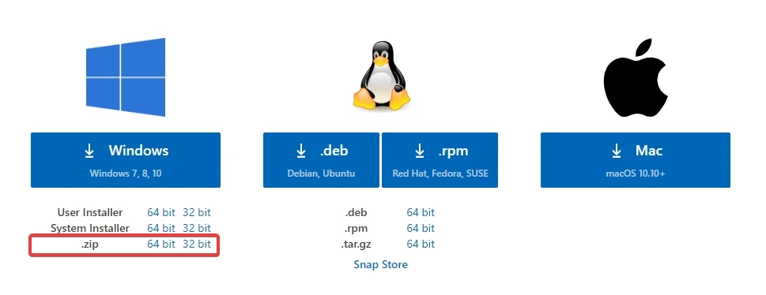

Recientemente me vi en la necesidad de instalar Visual Studio Code en un servidor Windows Server sin conexión a Internet. Tomando en cuenta que Visual Studio Code puede extender su funcionalidad por medio de la descarga de extensiones, poder descargarlas y configurarlas previamente para su uso fuera de línea.

Los pasos son los siguientes:

- Descarga la versión `.zip` Visual Studio Code.

<div class="gallery-box">
  <div class="gallery">
    
  </div>
  <em>Descarga la versión .ZIP de Visual Studio Code</em>
</div>

- Descomprime el archivo `.zip` descargado anteriormente.
- Crear una carpeta llamada `data` dentro de la carpeta de Visual Studio Code.

La estructura sería similar a la siguiente

```text
|- VSCode
|   |- Code.exe (el ejecutable de VS Code)
|   |- data (carpeta nueva)
|   |- ... (resto de archivos)
```

- Ingresar a Visual Studio Code y procede a descargar las extensiones que necesites
- De preferencia utiliza de alguna forma las extensiones, ya sea invocando algún comando de esta extensión o al abrir algún archivo que active el uso de la extensión, esto debido a que en ocasiones instalan dependencias en el primer uso de la extensión.
- Copia la carpeta de VSCode al servidor sin acceso a internet.

## 🎁 Bonus - Agregar a Menú Contextual

Para agregar Visual Studio Code Portable al menú contextual, basta con editar el siguiente código según la ruta en donde estará ubicado el ejecutable, guardarlo como un archivo .reg (registro de Windows) y ejecutar para agregar la configuración.

```registry
Windows Registry Editor Version 5.00

; Clic secundario en un archivo

[HKEY_CLASSES_ROOT\*\shell\Open with VS Code]
@="Edit with VS Code"
"Icon"="C:\\Program Files (x86)\\Microsoft VS Code\\Code.exe,0"

[HKEY_CLASSES_ROOT\*\shell\Open with VS Code\command]
@="\"C:\\Program Files (x86)\\Microsoft VS Code\\Code.exe\" \"%1\""

; Clic secundario en una carpeta, abrir como proyecto

[HKEY_CLASSES_ROOT\Directory\shell\vscode]
@="Open Folder as VS Code Project"
"Icon"="\"C:\\Program Files (x86)\\Microsoft VS Code\\Code.exe\",0"

[HKEY_CLASSES_ROOT\Directory\shell\vscode\command]
@="\"C:\\Program Files (x86)\\Microsoft VS Code\\Code.exe\" \"%1\""

; Clic secundario dentro de una carpeta, abrir como proyecto

[HKEY_CLASSES_ROOT\Directory\Background\shell\vscode]
@="Open Folder as VS Code Project"
"Icon"="\"C:\\Program Files (x86)\\Microsoft VS Code\\Code.exe\",0"

[HKEY_CLASSES_ROOT\Directory\Background\shell\vscode\command]
@="\"C:\\Program Files (x86)\\Microsoft VS Code\\Code.exe\" \"%V\""
```

---

Foto de <a href="https://unsplash.com/es/@jonasjacobsson?utm_source=unsplash&utm_medium=referral&utm_content=creditCopyText" target="_blank" rel="nofollow, noreferrer">Jonas Jacobsson</a> en <a href="https://unsplash.com/es/fotos/1iTKoFJvJ6E?utm_source=unsplash&utm_medium=referral&utm_content=creditCopyText" target="_blank" rel="nofollow, noreferrer">Unsplash</a>
