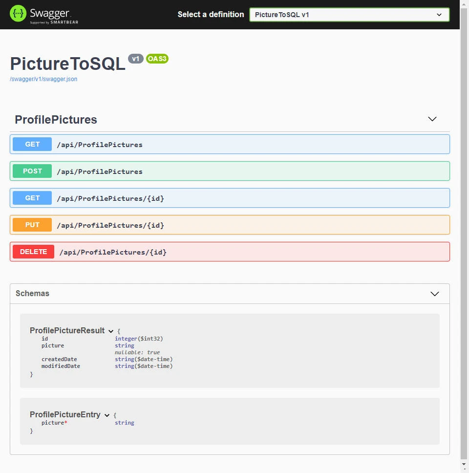

Almacenar una imagen en base de datos siempre ha sido un tema de controversia en distintos sitios y foros, sin embargo este tema es el más solicitado en mi blog.

El artículo original que publiqué hace años y uno de los temas que me han solicitado es la versión con Entity Framework con NET 5.

## 📜 Tabla de Contenido

- [🛠️ Configuración del proyecto](#configuración-del-proyecto)
- [⬇️ Paquetes NuGet](#paquetes-nuget)
- [⬇️ Instala Entity Framework Core .NET Command-line Tools](#instala-entity-framework-core-net-command-line-tools)
- [📦 Configuración de la Base de Datos](#configuración-de-la-base-de-datos)
- [🗺️ AutoMapper y el uso de DTOs](#automapper-y-el-uso-de-dtos)
- [⚙️ Controladores API](#controladores-api)
- [🔥 Comprobación](#comprobacion)
- [⛳ Ejemplo](#ejemplo)

## 🛠️ Configuración del proyecto

<a id="configuración-del-proyecto"></a>

En Visual Studio 2019 crea un nuevo proyecto ASP.NET con las siguientes características.

- .NET 5
- Tipo de autenticación Ninguno
- Configurar para HTTPS
- Habilitar compatibilidad con OpenAPI

Una vez creado el proyecto, procede a eliminar del proyecto la clase y controlador de WeatherForecast, ya que no serán utilizados.

## ⬇️ Paquetes NuGet

<a id="paquetes-nuget"></a>

Desde la consola del Administrador de Paquetes, instala las siguientes dependencias que se usarán en el proyecto:

```text
Install-Package Microsoft.EntityFrameworkCore.SqlServer -Version 5.0.8

Install-Package Microsoft.EntityFrameworkCore.Design -Version 5.0.8

Install-Package AutoMapper.Extensions.Microsoft.DependencyInjection -Version 8.1.1
```

## ⬇️ Instala Entity Framework Core .NET Command-line Tools

<a id="instala-entity-framework-core-net-command-line-tools"></a>

La instalación de esta herramienta puede realizarse con el siguiente comando:

```text
dotnet tool install --global dotnet-ef
```

Corrobora la instalación.

```text
dotnet ef
```

## 📦 Configuración de la Base de Datos

<a id="configuración-de-la-base-de-datos"></a>

### Modelos

La clase `BaseEntity` servirá como modelo base y este contará con un `Id` virtual el cual permitirá sobrescribirlo, adicionalmente para este caso colocaré las `propiedades` `CreatedDate` y `ModifiedDate`.

```csharp
public class BaseEntity
{
    public virtual int Id { get; set; }
    public DateTime CreatedDate { get; set; }
    public DateTime ModifiedDate { get; set; }
}
```

### Contexto de la Base de Datos

Crea una nueva clase que heredará de `DbContext`, en esta clase agrega una propiedad del tipo `DbSet<Modelo>`.

He colocado el código necesario para almacenar la Fecha y Hora de Creación del registro, así como el de Actualización, esto se logra al sobrescribir los métodos `SaveChanges` y `SaveChangesAsync`. Puedes encontrar más información en el siguiente <a href="https://stackoverflow.com/questions/14385477/adding-createddate-to-an-entity-using-entity-framework-5-code-first" target="_blank">enlace ➡</a>.

```csharp
public class PictureToSQLDbContext : DbContext
{
    public PictureToSQLDbContext([NotNullAttribute] DbContextOptions<PictureToSQLDbContext> options) : base(options)
    {

    }

    private void AddTimestamps()
    {
        var entries = ChangeTracker
                .Entries()
                .Where(e => e.Entity is BaseEntity && (
                        e.State == EntityState.Added
                        || e.State == EntityState.Modified));

        foreach (var entityEntry in entries)
        {
            ((BaseEntity)entityEntry.Entity).ModifiedDate = DateTime.Now;

            if (entityEntry.State == EntityState.Added)
            {
                ((BaseEntity)entityEntry.Entity).CreatedDate = DateTime.Now;
            }
        }
    }

    public override async Task<int> SaveChangesAsync(CancellationToken cancellationToken = default)
    {
        AddTimestamps();
        return await base.SaveChangesAsync(cancellationToken);
    }

    public override int SaveChanges()
    {
        AddTimestamps();
        return base.SaveChanges();
    }

    public DbSet<ProfilePicture> ProfilePictures { get; set; }

}
```

### ConnectionString

Ubica el archivo `appsettings.json`, crea una nueva sección para agregarar los datos del ConnectionString para acceder a la base de datos.

```json
{
    "ConnectionStrings": {
        "DefaultConnection": "Server=localhost; Database=PictureToSQL; Trusted_Connection=true;"
    },
    "Logging": {
        "LogLevel": {
            "Default": "Information",
            "Microsoft": "Warning",
            "Microsoft.Hosting.Lifetime": "Information"
        }
    },
    "AllowedHosts": "*"
}
```

### Agrega DbContext a la configuración de Servicios

En el archivo `Startup.cs` se debe agregar en el método `ConfigureServices` el uso del `DbContext`, usualmente lo agrego como primera instrucción, adicionalmente se le indica que cadena de conexión usar.

```csharp
public void ConfigureServices(IServiceCollection services)
{
    services.AddDbContext<PictureToSQLDbContext>(options => options.UseSqlServer(Configuration.GetConnectionString("DefaultConnection")));
    // otros servicios configurados
}
```

### Migración Inicial

Para realizar la primera migración, se hará uso de la herramienta de línea de comandos para Entity Framework instalada anteriormente.

```text
dotnet ef migrations add InitialCreate --project .\PictureToSQL\
```

El comando anterior creará una carpeta llamada `Migrations` en el proyecto de Visual Studio. Contendrá las configuraciones necesarias para la creación de la base de datos y tablas que se han especificado en el `DbContext`.

Para crear la base de datos utiliza la siguiente instrucción, esta hará uso de las configuraciones en tu archivo `appsettings.json`.

```text
dotnet ef database update --project .\PictureToSQL\
```

## 🗺️ AutoMapper y el uso de DTOs

<a id="automapper-y-el-uso-de-dtos"></a>

Un DTO es un Objeto de Transferencia de Datos y es utilizado para encapsular datos y enviarlos de un sistema a otro.

En este ejemplo se hará uso de DTOs con el propósito de no exponer las clases utilizadas como Modelos de la base de datos directamente a la API. Adicionalmente se realizará una conversión automática de un tipo de datos a otro para el manejo de la imagen 😉.

### DTOs para ProfilePicture

Se hará uso de anotaciones para indicar que algunos campos serán requeridos. Agrega la siguiente referencia.

```csharp
using System.ComponentModel.DataAnnotations;
```

En la entidad y en la base de datos se almacenará la imagen como un arreglo de bytes, mientras que en el Web Service se utilizará un campo string para enviar o recibir la imagen codificada como Base64.

### ProfilePictureEntry

```csharp
public class ProfilePictureEntry
{
    [Required]
    public string Picture { get; set; }
}
```

### ProfilePictureResult

```csharp
public class ProfilePictureResult
{
    public int Id { get; set; }
    public string Picture { get; set; }
    public DateTime CreatedDate { get; set; }
    public DateTime ModifiedDate { get; set; }
}
```

### Conversión de Tipos (ITypeConverter)

Para la conversión entre Base64 y un arreglo de bytes, implementa la interfaz `ITypeConverter` y la función `Convert`. El parámetro `source` se utilizará para realizar la conversión respectiva y se retornará el resultado de la conversión como resultado de la función.

```csharp
using AutoMapper;
using System.IO;
```

```csharp
public class Base64TypeConverter : ITypeConverter<byte[], string>
{
    public string Convert(byte[] source, string destination, ResolutionContext context)
    {
        using (MemoryStream m = new MemoryStream())
        {
            // Convert byte[] to Base64 String
            string base64String = System.Convert.ToBase64String(source);
            return base64String;
        }
    }
}
```

```csharp
public class ByteArrayTypeConverter : ITypeConverter<string, byte[]>
{
    public byte[] Convert(string source, byte[] destination, ResolutionContext context)
    {
        byte[] imageBytes = System.Convert.FromBase64String(source);
        return imageBytes;
    }
}
```

### Perfil de Mapeo

Hereda de la clase `AutoMapper.Profile` y en el constructor indicarle a `AutoMapper` que utilice las clases `TypeConverter` para la conversión y los mapeos posibles entre los DTOS y las entidades.

```csharp
public class MappingProfile : Profile
{
    public MappingProfile()
    {
        CreateMap<string, byte[]>().ConvertUsing(new ByteArrayTypeConverter());
        CreateMap<byte[], string>().ConvertUsing(new Base64TypeConverter());

        CreateMap<Dtos.ProfilePictureEntry, Models.ProfilePicture>();
        CreateMap<Models.ProfilePicture, Dtos.ProfilePictureResult>();
    }
}
```

### Registro de AutoMaper

En el archivo `Startup.cs` se debe agregar en el método `la` adición del Servicio AutoMaper. El servicio escanea las clases de AutoMapper y registra la configuración, mapeo y extensiones en la colección de servicios.

```csharp
public void ConfigureServices(IServiceCollection services)
{
    services.AddDbContext<PictureToSQLDbContext>(options => options.UseSqlServer(Configuration.GetConnectionString("DefaultConnection")));

    // otros servicios configurados

    services.AddAutoMapper(typeof(Startup));
}
```

## ⚙️ Controladores API

<a id="controladores-api"></a>

### ProfilePicture

Crea un nuevo controlador API con acciones de lectura y escritura, el nombre que estaré utilizando es `ProfilePicturesController.cs`. Este paso creará una nueva clase llamada `ProfilePicturesController` con métodos `base` que utilizarás como plantilla.

```csharp
[Route("api/[controller]")]
[ApiController]
public class ProfilePicturesController : ControllerBase
{
    // GET: api/<ProfilePicturesController>
    [HttpGet]
    public IEnumerable<string> Get()
    {
        return new string[] { "value1", "value2" };
    }

    // GET api/<ProfilePicturesController>/5
    [HttpGet("{id}")]
    public string Get(int id)
    {
        return "value";
    }

    // POST api/<ProfilePicturesController>
    [HttpPost]
    public void Post([FromBody] string value)
    {
    }

    // PUT api/<ProfilePicturesController>/5
    [HttpPut("{id}")]
    public void Put(int id, [FromBody] string value)
    {
    }

    // DELETE api/<ProfilePicturesController>/5
    [HttpDelete("{id}")]
    public void Delete(int id)
    {
    }
}
```

Para crear el constructor puedes utilizar el snippet `ctor`, en donde posteriormente debes agregar dos parámetros para la inyección de dependencias. El primer parámetro corresponde a uso de Automapper y el segundo para el contexto de la base de datos.

```csharp
[Route("api/[controller]")]
[ApiController]
public class ProfilePicturesController : ControllerBase
{
    private readonly IMapper mapper;
    private readonly PictureToSQLDbContext dbContext;

    public ProfilePicturesController(IMapper mapper, PictureToSQLDbContext dbContext)
    {
        this.mapper = mapper;
        this.dbContext = dbContext;
    }

    // Código adicional de la clase
}
```

Agrega el siguiente código para satisfacer las dependencias.

```csharp
using AutoMapper;
using Microsoft.AspNetCore.Mvc;
```

### GET

En el método `GET` podrás apreciar que la conversión con Automapper se realiza de forma transparente, en donde convertimos cada item de la lista que obtuvimos de la base de datos al tipo `ProfilePictureResult` que estamos utilizando como un DTO.

```csharp
// GET: api/<ProfilePicturesController>
[HttpGet]
public async Task<ActionResult<IEnumerable<Dtos.ProfilePictureResult>>> Get()
{
    var results = await dbContext.ProfilePictures.Select(c => mapper.Map<Dtos.ProfilePictureResult>(c)).ToListAsync();

    return Ok(results);
}

// GET api/<ProfilePicturesController>/5
[HttpGet("{id}")]
public async Task<ActionResult<Dtos.ProfilePictureResult>> Get(int id)
{
    var profilePicture = await dbContext.ProfilePictures.FirstOrDefaultAsync(c => c.Id == id);

    if (profilePicture is null)
        return NotFound(id);

    var result = mapper.Map<Dtos.ProfilePictureResult>(profilePicture);

    return Ok(result);
}
```

### POST

El método `POST` debe procesar dos conversiones, esto es debido a que se recibe la imagen como una cadena base64 la cual debe ser convertida a un arreglo de bytes. Posteriormente para la respuesta, se retorna un DTO con data adicional y la imagen nuevamente en cadena base64. Normalmente el método `POST` debería devolver un código `201` para notificar la creación del recurso.

```csharp
// POST api/<ProfilePi cturesController>
[HttpPost]
public async Task<ActionResult<Dtos.ProfilePictureResult>> Post(Dtos.ProfilePictureEntry profilePictureEntry)
{
    var profilePicture = mapper.Map<Models.ProfilePicture>(profilePictureEntry);

    dbContext.ProfilePictures.Add(profilePicture);

    await dbContext.SaveChangesAsync();

    return CreatedAtAction(nameof(Get), new { id = profilePicture.Id }, mapper.Map<Dtos.ProfilePictureResult>(profilePicture));
}
```

### PUT

En el método `PUT` se estarán reemplazando todos los campos, por lo que el mapeo se realizará sobre el objeto que obtuvimos de la consulta a la base de datos.

```csharp
// PUT api/<ProfilePicturesController>/5
[HttpPut("{id}")]
public async Task<ActionResult<Dtos.ProfilePictureEntry>> Put(Dtos.ProfilePictureEntry profilePictureEntry)
{
    var profilePicture = await dbContext.ProfilePictures.FirstOrDefaultAsync(c => c.Id == id);

    if (profilePicture is null)
        return NotFound(profilePicture);

    mapper.Map<Dtos.ProfilePictureEntry, Models.ProfilePicture>(profilePictureEntry, profilePicture);

    await dbContext.SaveChangesAsync();

    var result = mapper.Map<Dtos.ProfilePictureResult>(profilePicture);

    return Ok(result);
}
```

### DELETE

El método `Delete` no tendrá conversión, ya que se utilizará el Id directamente y de ser exitosa la búsqueda, se procederá a eliminar el registro. La respuesta no devolverá contenido.

```chsarp
// DELETE api/<ProfilePicturesController>/5
[HttpDelete("{id}")]
public async Task<ActionResult> Delete(int id)
{
    var profilePicture = await dbContext.ProfilePictures.FirstOrDefaultAsync(c => c.Id == id);

    if (profilePicture is null)
        return NotFound(id);

    dbContext.Remove(profilePicture);

    await dbContext.SaveChangesAsync();

    return NoContent();
}
```

Al compilar el proyecto y ejecutarlo en modo debug se mostrará la siguiente página de Swagger en donde podráas probar el API.

<div class="gallery-box">
  <div class="gallery">
    
  </div>
  <em>Swagger - PictureToSQL</a></em>
</div>

## 🔥 Comprobación

<a id="comprobacion"></a>

### Consideraciones

- Toma en cuenta el <a href="https://stackoverflow.com/questions/4715415/base64-what-is-the-worst-possible-increase-in-space-usage" target="_blank">crecimiento de tamaño ➡</a> de la data de la imagen al usar la codificación Base64, por lo que es un tema a considerar al consumir el API.
- El proyecto es un ejemplo, por lo que no hay paginación ni un manejo de errores de conversión más allá de lo básico.

### Sitios Auxiliares

Utilizaré los siguientes sitios para realizar la comprobación de la conversión de la imagen en Base64.

- <a href="https://onlineimagetools.com/convert-image-to-base64" target="_blank" rel="nofollow, noreferrer">Online Image Tools – Image to Base64 Converter ➡</a>
- <a href="https://onlineimagetools.com/convert-base64-to-image" target="_blank" rel="nofollow, noreferrer">Online Image Tools – Base64 to Image Converter ➡</a>

El uso de ambos enlaces es bastante directo y sencillo. Cargas una imagen y te retorna la cadena Base64, copias una cadena Base64 y te mostrará la imagen.

### Comprobación POST

- Carga una imagen en el sitio Image to Base64 Converter y obtén la cadena codificada.
- En Swagger expande la opción `POST /api/ProfilePictures` y da Clic al botón `Try it Out`. En la sección `Request body` reemplaza el valor string con la cadena Base64 obtenida.
- Presiona el botón `Execute` y valida el mensaje de respuesta. Podrás comprobar que se ha generado un Id y se han devuelto los datos de la fecha de creación y fecha de modificación.
- Presiona nuevamente el botón Execute para crear un registro adicional.

### Comprobación GET

- En Swagger expande la opción `GET /api/ProfilePictures` y da Clic al botón `Try it out`. Presiona el botón `Execute` y valida el mensaje de respuesta.
- Podrás observar que la respuesta retornó dos resultados, toma el valor del campo picture de cualquiera de los primeros resultados y pegalo en el sitio Base64 to Image Converter. Obtendrás la imagen que usaste en la prueba del método `POST`.

Adicionalmente puedes utilizar el método `GET /api/ProfilePictures/{id}` colocando como parámetro alguno de los dos Id creados en las pruebas del método `POST`.

### Comprobación PUT

- Carga una nueva imagen en el sitio Image to Base64 Converter y obtén la cadena codificada.
- En Swagger expande la opción `PUT /api/ProfilePictures/{id}` y da Clic al botón `Try it Out`. En la sección `Parameters` coloca el id de la imagen que desees modificar, en este ejemplo colocaré el valor 2. En la sección `Request body` reemplaza el valor string con la cadena Base64 obtenida.
- Presiona el botón `Execute` y valida el mensaje de respuesta. Podrás comprobar que se ha modificado la cadena de caracteres correspondiente a la nueva imágen y se han devuelto los datos de la fecha de creación y un cambio en el valor de fecha de modificación.

### Comprobación DELETE

- En Swagger expande la opción `DELETE /api/ProfilePictures/{id}` y da Clic al botón `Try it Out`. En la sección `Parameters` coloca el id de la imagen que desees eliminar, en este ejemplo colocaré el valor 2.
- Presiona el botón `Execute` y valida el mensaje de respuesta.

## ⛳ Ejemplo

<a id="ejemplo"></a>

He preparado un pequeño ejemplo que puedes acceder en GitHub con el código necesario para que puedas probar todo lo mencionado en el artículo.

<a href="https://github.com/jebucaro/api-rest-imagen-base-de-datos-ef.git" target="_blank">Descargar Ejemplo ➡</a>

---

Foto de <a href="https://unsplash.com/es/@neom?utm_source=unsplash&utm_medium=referral&utm_content=creditCopyText" target="_blank" rel="nofollow, noreferrer">NEOM</a> en <a href="https://unsplash.com/es/fotos/yx7TJle8LhM?utm_source=unsplash&utm_medium=referral&utm_content=creditCopyText" target="_blank" rel="nofollow, noreferrer">Unsplash</a>
