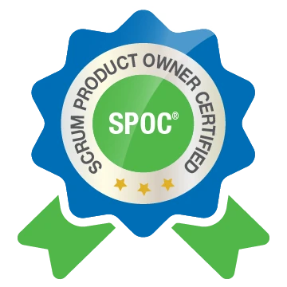

Me llena de felicidad empezar el año 2021 con la acreditación Scrum Product Owner Certified avalada por Scrumstudy. ¿Todavía es enero verdad 😉?

  

    
  

  <em><a href="https://www.scrumstudy.com/certification/verify?type=SPOC&number=775364" target="_blank">SPOC - SCRUMstudy ➡</a></em>

## 🤔 ¿Por qué Product Owner?
Antes de iniciar formalmente mi carrera en la tecnología, trabajé como receptor pagador por dos años aproximadamente. Conocer el negocio fue un factor significativo que me permitió ser seleccionado para desarrollar proyectos prioritarios o de gran visibilidad para el grupo financiero.

Actualmente desempeño el puesto de Ingeniero de Desarrollo Senior y puedo observar que cada día codifico menos, incluso al capacitar al nuevo personal me enfoco en que comprendan los procesos del negocio.

## Beneficios

1. **Expansión de oportunidades profesionales**: Aumenta las oportunidades laborales y el potencial de un salario más alto debido a la credencial adicional.

2. **Mejora de habilidades y conocimientos**: Proporciona un amplio conocimiento sobre las metodologías Scrum, mejorando las habilidades de gestión de proyectos.

3. **Mejor gestión del producto**: Te dota de las habilidades necesarias para maximizar el valor del producto y alinear los esfuerzos del equipo con los objetivos empresariales.

4. **Mejora de la colaboración en equipo**: Impulsa la productividad al asegurar que todos comprendan los objetivos del proyecto y su papel en su consecución.

5. **Aumento de la tasa de éxito del proyecto**: Ayuda a reducir la complejidad del proyecto y a aumentar la tasa de éxito.

6. **Desarrollo profesional**: Muestra tu compromiso con el desarrollo profesional, lo que te hace más atractivo para los empleadores.

7. **Oportunidades de networking**: Proporciona oportunidades para establecer contactos con otros profesionales del campo durante seminarios y clases de formación.

## Posibles inconvenientes

1. **Desenfoque de las habilidades técnicas**: El desempeño del rol de propietario del producto puede alejar al desarrollador senior de su enfoque principal, que es el desarrollo de software.

2. **Conflictos de roles**: Puede haber conflictos de roles si el desarrollador senior también está actuando como propietario del producto, ya que estos roles tienen responsabilidades diferentes.

---
Foto de <a href="https://unsplash.com/@sunday_digital?utm_source=unsplash&utm_medium=referral&utm_content=creditCopyText" target="_blank" rel="nofollow, noreferrer">Nastuh Abootalebi</a> en <a href="https://unsplash.com/es/fotos/eHD8Y1Znfpk?utm_source=unsplash&utm_medium=referral&utm_content=creditCopyText" target="_blank" rel="nofollow, noreferrer">Unsplash</a>
  