Alguna vez te ha pasado que alguien te pide un estatus de tus avances y te quedas buscando en tu memoria qué fue lo último que hiciste?. ¡No estás solo! Llevar un registro de trabajo, más conocido como `work journal` o `work log`, puede sonar como un trámite adicional, pero en realidad es una de las herramientas más útiles para ser más productivo y organizado en tu día a día laboral.

A mí me ha servido llevar una bitácora de trabajo en al menos tres momentos clave de mi carrera.

1. Durante una reestructuración en la empresa, cuando me pidieron un informe detallado sobre los logros alcanzados, los obstáculos enfrentados y las acciones que tomé para superarlos.
2. Al solicitar un aumento de salario; gracias al registro, tenía toda la información lista para respaldar mi caso de manera clara y convincente.
3. Trabajando por contrato, en un proyecto con modalidad _time and materials_. El cliente pidió un desglose detallado de las actividades registradas diariamente en el _timesheet_, y la bitácora me ayudó a entregar un informe rápido y preciso.

> "El secreto del éxito es estar listo cuando llegue tu oportunidad."  
> – Benjamin Disraeli

Tener respuestas claras y evidencia concreta de tus logros no solo mejora tu preparación, sino que también proyecta confianza y profesionalismo en cualquier entorno laboral.

## 🤔 ¿Qué es una bitácora de trabajo?

Una bitácora de trabajo es un registro estructurado de actividades. Puedes incluir detalles como los siguientes:

- ¿Qué tareas he completado?
- ¿Qué tareas necesitas abordar a continuación?
- ¿Cuáles han sido tus mayores distractores o tus mayores pérdidas de tiempo?
- Notas importantes, aprendizajes o dificultades a lo largo del día

Aunque puede parecer similar a las preguntas de una _stand up meeting_, tiene un propósito más personal y objetivo: ayudarte a llevar un seguimiento preciso de tus progresos, identificar patrones en tus hábitos y planificar con más eficacia.

## 😒 ¿Por qué molestarse?

A pesar de que mantener esta práctica puede parecer tedioso al principio, la realidad es que te ahorrará tiempo, reducirá tus niveles de estrés y, quizás, te saque de apuros en más de una ocasión. Aquí hay algunas razones clave para abrazar esta costumbre:

### 💪 Mantiene un rastro claro de tus logros

¡No subestimes todo lo que haces! Documentar tus avances evita que olvides tus logros o las veces que superaste obstáculos importantes. Durante evaluaciones de desempeño o reuniones con jefes, tu registro puede hablar por vos, facilitándote justificar tu trabajo con hechos concretos.

### ⏳ Te ayuda a entender en qué inviertes tu tiempo

¿Cuántas veces has llegado al final del día sin saber en qué volaron esas ocho horas? Una bitácora te permite identificar exactamente en qué invertiste tu tiempo, incluidas interrupciones o tareas inesperadas. Incluso puedes visualizar cuándo eres más productivo: ¿Mañanas creativas? ¿Mejor enfoque después de un almuerzo saludable? Esto puede ayudarte a ajustar tu horario, eliminando esas actividades que no aportan.

### 🔎 Reduce ambigüedades y mejora tu enfoque

A veces, aunque sepás lo que tenés que hacer, ese “por dónde empiezo” genera estrés. Mantener un registro al inicio y al cierre del día te da claridad. Incluso podés usarlo para definir objetivos claros y reducir la incertidumbre de cómo abordar tareas grandes o complejas. Organizar tus pensamientos antes de iniciar evita distracciones o solucionarlo “improvisando” en el camino.

### ✅ Cierra los ciclos al final del día

Nada es más satisfactorio que ver una lista de tareas tachadas. Al cerrar el día, tu bitácora no solo te permite reconocer lo que cumpliste (¡te lo mereces!), sino que también muestra qué quedó pendiente. Esto elimina la incertidumbre, ya que puedes reprogramar esos pendientes para mañana sin estrés.

## 💡 Beneficios más allá del trabajo

Aunque sea una herramienta principalmente laboral, llevar un registro puede ayudarte también en otros aspectos de tu vida. Te da perspectiva, fomenta la auto-mejora e incluso puede servirte como recordatorio de aprendizajes pasados para ahorrarte tiempo en el futuro.

> "Nunca memorices algo que puedes buscar".
>
> <a href="https://www.goodreads.com/quotes/24194-never-memorize-something-that-you-can-look-up" target="_blank" rel="nofollow">- Albert Einstein</a>

Ese consejo aplica aquí: confiar en tus propias notas libera espacio mental y mejora tu flujo de trabajo.

## 🛠️ ¿Cómo empezar?

No tienes que complicarte. Elegí una herramienta básica que te funcione: desde una libreta física hasta aplicaciones digitales como `Notion` u `Obsidian`. Lo importante es que sea **rápido** de actualizar y fácil de consultar. Lo ideal es registrar:

1. **Inicio del día:** Tus metas y pendientes clave.
2. **Durante el día:** Avances, desafíos y cambios no planeados (las famosas tareas de último minuto).
3. **Fin del día:** Un breve resumen de lo que lograste y qué quedó pendiente para mañana.

## ✍️ Ejemplo de Plantilla en `Obsidian` para tu Bitácora de Trabajo

`Obsidian`, tomando la descripción de su sitio oficial, es la aplicación de escritura privada y flexible que se adapta a tu forma de pensar. Es una excelente aplicación, la uso a diario, y como **Contractor**, puedo hacer uso de la licencia `De Minimis Commercial Use License`. En caso trabajes en planilla, necesitas conseguir una licencia comercial si pretendes usar `Obsidian` para actividades laborales. Puedes evaluar el uso de `Obsidian` para fines comerciales durante quince días.

Esta plantilla se basa en el trabajo de **Dann Berg** en su publicación <a href="https://dannb.org/blog/2022/obsidian-daily-note-template/" target="_blank">My Obsidian Daily Note Template</a>. Compartiré una adecuación de la plantilla en base a mis necesidades orientando el uso hacia una bitácora de trabajo.

### ⚙️ Configuración de la Plantilla

Es necesario tener instalado `Obsidian` y una bóveda que usarás para tu bitácora de trabajo.

<div class="gallery-box">
  <div class="gallery">
    
    
  </div>
  <em>Obsidian - Crea una bóveda</em>
</div>

#### Plugins

- <a href="https://help.obsidian.md/Plugins/Daily+notes" target="_blank" rel="nofollow">Daily Notes</a>, plugin incluido en `Obsidian`, no es necesario instalar.
- <a href="https://github.com/SilentVoid13/Templater" target="_blank" rel="nofollow">Templater</a>, plugin de la comunidad. Debe ser instalado desde <a href="https://help.obsidian.md/Extending+Obsidian/Community+plugins" target="_blank" rel="nofollow">Obsidian</a>.
- <a href="https://github.com/liamcain/obsidian-calendar-plugin" target="_blank" rel="nofollow">Calendar</a>, plugin de la comunidad. Debe ser instalado desde <a href="https://help.obsidian.md/Extending+Obsidian/Community+plugins" target="_blank" rel="nofollow">Obsidian</a>.
- <a href="https://github.com/blacksmithgu/obsidian-dataview" target="_blank" rel="nofollow">Dataview</a>, plugin de la comunidad. Debe ser instalado desde <a href="https://help.obsidian.md/Extending+Obsidian/Community+plugins" target="_blank" rel="nofollow">Obsidian</a>.

##### Habilita los Plugins de la comunidad

<div class="gallery-box">
  <div class="gallery">
    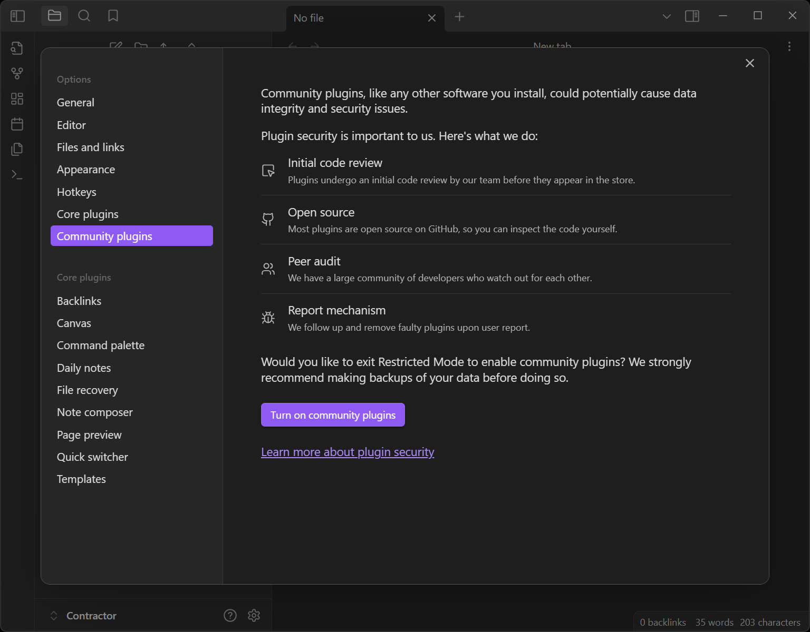
    
  </div>
  <em>Obsidian - Habilita los plugins de la comunidad</em>
</div>

Haz clic en el botón `Browse` y en la ventana desplegable, busca el nombre del plugin. En este caso, `Templater`.

<div class="gallery-box">
  <div class="gallery">
    
  </div>
  <em>Obsidian - Buscar Plugins</em>
</div>

##### Plugin Templater

<div class="gallery-box">
  <div class="gallery">
    
    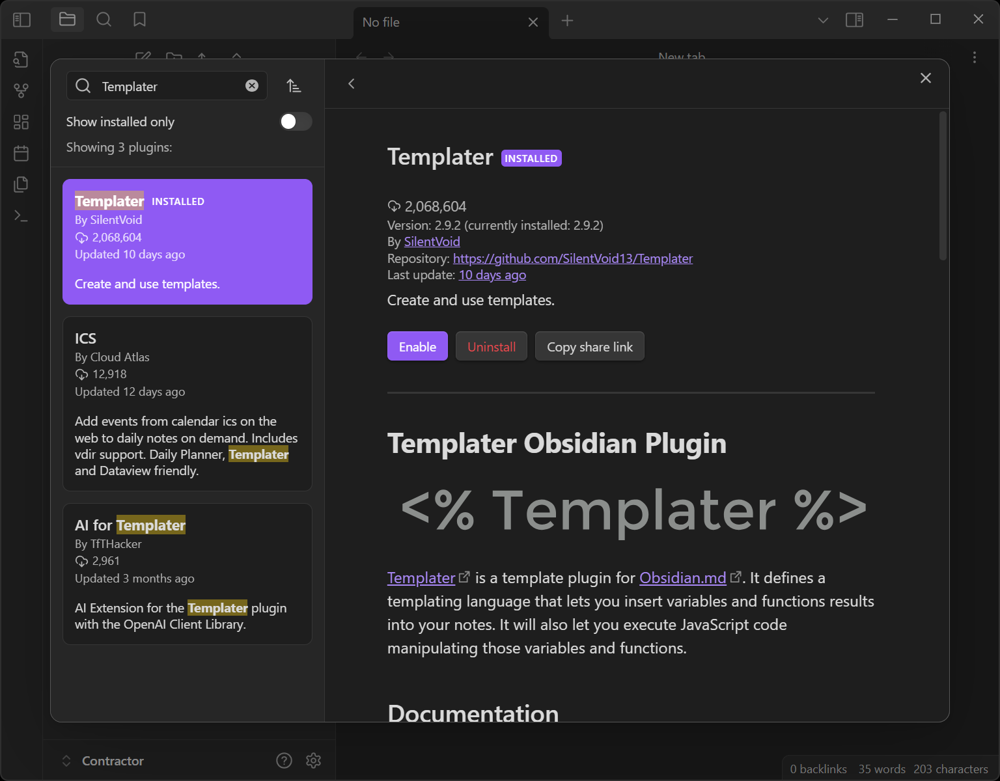
    
  </div>
  <em>Obsidian - Instala y habilita el Plugin Templater</em>
</div>

##### Plugin Calendar

<div class="gallery-box">
  <div class="gallery">
    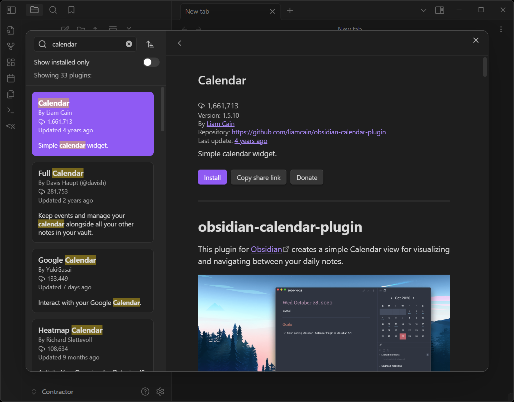
    
    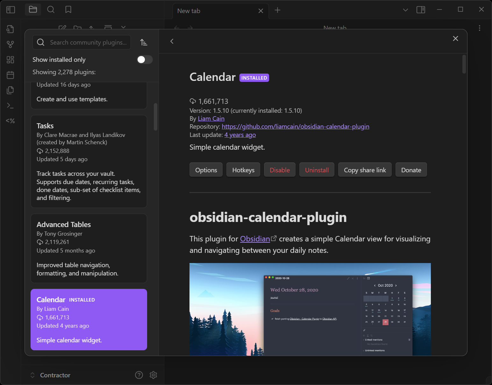
  </div>
  <em>Obsidian - Instala y habilita el Plugin Calendar</em>
</div>

##### Plugin Dataview

<div class="gallery-box">
  <div class="gallery">
    
    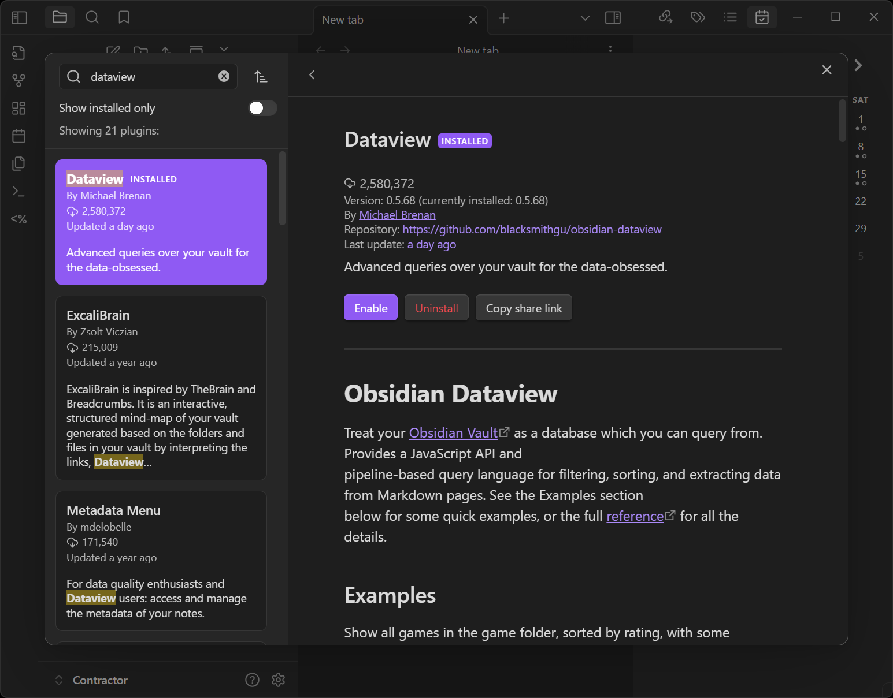
    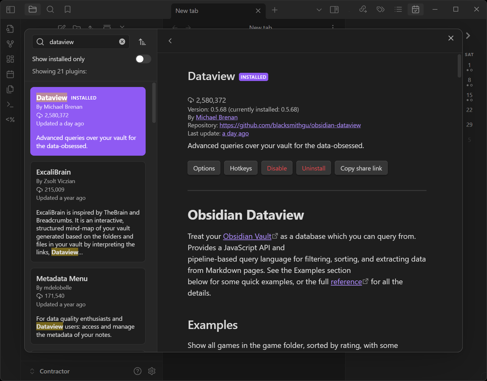
  </div>
  <em>Obsidian - Instala y habilita el Plugin Dataview</em>
</div>

Por el momento no realizaremos modificaciones en las configuraciones de los plugins.

#### Configuración de la Plantilla

Crea un nuevo directorio llamado `Templates` y dentro de este un directorio llamado `Daily Templates`. Dentro de `Daily Templates` crea una nueva nota llamada `Daily Notes Template` y copia y pega el siguiente código dentro de la nota en modo `source`. Te recomiendo que utilices `Ctrl+Shift+v` para pegar el contenido sin formato.

````
---
created: <%tp.file.creation_date()%>
tags:
- Daily
- Daily/<%tp.file.creation_date("YYYY")%>/<%tp.file.creation_date("MM-MMMM")%>
---
## 🗓️ Daily Questions

### 📌 Tasks

- [ ] <% tp.file.cursor() %>

### 🎥 Meetings

-

### 🚧 Impediments

-

---
## 📝 Notes


---
### 📖 Daily Notes Overview

#### ✍️ Notes created today

```dataview
List FROM "" WHERE file.cday = date("<%tp.date.now("YYYY-MM-DD")%>") SORT file.ctime asc
```

#### 🔄️ Notes last updated today

```dataview
List FROM "" WHERE file.mday = date("<%tp.date.now("YYYY-MM-DD")%>") SORT file.mtime asc
```

````

<div class="gallery-box">
  <div class="gallery">
    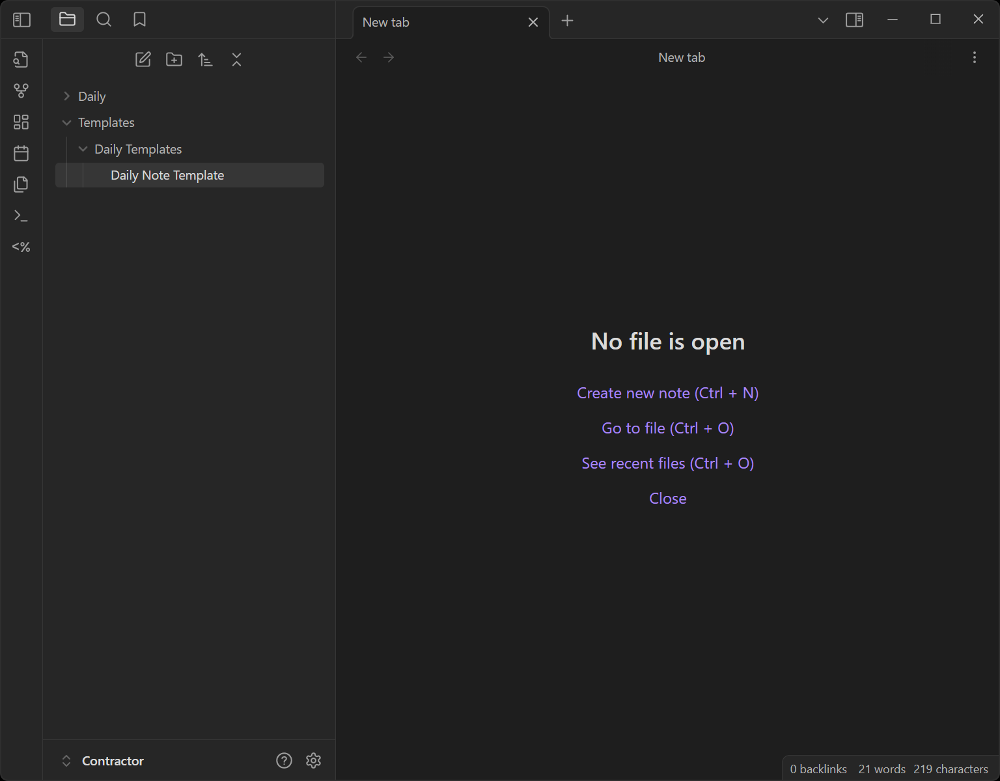
    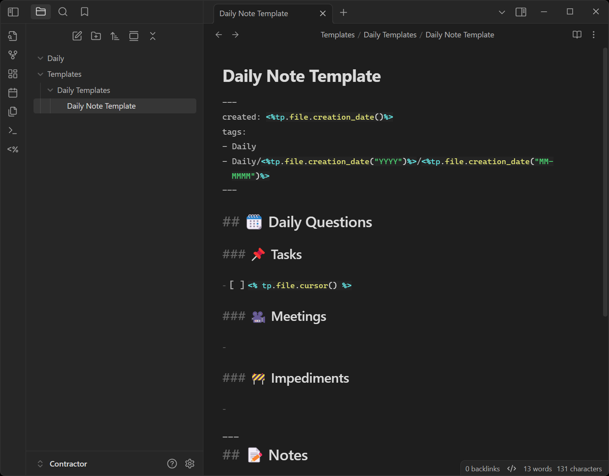
  </div>
  <em>Obsildian - Estructura de directorios</em>
</div>

#### Configuración en los Plugins

Ve a las configuraciones, dentro de la sección `Core plugins`, ubica las configuraciones del plugin `Daily Notes`. Asigna el siguiente valor `YYYY/MM-MMMM/YYYY-MM-DD-dddd` a la propiedad `Date Format`. Esto permitirá crear una estructura anidada de directorios (separador `/`) organizados por `año > mes > día`, facilitando la navegación. Adicionalmente asigna el valor `Daily` a la propiedad `New File Location` y `Templates/Daily Templates/Daily Note Template` a la propiedad `Template file location`. De esta manera, el plugin podrá crear una nueva nota basada en la plantilla `Daily Note Template` al dar clic en el botón `Open today's daily note` en la cinta de accesos de `Obsidian`. Opcionalmente, puedes marcar la opción `Open daily note on startup`, personalmente es algo que mantengo activo.

<div class="gallery-box">
  <div class="gallery">
    
  </div>
  <em>Obsidian - Configuración de Daily note</em>
</div>

Finalmente, en la sección de `Community plugins`, ubica las configuraciones del plugin `Templater`. Asigna el valor `Templates` en la propiedad `Template folder location`. Activa las opciones `Automatic jump to cursor` y `Trigger Templater on new file creation`. Esto permitirá que automáticamente se ejecute el código de `Templater` para asignar las etiquetas de la fecha. Navega hacia abajo en las configuraciones de `Templater`, activa la opción `Enable folder templates`, se mostrarán dos nuevos campos, en el primero escoge la carpeta `Daily` y en la segunda escoge `Templates/Daily Templates/Daily Note Template.md`. Esto permitirá asociar la plantilla específica para la bitácora.

<div class="gallery-box">
  <div class="gallery">
    
    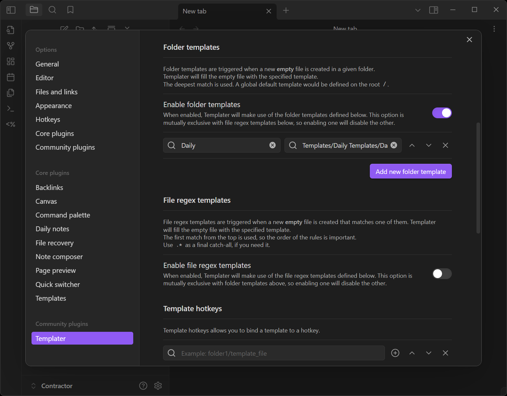
  </div>
  <em>Obsidian - Configuración de Templater</em>
</div>

### 🎬 Uso de la plantilla

Haz configurado satisfactoriamente la plantilla, considérala como un punto inicial. Muchas cosas se pueden realizar con `Obsidian` y los plugins de la comunidad, sin embargo, para iniciar a registrar tu **bitácora de trabajo**, considero que esta configuración es más que suficiente.

En la barra lateral izquierda, puedes encontrar una cinta de accesos, una de ellas es `Open today's daily note`. Haz clic en el acceso y te creará una nueva entrada de la fecha del día o te abrirá la entrada existente con la fecha del día. De la misma esto ocurrirá al abrir `Obsidian` si marcaste la opción en las configuraciones de `Daily note`.

<div class="gallery-box">
  <div class="gallery">
    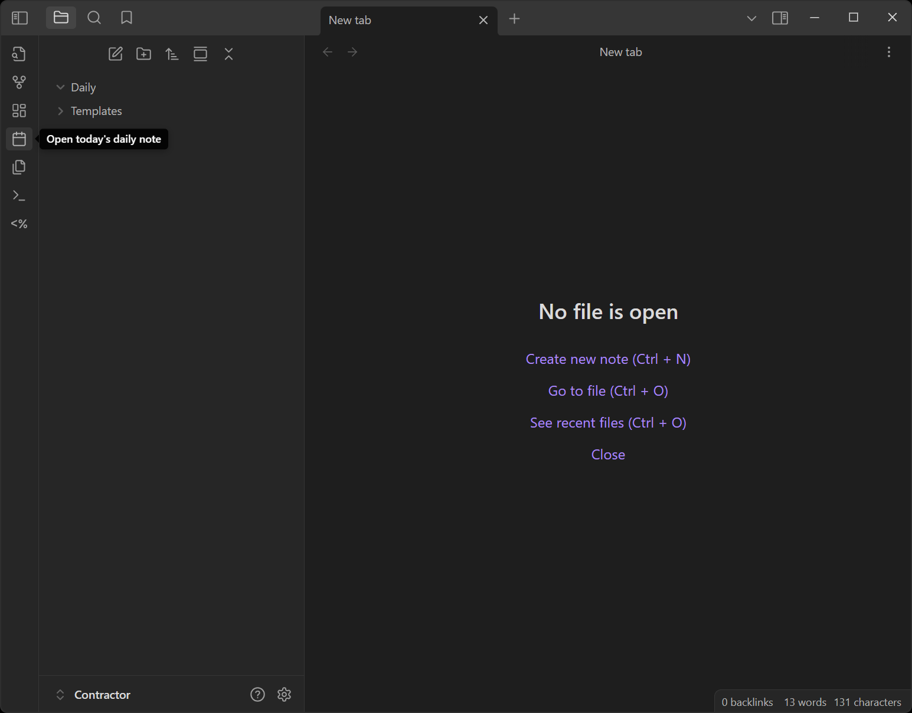
    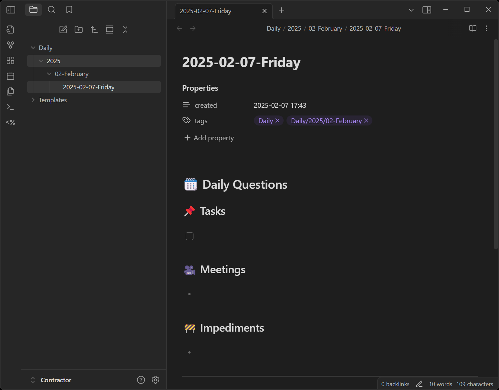
  </div>
  <em>Obsidian - Crea la nota del día de hoy</em>
</div>

En la parte superior derecha, puedes encontrar el botón `Expand`. Al dar clic al botón, se mostrarán diferentes opciones entre ellas `Calendar` . La vista de calendario te permitirá poder desplazarte entre las diferentes notas diarias. Si realizar un doble clic sobre una fecha en particular, y en esta no existe una nota diaria, te mostrará un dialogo confirmando si desear crear una nota diaria para ese día. Recuerda que puedes activar o desactivar esta vista de calendario, el botón `Expand` ha sido reemplazado por uno llamado `Collapse`.

<div class="gallery-box">
  <div class="gallery">
    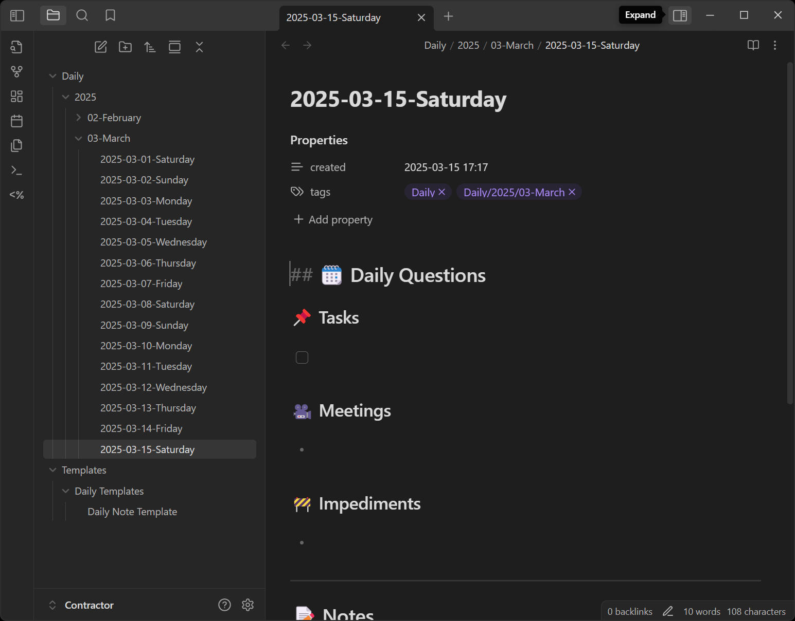
    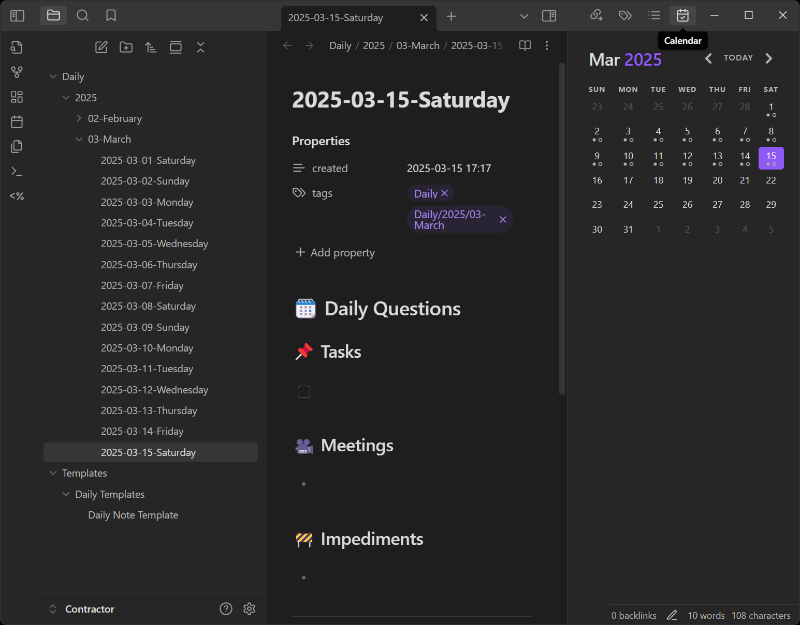
  </div>
  <em>Obsidian - Vista de calendario</em>
</div>

Si te encuentras en modo edición `Source mode`, el resumen de las notas mostrará un código, sin embargo, al cambiar a la vista de lectura `Reading view`, se mostrará la lista de las notas que fueron creadas ese día, al igual las notas cuya última fecha de modificación haya sido ese día.

<div class="gallery-box">
  <div class="gallery">
    
    
  </div>
  <em>Obsidian - Vista de edición y lectura</em>
</div>

Mi flujo normal es cambiar a edición cuando necesito revisar algo de esta vista general.

La búsqueda en `Obsidian` normalmente es más que suficiente, sin embargo, te recomiendo que explores `Graph view` una vez tengas unas cuantas notas agregadas 😉.

## 👌 En resumen

Llevar una bitácora de trabajo es más que una simple lista de tareas; es una herramienta de crecimiento profesional. Te ayuda a organizarte, manejar mejor tu tiempo, evitar el estrés y destacar en equipo. Además, hace la vida mucho más fácil durante reuniones, revisiones de desempeño o cierres de proyecto. Con el tiempo, notarás patrones en tu rendimiento y ganarás confianza en tu progreso.

¿Listo para empezar una? Si la empleas correctamente, ¡te sorprenderá cuánto impacto puede tener este pequeño hábito en tu productividad y tranquilidad!

---

Foto de <a href="https://unsplash.com/@glenncarstenspeters?utm_content=creditCopyText&utm_medium=referral&utm_source=unsplash" target="_blank" rel="nofollow, noreferrer">Glenn Carstens-Peters</a> en <a href="https://unsplash.com/es/fotos/boligrafo-de-clic-plateado-mbLr6NEatMI?utm_content=creditCopyText&utm_medium=referral&utm_source=unsplash" target="_blank" rel="nofollow, noreferrer">Unsplash</a>
