Has someone ever asked you for an update on your progress, and you had to dig deep into your memory to figure out what you last worked on? You’re not alone!

Keeping a work log (also known as a work journal or work log) might sound like just another extra step, but in reality, it’s one of the most useful tools for boosting your productivity and keeping your work life organized.

From my own experience, keeping a log has helped me in some key moments of my career:

1. During a company restructure, when I was asked for a detailed report of my achievements, the obstacles I faced, and the steps I took to overcome them.
2. When requesting a raise; thanks to my log, I had all the data ready to make my case clearly and convincingly.
3. While working on a contract for a time and materials project. The client asked for a detailed breakdown of daily activities in the timesheet, and my log helped me deliver a quick and accurate report.

> "The secret of success is to be ready when your opportunity comes."  
> – Benjamin Disraeli

Having clear answers and concrete evidence of your achievements not only improves your preparation but also shows confidence and professionalism in any work environment.

## 🤔 What is a work log?

A work log is a structured record of your activities. You can include details such as:

- What tasks did I complete?
- What tasks will I need to tackle next?
- What were my biggest distractions or time sinks?
- Important notes, learnings, or difficulties throughout the day

While it may sound a bit like the `stand-up meeting` questions, the purpose of a personal work log is to help you track your progress, spot patterns in your habits, and plan more effectively.

## ❓ Why bother keeping a work log?

Even if it feels tedious at first, the truth is this practice will save you time, lower your stress, and may even get you out of a tight spot more than once. Here are some key reasons to embrace it:

### 💪 It gives you a clear trail of your achievements

Don’t underestimate everything you do! Documenting your progress makes sure you don’t forget your wins or the times you overcame big hurdles. During performance reviews or meetings with your manager, your log can speak for you, helping you back up your work with solid facts.

### ⏳ It helps you understand how you spend your time

How many times have you reached the end of the day without knowing where those eight hours went? A log lets you pinpoint exactly what you worked on, including interruptions or unexpected tasks. You’ll also start to notice your most productive times: Are you more creative in the mornings? Do you focus best after a good lunch? This can help you fine-tune your schedule and cut out low-value activities.

### 🔎 It eliminates ambiguity and boosts your focus

Sometimes, even when you know what you need to do, that “where do I start?” question can cause stress. Logging your work at the start and end of the day gives you clarity. You can even use your log to set clear goals and reduce uncertainty when tackling big or complex tasks. Organizing your thoughts before you start helps you stay on track and avoid “winging it” as you go.

### ✅ It brings closure at the end of your day

Few things are as satisfying as crossing off completed tasks. At the end of your workday, your log lets you see what you’ve accomplished (you earned it!) and shows you what’s still left. That way, there’s no uncertainty and you can shuffle your remaining tasks to the next day, no stress required.

## 💡 Benefits beyond work

Even though it’s mainly a work tool, keeping a log can help you in other areas of life too. It gives you perspective, encourages self-improvement, and can remind you of past learnings so you can save time in the future.

> "Never memorize something that you can look up".
>
> <a href="https://www.goodreads.com/quotes/24194-never-memorize-something-that-you-can-look-up" target="_blank" rel="nofollow">- Albert Einstein</a>

That advice fits perfectly here: relying on your own notes frees up your mental space and streamlines your workflow.

## 🛠️ How to get started

Don’t make it complicated. Choose a simple tool that works for you—anything from a paper notebook to digital apps like `Notion` or `Obsidian`. The key is that it should be quick to update and easy to review. Ideally, you’ll want to log:

1. **Start of the day:** Your key goals and tasks.
2. **During the day:** Progress, challenges, and unexpected changes (those last-minute requests).
3. **End of the day:** A brief summary of what you accomplished and what’s left for tomorrow.

## ✍️ Example: Using an `Obsidian` Template for Your Work Log

`Obsidian`, according to its official site, is a private and flexible writing app that adapts to your way of thinking. It’s an excellent app—I use it every day! You can download and use `Obsidian` for free, forever, for any purpose, including personal, commercial, nonprofit, educational, and even governmental use.

This template is based on the work of **Dann Berg** in his post <a href="https://dannb.org/blog/2022/obsidian-daily-note-template/" target="_blank">My Obsidian Daily Note Template</a>. Below I’ll share my own adaptation, tailored for work logs.

### ⚙️ Setting Up the Template

You’ll need `Obsidian` installed and a vault to use for your work log.

<div class="gallery-box">
  <div class="gallery">
    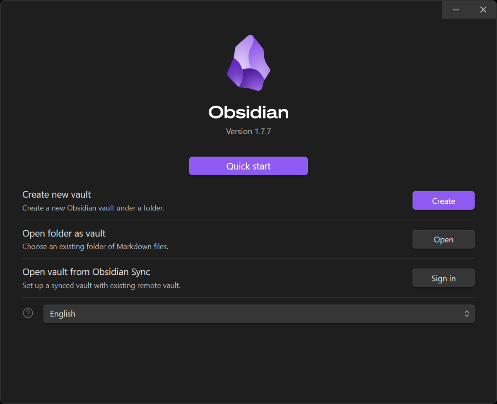
    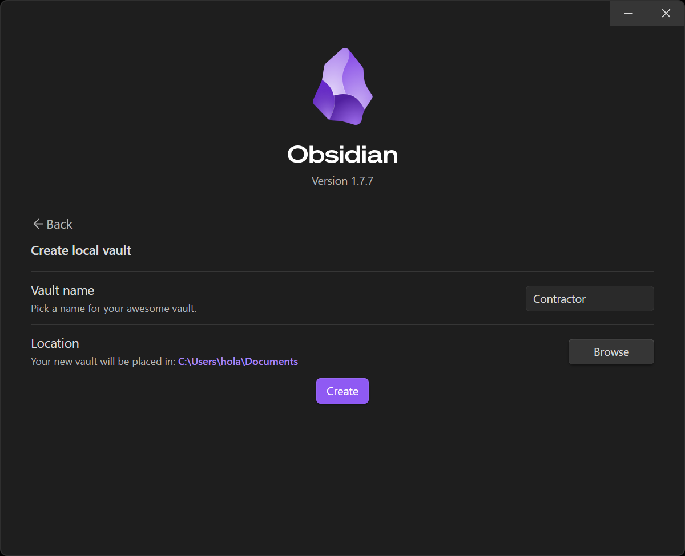
  </div>
  <em>Obsidian - Obsidian - Create a Vault</em>
</div>

#### Plugins

- <a href="https://help.obsidian.md/Plugins/Daily+notes" target="_blank" rel="nofollow">Daily Notes</a>, included by default in Obsidian, no installation required.
- <a href="https://github.com/SilentVoid13/Templater" target="_blank" rel="nofollow">Templater</a>, a community plugin that needs to be installed from the <a href="https://help.obsidian.md/Extending+Obsidian/Community+plugins" target="_blank" rel="nofollow">Obsidian plugin gallery</a>.
- <a href="https://github.com/liamcain/obsidian-calendar-plugin" target="_blank" rel="nofollow">Calendar</a>, a community plugin that needs to be installed from the <a href="https://help.obsidian.md/Extending+Obsidian/Community+plugins" target="_blank" rel="nofollow">Obsidian plugin gallery</a>
- <a href="https://github.com/blacksmithgu/obsidian-dataview" target="_blank" rel="nofollow">Dataview</a>, a community plugin that needs to be installed from the <a href="https://help.obsidian.md/Extending+Obsidian/Community+plugins" target="_blank" rel="nofollow">Obsidian plugin gallery</a>.

##### Enable Community Plugins

<div class="gallery-box">
  <div class="gallery">
    
    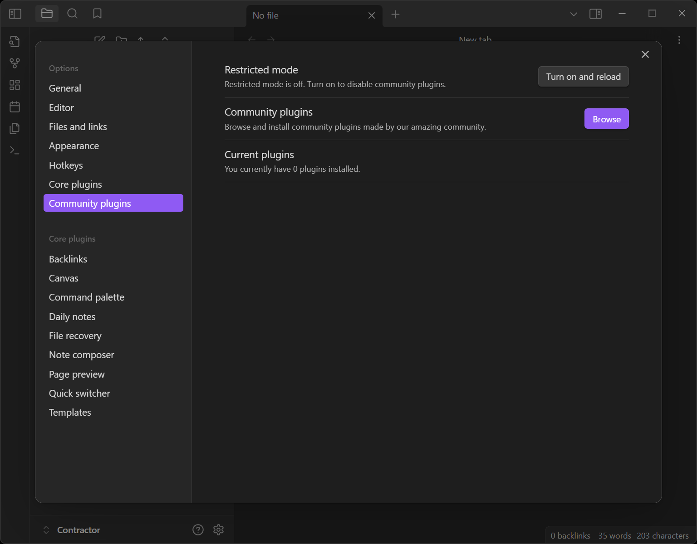
  </div>
  <em>Obsidian - Enable Community Plugins</em>
</div>

Click on the `Browse` button and in the popup window, search for the plugin name (for example, `Templater`).

<div class="gallery-box">
  <div class="gallery">
    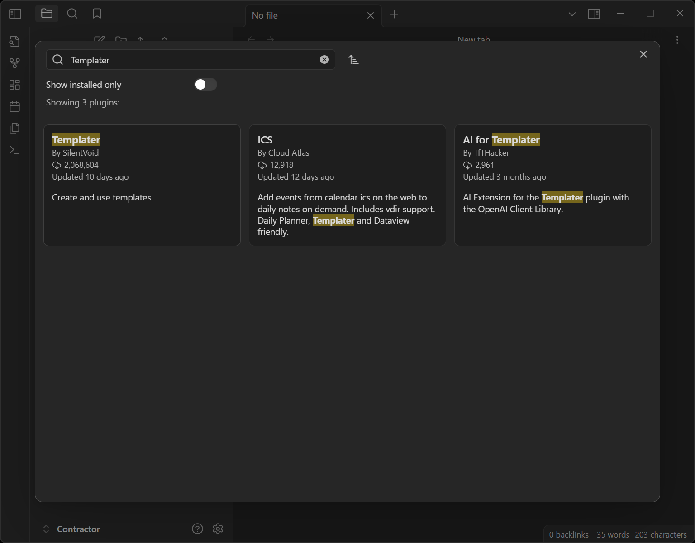
  </div>
  <em>Obsidian - Search Community Plugins</em>
</div>

##### Templater Plugin Installation

<div class="gallery-box">
  <div class="gallery">
    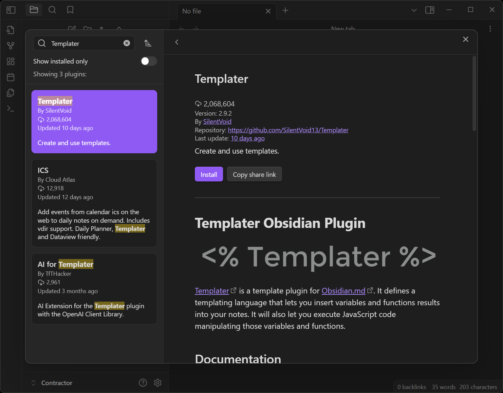
    
    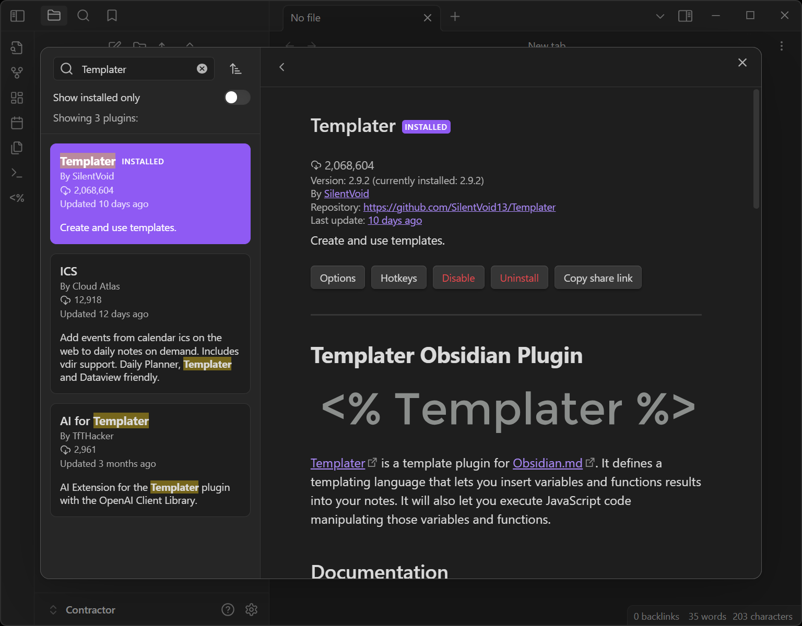
  </div>
  <em>Obsidian - Install and Enable Templater Plugin</em>
</div>

##### Calendar Plugin Installation

<div class="gallery-box">
  <div class="gallery">
    
    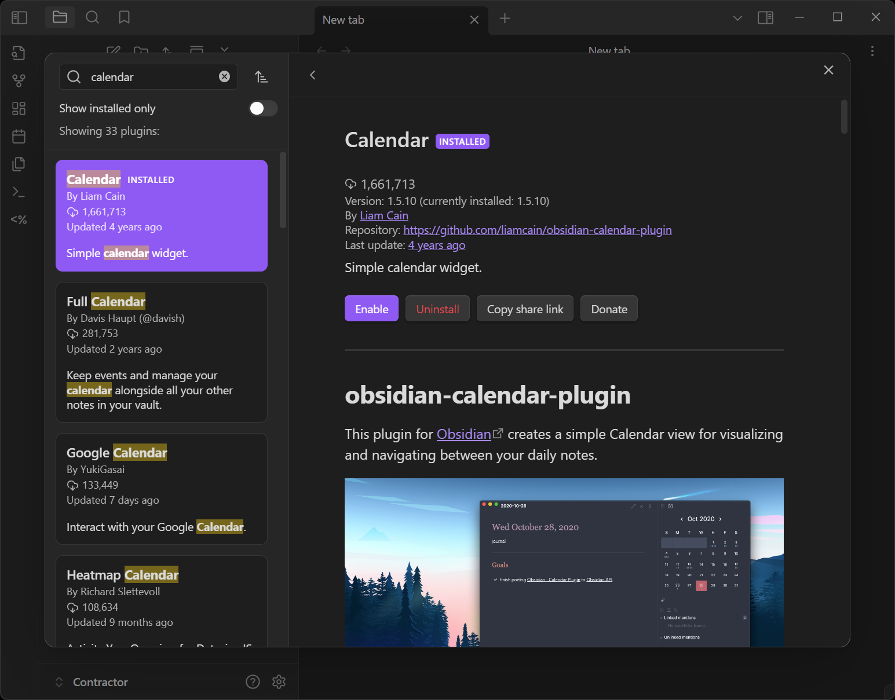
    
  </div>
  <em>Obsidian - Install and Enable Calendar Plugin</em>
</div>

##### Dataview Plugin Installation

<div class="gallery-box">
  <div class="gallery">
    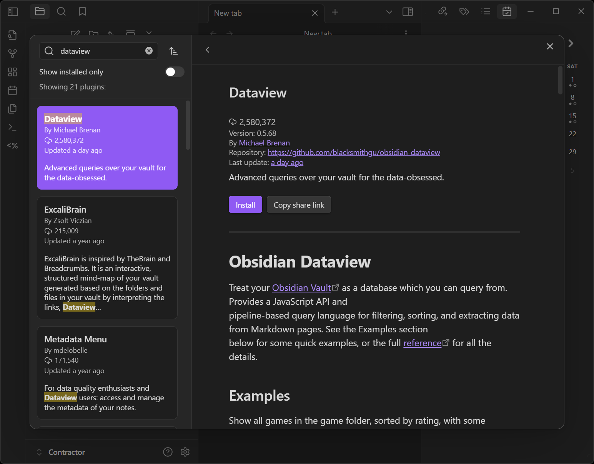
    
    
  </div>
  <em>Obsidian - Install and Enable Dataview Plugin</em>
</div>

For now, we won't change the plugins’ default settings.

#### Setting Up the Template

Create a new folder called `Templates` and within it, a sub-folder called `Daily Templates`. Inside `Daily Templates`, create a new note called `Daily Notes Template` and copy-paste the following snippet into the note in source mode. (Tip: Use `Ctrl+Shift+v` to paste as plain text.)

````markdown
---
created: <%tp.file.creation_date()%>
tags:
    - Daily
---

## 🗓️ Daily Questions

### 📌 Tasks

- [ ] <% tp.file.cursor() %>

### 🎥 Meetings

-

### 🚧 Impediments

- ***

## 📝 Notes

---

### 📖 Daily Notes Overview

#### ✍️ Notes created today

```dataview
List FROM "" WHERE file.cday = date("<%tp.date.now("YYYY-MM-DD")%>") SORT file.ctime asc
```

#### 🔄️ Notes last updated today

```dataview
List FROM "" WHERE file.mday = date("<%tp.date.now("YYYY-MM-DD")%>") SORT file.mtime asc
```
````

<div class="gallery-box">
  <div class="gallery">
    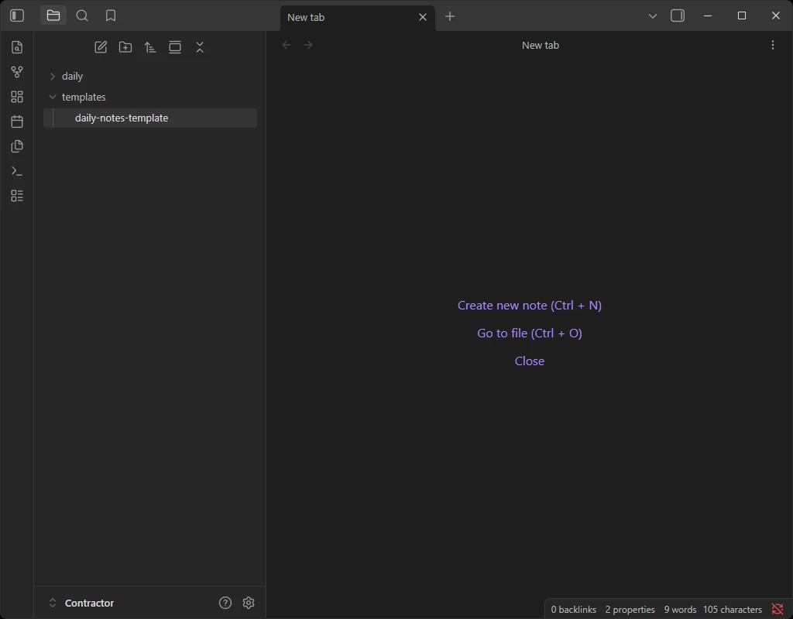
    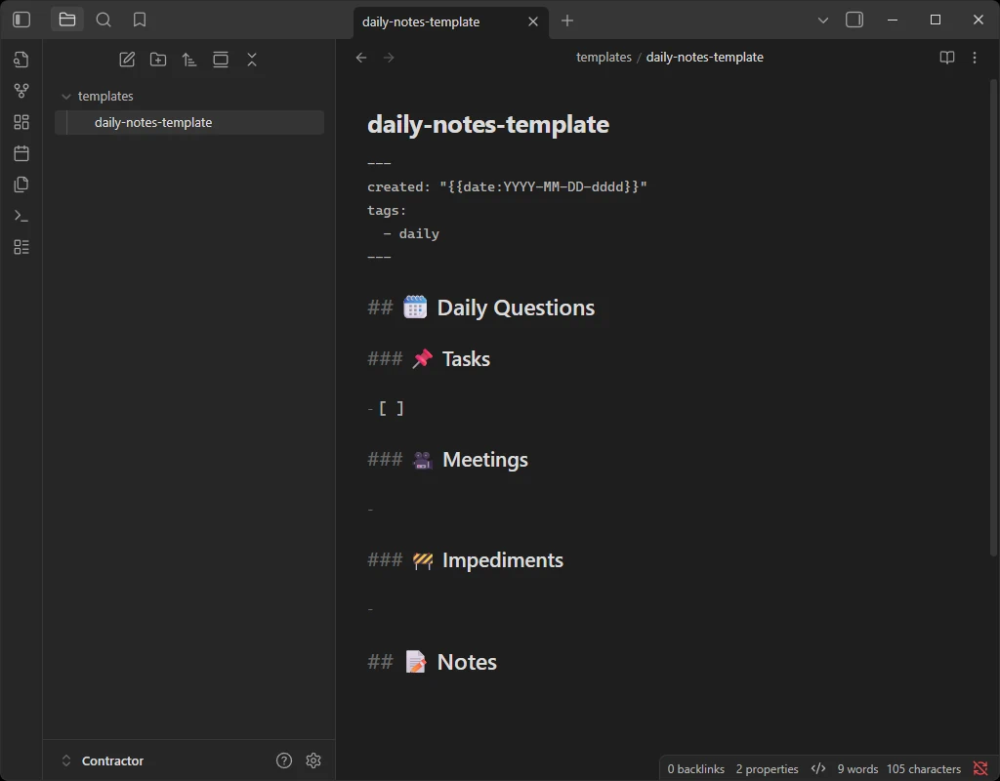
  </div>
  <em>Obsidian - Directory Structure</em>
</div>

#### Plugin Configuration

Go to settings and, under `Core plugins`, find the `Daily Notes` plugin settings. Set `YYYY/MM-MMMM/YYYY-MM-DD-dddd` as the value for `Date Format`. This will nest your notes in subfolders by year > month > day, making it easier to browse. Also, set `Daily` as the value for `New File Location`, and `Templates/Daily Templates/Daily Note Template` as the `Template file location`. This way, when you hit `Open today's daily note` in the Obsidian ribbon, your new note will use the template. You may also want to enable `Open daily note on startup`, personally, I keep this turned on.

<div class="gallery-box">
  <div class="gallery">
    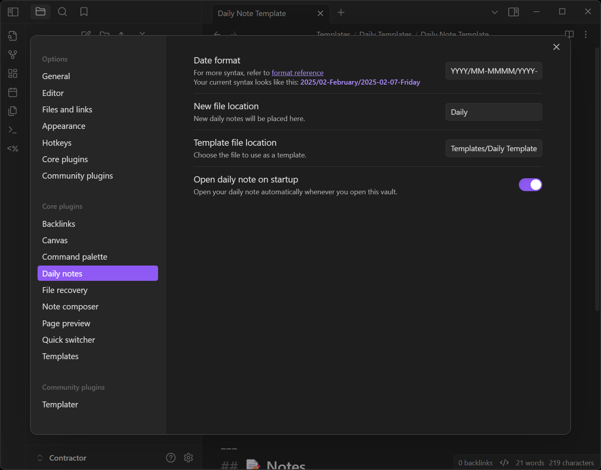
  </div>
  <em>Obsidian - Daily Note Settings</em>
</div>

Finally, under `Community plugins`, look for the Templater plugin settings. Set `Templates` as the `Template folder location`. Turn on `Automatic jump to cursor` and `Trigger Templater on new file creation`. This will let Templater automatically insert the date tags. Scroll down in Templater settings, enable `Enable folder templates`, and choose the `Daily` folder in the first box, and `Templates/Daily Templates/Daily Note Template.md` in the second. This will associate your daily note template with the notes you create in the log.

<div class="gallery-box">
  <div class="gallery">
    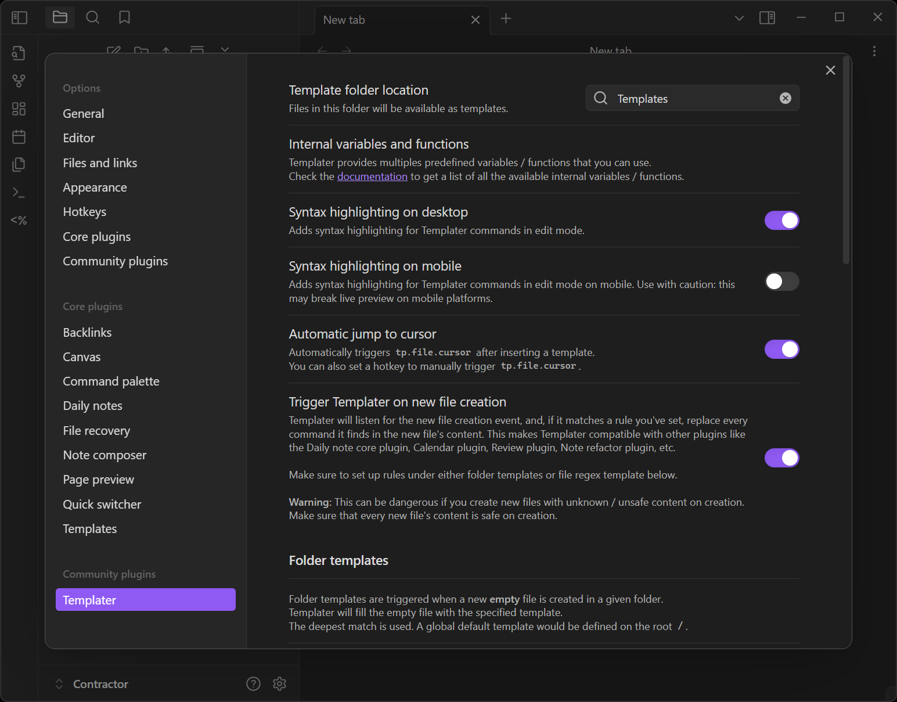
    
  </div>
  <em>Obsidian - Templater Configuration</em>
</div>

### 🎬 Using the template

Your template is now ready to go, treat it as a starting point! There’s a lot you can do with Obsidian and community plugins, but for getting started with your work log, this setup is more than enough.

On the left sidebar, you'll see quick access buttons, including one for `Open today's daily note`. Clicking it will create a new entry for today's date (or open the existing one, if it’s already there). The same thing happens when you launch Obsidian, if you enabled the option in Daily Note settings.

<div class="gallery-box">
  <div class="gallery">
    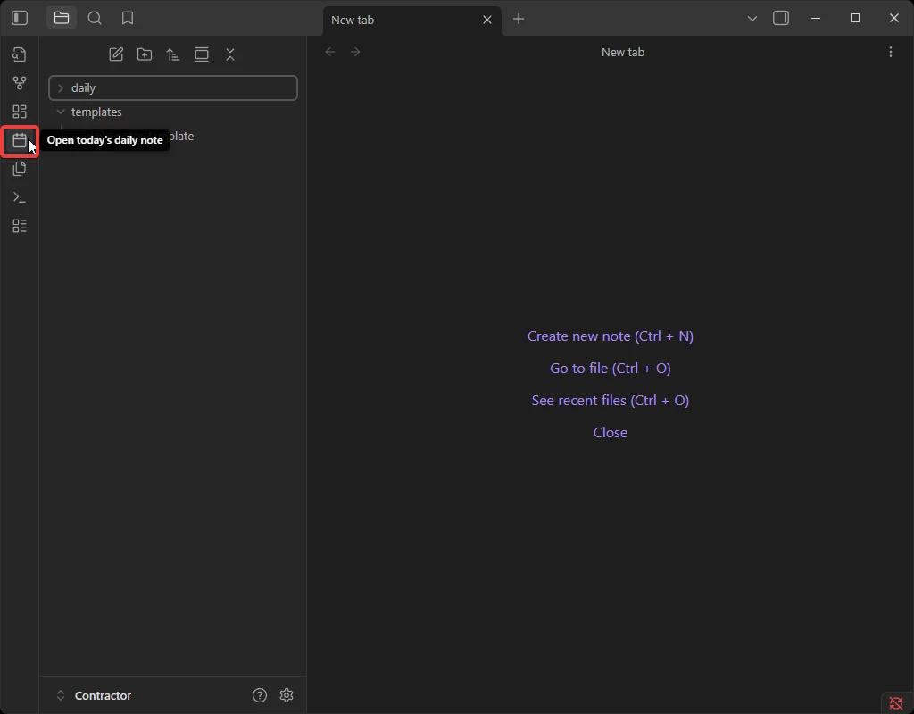
    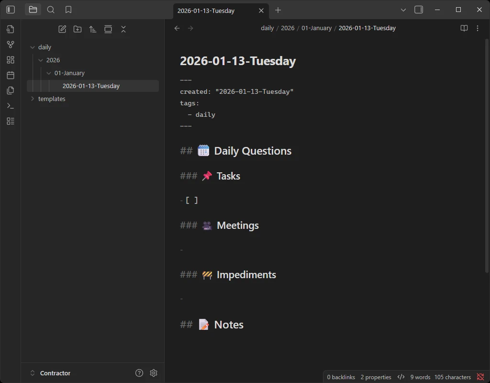
  </div>
  <em>Obsidian - Create Today's Note</em>
</div>

In the top right, you’ll find the `Expand` button. Click it to show different tabs, one of which is `Calendar`. The calendar view lets you jump between different daily notes. If you double-click a date that doesn’t have a daily note yet, the app will prompt you to create one for that day. You can toggle this view on or off—when expanded, the button becomes `Collapse`.

<div class="gallery-box">
  <div class="gallery">
    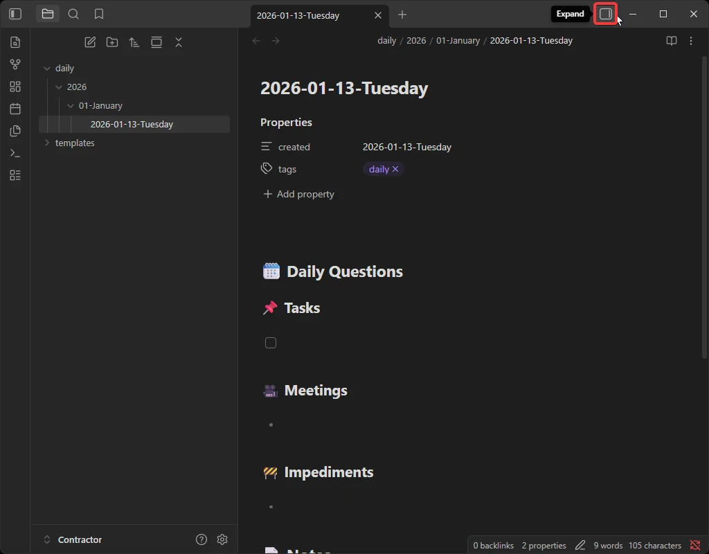
    
  </div>
  <em>Obsidian - Calendar View</em>
</div>

SIf you're in `Source mode`, the daily note summary will show raw code, but when you switch to `Reading view`, you’ll see a clean list of notes you created or last updated that day.

<div class="gallery-box">
  <div class="gallery">
    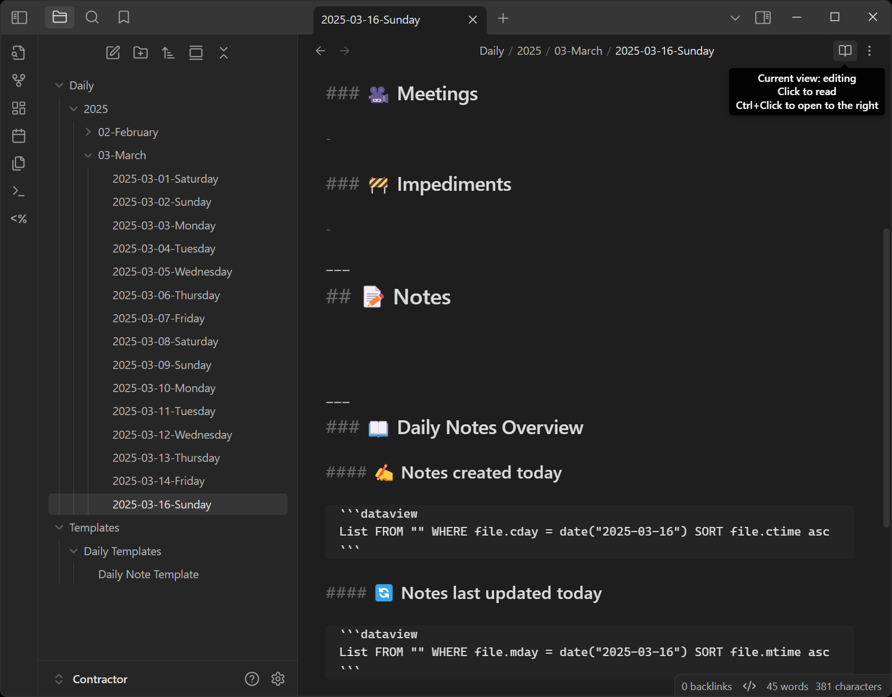
    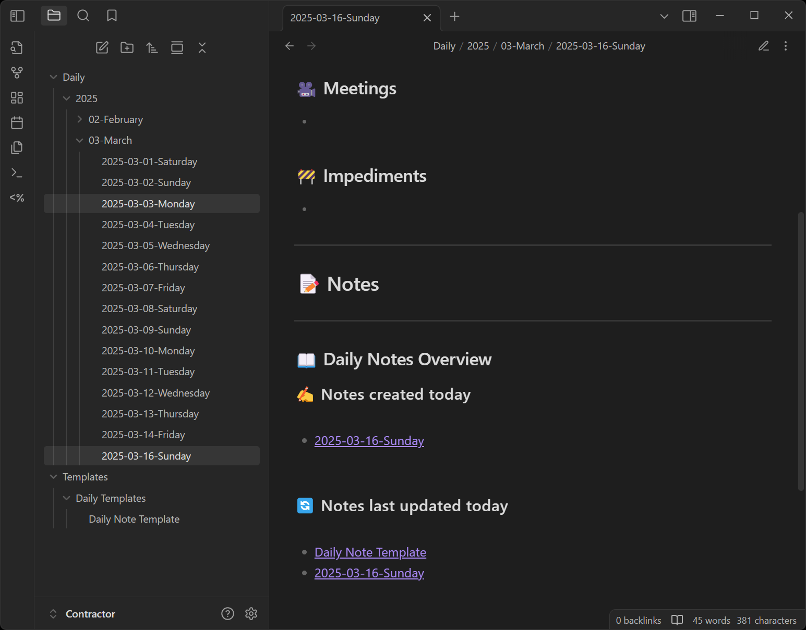
  </div>
  <em>Obsidian - Edit and Reading Views</em>
</div>

My usual process is to switch into editing mode when I need to review something from this overview.

Obsidian's search is usually more than enough, but I recommend checking out the `Graph view` once you’ve built up some notes. 😉

## 👌 In summary

Keeping a work log is more than just a to-do list; it’s a tool for professional growth. It helps you organize, manage your time, reduce stress, and stand out on your team. It also makes things much easier during meetings, reviews, or project wrap-ups. Over time, you’ll spot trends in your performance and gain confidence in your progress.

Ready to get started? If you stick to this habit, you’ll be surprised by how much it can boost your productivity and peace of mind!

---

Photo by <a href="https://unsplash.com/@glenncarstenspeters?utm_content=creditCopyText&utm_medium=referral&utm_source=unsplash" target="_blank" rel="nofollow, noreferrer">Glenn Carstens-Peters</a> on <a href="https://unsplash.com/es/fotos/boligrafo-de-clic-plateado-mbLr6NEatMI?utm_content=creditCopyText&utm_medium=referral&utm_source=unsplash" target="_blank" rel="nofollow, noreferrer">Unsplash</a>
