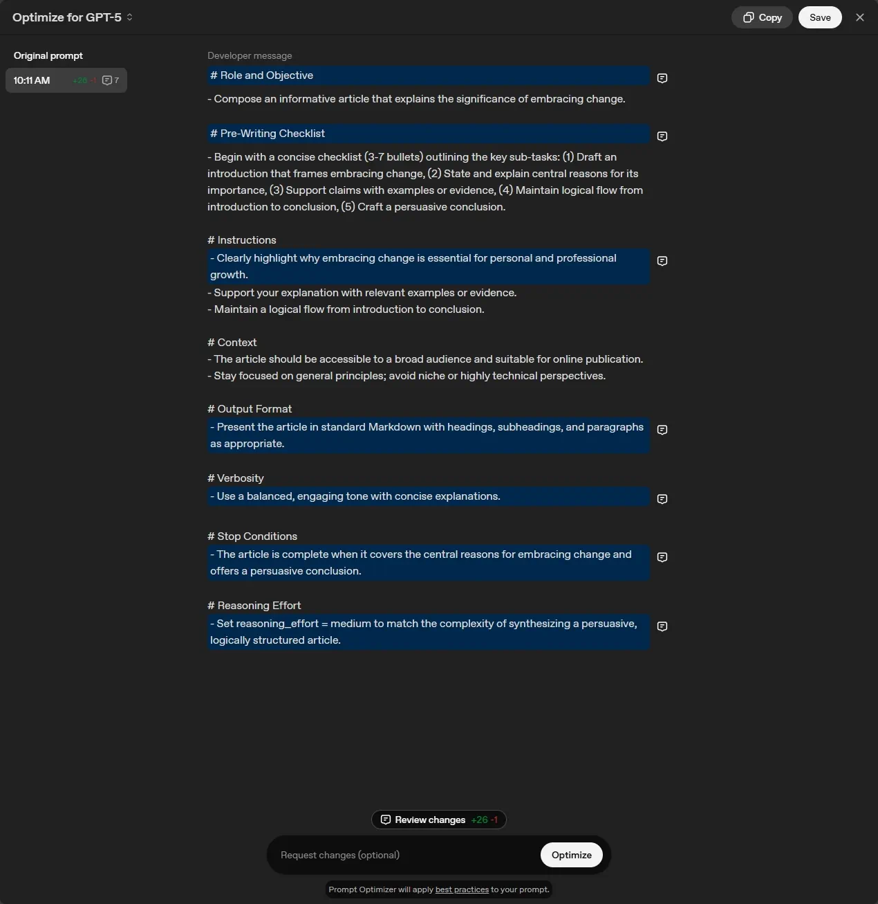
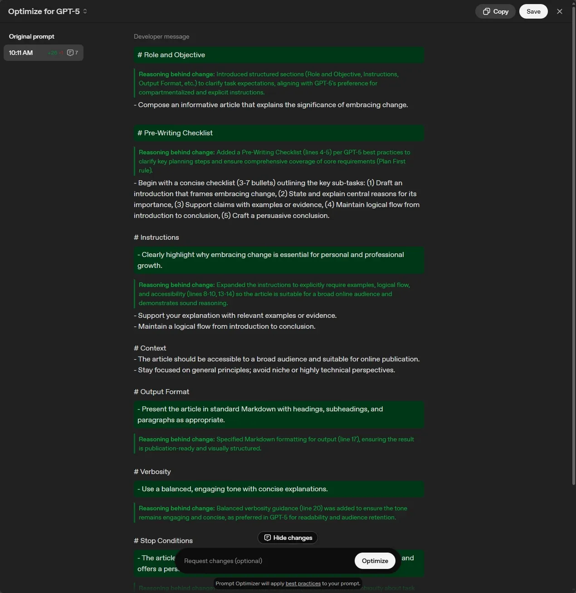
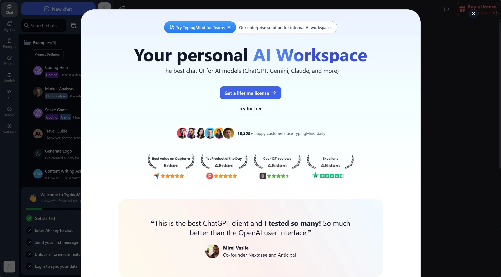
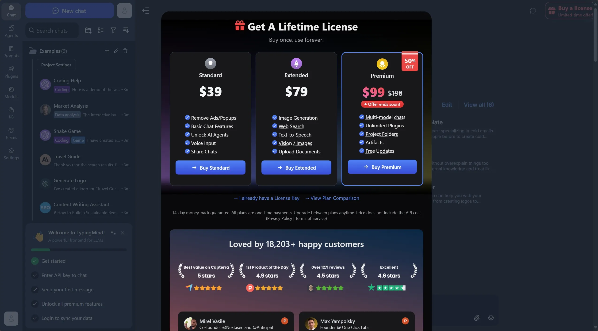

The GPT-5 launch has been... interesting, and this meme perfectly sums up the GPT-4 vs GPT-5 experience:

<div class="gallery-box">
  <div class="gallery">
    
  </div>
  <em>You vote for GPT-5 or GPT-4o via <a href="https://www.reddit.com/r/GPT3/comments/1mo4wt0/you_vote_for_gpt5_or_gpt4o/" target="_blank" rel="nofollow, noreferrer">Reddit</a></em>
</div>
Turns out when your AI becomes more thoughtful, you need to be more thoughtful too.

---

## 📚 Table of Contents

- [🤔 What makes modern AI models different?](#-what-makes-modern-ai-models-different)
- [🔄 ChatGPT automatically switches between models](#-chatgpt-automatically-switches-between-models)
- [⚡ Usage limits and practical alternatives](#-usage-limits-and-practical-alternatives)

---

## 🤔 What makes modern AI models different?

Modern AI models respond well to structured, detailed requests. It's similar to how you'd write clear technical specifications. Being specific about requirements, constraints, and expected outcomes leads to better results.

Think of it like this: if you were giving directions to someone, you wouldn't just say "go to the store." You'd be specific about which store, what route to take, and what to do when they get there. Modern AI models work the same way, they perform dramatically better when you give them clear, structured guidance.

The key components that make all the difference include:

- **Clear requirements**: Specific scope, constraints, and success criteria
- **Logical structure**: Breaking down complex problems into manageable parts
- **Validation steps**: Having the AI check its work against your needs
- **Complete coverage**: Ensuring all aspects of multi-faceted problems get addressed

While this might seem like extra work upfront, it typically saves time by reducing back-and-forth clarification.

### ❓ Why bother with this structured approach?

Taking time to organize your requests properly can improve your experience in several ways:

#### 💪 It eliminates the guessing game

When you provide clear context and constraints, you're more likely to get responses that actually fit your situation. The AI has the information it needs to give you relevant, targeted results.

#### ⏳ It saves you from endless back-and-forth

Instead of gradually adding context through multiple follow-up prompts, a well-structured initial request often gets you comprehensive results right away. Over time, you'll also build up effective prompt patterns you can reuse.

#### 🔎 It handles complex trade-offs better

Technical decisions often involve balancing competing priorities, such as: performance vs cost, security vs usability, etc. Structured prompts help ensure the AI considers all relevant factors when analyzing these trade-offs.

#### ✅ It builds reliable processes

When your approach is systematic, you can trust the results more and even share your methods with teammates. This creates consistency across your technical discussions and decisions.

### 💡 The hidden benefits you didn't expect

Using structured prompting also develops your general problem-solving skills. You'll likely find yourself thinking more systematically about technical challenges, defining requirements more clearly, and communicating complex ideas more effectively.

> "The first rule of any technology used in a business is that automation applied to an efficient operation will magnify the efficiency."
> – Bill Gates

Having reliable templates frees up mental energy for strategic thinking and creative problem-solving.

### 🛠️ Core principles for effective prompting

The fundamentals are straightforward:

#### 📝 Structure improves clarity

Organizing your requests helps AI models understand what you need. Think of it like the difference between well-documented code and a tangled mess - structure makes everything work better.

A basic framework that works well:

```text
<objective>
[Your specific goal and what success looks like]
</objective>

<context>
[Relevant background, constraints, current situation]
</context>

<requirements>
[Step-by-step guidance and expected deliverables]
</requirements>
```

#### 🧠 Include analysis phases

Asking the AI to analyze before recommending often leads to more thoughtful responses. It's like having someone understand the problem thoroughly before jumping to solutions.

Consider adding steps like:

```text
Before providing recommendations:
1. Analyze the current situation and key challenges
2. Evaluate available options against the constraints
3. Consider trade-offs and potential issues
4. Validate the analysis before presenting solutions
```

#### 🔍 Build in validation

You can ask the AI to review its own work against your requirements and best practices. This adds an extra quality check to the process.

### 🔧 Official resources for prompt optimization

OpenAI has released specific guidance and tools designed to help with GPT-5 prompting. These resources can be particularly useful when you're working with complex technical problems or migrating existing prompts.

#### 📚 GPT-5 prompting guide

The <a href="https://cookbook.openai.com/examples/gpt-5/gpt-5_prompting_guide" target="_blank">official GPT-5 prompting guide ➡️</a> covers best practices specifically tailored for GPT-5's capabilities. It focuses on areas where GPT-5 excels: agentic tasks, coding, and precise control over model behavior.

#### 📖 Optimization cookbook

The <a href="https://cookbook.openai.com/examples/gpt-5/prompt-optimization-cookbook" target="_blank">prompt optimization cookbook ➡️</a> provides practical examples and before-and-after comparisons showing how prompt optimization can create measurable improvements.

Keep in mind that effective prompting varies by use case, so these tools work best when combined with systematic testing and iteration based on your specific needs.

#### 🛠️ Prompt optimization tool

OpenAI's <a href="https://platform.openai.com/chat/edit?models=gpt-5&optimize=true" target="_blank">Prompt Optimizer ➡️</a> in their Playground can help improve existing prompts by identifying and fixing common issues:

- Contradictions in prompt instructions
- Missing or unclear format specifications
- Inconsistencies between prompts and examples

The tool is designed to understand your specific task and apply relevant optimizations for different use cases like coding workflows or multi-modal applications.

<div class="gallery-box">
  <div class="gallery">
    
  </div>
  <em>Prompt-Optimizer</em>
</div>

##### 🧪 Let's test it

This a simple prompt with no structure.

```text
Write an article explaining the importance of embracing change.
```

The result of using OpenAI's <a href="https://platform.openai.com/chat/edit?models=gpt-5&optimize=true" target="_blank">Prompt Optimizer ➡️</a> is a structured prompt with the following sections:

- Role and Objective
- Pre-Writing Checklist
- Instructions
- Context
- Output Format
- Verbosity
- Stop Conditions

No wonder people are having issues working with GPT-5 😅.

<div class="gallery-box">
  <div class="gallery">
    
    
    
  </div>
  <em>Optimize for GPT-5</em>
</div>

## 🔄 ChatGPT automatically switches between models



It appears that ChatGPT now let's you select the model and reasoning level, and you can even select older models such as GPT-4.1.



GPT-5 is naturally thorough, which usually helps but sometimes you need faster answers. You can guide how much time it spends thinking through your problem.

**When you need quick answers:**

If you're working on something straightforward and want faster results, let the AI know:

```text
Focus on speed over completeness. Give me actionable steps quickly rather than exploring every possibility.
```

**When you want thorough exploration:**

For complex problems where you want GPT-5 to work through everything systematically:

```text
Take the time needed to fully solve this. Don't ask for clarification - make the most reasonable assumptions and keep working until it's complete, document it for the user's reference.
```

**Why this matters:**

Quick fixes don't need deep research. Complex system design does. Matching your request style to your actual needs gets you better results faster.



Think of it like asking for directions: sometimes you just need "turn left at the light," other times you want the full route with alternatives and traffic considerations.



## ⚡ Usage limits and practical alternatives



Sam Altman via X, confirms ChatGPT Plus subscribers will have increased rate limit.



At the launch of GPT-5, limits were enforced to Plus ChatGPT users.

- **Free users:** 10 GPT-5 messages every 5 hours, plus one GPT-5 Thinking message per day. After hitting the limit, the system switches to a lighter mini model.
- **Plus users:** Up to 80 messages every 3 hours and 200 GPT-5 Thinking messages per week. After the limit, chats revert to the mini model.

### 🏠 Our personal journey: From subscriptions to APIs

My wife and I were both ChatGPT users, and we started running into these limits frequently. The natural solution seemed to be getting two ChatGPT Plus subscriptions ($40/month total), plus I was interested in trying Claude, which would add another $20/month subscription.

That's when I decided to run a little experiment: **what if we used the APIs directly instead?**.

#### 💰 The numbers don't lie

Here's what our actual API usage looked like over several months:


{
type: 'bar',
data: {
labels: ['Jan', 'Feb', 'Mar', 'Apr', 'May', 'Jun', 'Jul'],
datasets: [
{
label: 'Anthropic',
data: [0, 0.24, 1.11, 0.49, 20.66, 12.91, 12.30]
},
{
label: 'OpenAI',
data: [5.05, 9.78, 5.74, 6.05, 7.42, 2.54, 3.61]
}
]
},
options: {
plugins: {
legend: { display: true },
title: { display: true, text: 'Consolidated Costs by Month' }
},
scales: {
x: { stacked: true },
y: { stacked: true }
}
}
}


Even in our heaviest usage month (May at ~$28 combined), we stayed well under what three subscriptions would cost us ($60/month). Most months, we're saving 60-70% compared to the subscription route.

### 🛠️ The API alternatives that actually work for us

Instead of fighting usage limits, we switched to API-powered interfaces that give us the same models with complete control:

#### 🎯 TypingMind: The easy button

We use <a href="https://www.typingmind.com/" target="_blank">TypingMind ➡️</a> for its clean, ChatGPT-like interface. It connects to both our OpenAI and Anthropic API keys, so we can switch between GPT-5 and Claude seamlessly.

<div class="gallery-box">
  <div class="gallery">
    
    
    
  </div>
  <em>TypingMind</em>
</div>

I admit that currently, the TypingMind license is quite expensive, it goes for about $99 for the full version. I'm happy that I bough it for less than half the price, but even if I were going to buy it today, I could bough it in six months by thinking that I'm paying the ChatGPT subscription.

**What we love about it:**

- No usage limits
- One interface for multiple AI providers
- Conversation history and organization

#### 🆓 Open-WebUI: For the tinkerers

I also set up <a href="https://openwebui.com/" target="_blank">Open-WebUI ➡️</a> on our home server for when I want to experiment with different models or experimenting with Ollama.

<div class="gallery-box">
  <div class="gallery">
    
    
  </div>
  <em>Open WebUI</em>
</div>

**Why we keep both:**

- TypingMind for daily use
- Open-WebUI for experimental work and local hosting


**Tip from our experience:** Start with TypingMind if you want something that "just works." You can always add Open-WebUI later if you catch the self-hosting bug like I did. Or try Open-WebUI if you want to do a safe experiment without expending.


### 🤷‍♂️ The honest trade-offs

**What you gain:**

- Complete control over usage and costs
- Access to multiple AI providers in one place
- Pay only for what you actually use
- No more "rate limit reached" frustrations

**What you lose:**

- Need to manage API keys and billing
- Slightly more complex initial setup
- Access to custom GPTs

For us, the cost savings and flexibility easily outweigh the minor setup complexity. Plus, once it's configured, it's actually simpler than managing multiple subscriptions.


**Real talk:** This approach isn't for everyone. If you prefer the simplicity of a single subscription and don't mind usage limits, stick with ChatGPT Plus. But if you're like us and want maximum flexibility at lower costs, API access is a game-changer.


---

Photo by <a href="https://unsplash.com/@seanwsinclair?utm_content=creditCopyText&utm_medium=referral&utm_source=unsplash" target="_blank" rel="nofollow, noreferrer">Sean Sinclair</a> on <a href="https://unsplash.com/photos/a-blurry-image-of-a-rainbow-colored-background-C_NJKfnTR5A?utm_content=creditCopyText&utm_medium=referral&utm_source=unsplash" target="_blank" rel="nofollow, noreferrer">Unsplash</a>
