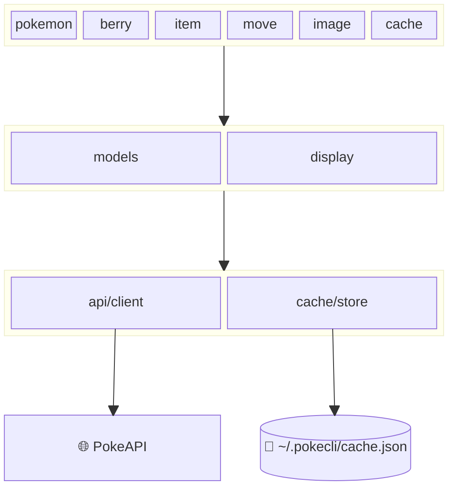

## 🎯 TL;DR

This post shows how to make a Python CLI easier for **Claude Code** to use. I use a new tool called `pokecli` as the example and add a small `SKILL.md` that gives the agent a clear command guide.

The goal is not to change how the CLI works. It is to stop the agent from re-learning the same help text during the task. A good skill gives Claude Code a shorter path into the tool, with clear triggers, command groups, examples, and a small reference file when extra detail is needed.

**Choose your path:**

- 🚀 [Build the skill](#quick-start)
- 👀 [See the final SKILL.md file](#results)
- 🧠 [Learn the pattern](#how-it-works)
- ✅ [Test the skill](#testing-your-skill)
- 🛠️ [Build one yourself](#build-it-yourself)

---

## 🤔 Why I Built This?

I recently gave an internal tech talk at work called **_Make Your CLI Tools AI-Native with SKILL.md_**. The feedback was a good signal that the idea landed, but it also made something clear: I needed a practical example people could inspect and reuse.

This post is that example.

I like CLIs that do one thing well, and `pokecli` is a good example of that. It has a clean command surface, clear output, and a workflow that feels natural in the terminal.





What I wanted to show is that you do not need to redesign a CLI to make it more useful for an AI agent. In many cases, the missing piece is a compact guide that tells the agent when to use the tool, which commands exist, and how to apply them safely.

---

## 📸 See It In Action

The end result is a small skill folder that Claude Code can load when a request matches the right trigger phrases:

```text
pokecli-skill/
└── skills/
    └── pokecli/
        ├── SKILL.md
        └── references/
            └── api-fields.md
```

Once installed into `~/.claude/skills/pokecli`, Claude Code gets a much clearer picture of how to use the tool:

- When to reach for `pokecli`
- Which commands belong to each resource
- Which flags are shared across `get` commands
- How to download sprites
- How to inspect and clear the local cache





This is the same core idea used by Microsoft's Playwright CLI skill: keep the always-loaded trigger small, keep the main body focused, and push extra detail into reference files only when needed.

---

## 💡 The Problem (In 60 Seconds)

CLI help text is great for humans. The problem is not that an agent cannot use it. The problem is that the agent has to keep re-learning the same command surface during the task.

If an agent only sees raw help output, it still has to answer basic questions during the task:

- Which resource groups exist?
- Which commands support `--no-cache`?
- Which output formats are available?
- How do image downloads work?
- Which cache commands are safe to run?

That means the model spends part of its context budget re-learning the tool instead of solving the user's request.

This is the real value of a skill. It turns a CLI into a smaller, more direct interface for an agent.

---

## ✨ The Solution

A skill is a folder of Markdown instructions that teaches an AI agent how to use a tool or follow a workflow.

For Claude Code, a well-built skill usually has three layers:

1. **Frontmatter**: the skill name, description, and allowed tools
2. **SKILL.md body**: the command guide the agent reads when the skill triggers
3. **References**: extra docs loaded only when the main file is not enough

This pattern matters because it keeps the default context small.

The frontmatter does the triggering work. The body gives the agent a short, practical command map. The references hold the field-level detail that only matters in a few cases.

That is the pattern I want to apply to pokecli.

---

<span id="quick-start"></span>

## 🚀 Quick Start

### Install the CLI with `uv`



This requires `uv` to be installed on your machine first. To install `uv`, you can follow the guide on the Astral site.



```bash
uv tool install git+https://github.com/jebucaro/pokecli
```

You can later uninstall the tool running the following command.

```bash
uv tool uninstall pokecli
```

### Install the Claude skill

```bash
pokecli install --skills
```






You could also copy the skill files into place by hand or do the same step with a small script. I added `install --skills` to make the example complete and easy to run.

### Optional: local dev setup

```bash
git clone https://github.com/jebucaro/pokecli
cd pokecli
uv sync
uv run pokecli --help
```

pokecli exposes six top-level command groups:

- `pokemon`
- `berry`
- `item`
- `move`
- `image`
- `cache`

Within those groups, the main operations include `get`, `list`, `moves`, `download`, `stats`, and `clear`.

### Test the CLI before writing the skill

Add `uv run` before each command if you are testing locally with the dev setup

```bash
pokecli pokemon get pikachu
pokecli berry list --limit 5
pokecli image download pokemon 25 -o /tmp/pikachu.png
pokecli cache stats
```


The skill does not replace the CLI documentation. It gives Claude Code a smaller and more useful entry point into the same command surface.


---

<span id="results"></span>

## 📦 Results

This is the full literal contents of `SKILL.md` as I would ship it with pokecli:

````markdown
---
name: pokecli
description: Queries Pokémon, Berries, Items, and Moves data via the pokecli CLI. Use when the user needs to look up Pokémon stats, berries, items, or moves, download sprites, or manage the local cache. Also use when the user mentions "pokecli", "pokedex", or "PokeAPI"
allowed-tools: Bash(pokecli:*)
---

# Pokémon Data Lookup with pokecli

## Quick start

```bash
pokecli pokemon get pikachu
pokecli berry get oran
pokecli item get master-ball
pokecli move get thunderbolt
```

## Core workflow

1. Query: Use `pokecli <resource> get <name_or_id>` to fetch details
2. Browse: Use `pokecli <resource> list` to paginate through all entries
3. Download: Use `pokecli image download pokemon <name> -o <path>` for sprites
4. Cache: Use `pokecli cache stats` and `pokecli cache clear` to manage local data

Responses are cached locally after the first request. Use `--no-cache` to force a fresh fetch.

## Commands

### Pokemon

```bash
pokecli pokemon get pikachu
pokecli pokemon get 25
pokecli pokemon get charizard --format json
pokecli pokemon get bulbasaur --no-cache
pokecli pokemon list
pokecli pokemon list --limit 50
pokecli pokemon list --limit 20 --offset 40
pokecli pokemon moves charmander
pokecli pokemon moves 4 --format json
```

### Berry

```bash
pokecli berry get cheri
pokecli berry get 1
pokecli berry get oran --format json
pokecli berry list
pokecli berry list --limit 10
pokecli berry list --limit 10 --offset 20
```

### Item

```bash
pokecli item get potion
pokecli item get 1
pokecli item get master-ball --format json
pokecli item list
pokecli item list --limit 30
pokecli item list --limit 30 --offset 60
```

### Move

```bash
pokecli move get thunderbolt
pokecli move get 24
pokecli move get surf --format json
pokecli move get flamethrower --no-cache
pokecli move list
pokecli move list --limit 40
pokecli move list --limit 20 --offset 100
```

### Image Download

```bash
pokecli image download pokemon pikachu -o pikachu.png
pokecli image download pokemon pikachu -o pikachu_shiny.png --variant front_shiny
pokecli image download pokemon 6 -o charizard_back.png --variant back_default
pokecli image download pokemon 133 -o /tmp/eevee.png
```

Sprite variants: `front_default`, `front_shiny`, `back_default`, `back_shiny`, `front_female`, `front_shiny_female`

### Cache Management

```bash
pokecli cache stats
pokecli cache clear
pokecli cache clear --resource pokemon
pokecli cache clear --resource item
```

## Global options

| Option           | Description                                  |
| ---------------- | -------------------------------------------- |
| `--no-cache`     | Bypass local cache, fetch fresh from PokeAPI |
| `--format table` | Rich formatted table output (default)        |
| `--format json`  | Raw JSON with syntax highlighting            |

## Example: Compare two Pokémon

```bash
pokecli pokemon get charizard
pokecli pokemon get blastoise
```

## Example: Browse and then inspect

```bash
pokecli move list --limit 10
pokecli move get pound
```

## Example: Download all starters

```bash
pokecli image download pokemon bulbasaur -o bulbasaur.png
pokecli image download pokemon charmander -o charmander.png
pokecli image download pokemon squirtle -o squirtle.png
```

## Example: Look up moves a Pokémon can learn

```bash
pokecli pokemon moves pikachu
pokecli pokemon moves charizard --format json
```

## Troubleshooting

For detailed command reference and data field descriptions, consult `references/api-fields.md`.
````

And this is the folder layout Claude Code should end up loading:

```text
.claude/
└── skills/
    └── pokecli/
        ├── SKILL.md
        └── references/
            └── api-fields.md
```

---

<span id="how-it-works"></span>

## 🏗️ How It Works

The nice part of this pattern is that it stays close to the tool itself. You are not inventing a new interface. You are reorganizing the CLI into an agent-friendly guide.

### 1. The Install Flow

For this example, the setup works like a normal tool install.

You install `pokecli` with `uv tool install git+https://github.com/jebucaro/pokecli`, then you run `pokecli install --skills`.

You could also install the skill files manually or with a small script. I added this command so the post could show a complete end-to-end example.

At that point, the CLI does not generate a new skill from scratch. It copies the skill files that already ship inside the installed package into the place Claude Code expects.

That matters because the user does not need the repo checked out locally. The installed tool already has what it needs. In practical terms, the flow is simple:

1. `uv` installs the CLI as a runnable tool
2. `pokecli install --skills` enters the `install` command group
3. The command reads the packaged skill files
4. It creates `~/.claude/skills/pokecli`
5. It writes `SKILL.md` and `references/api-fields.md`

It keeps the setup short and keeps the implementation easy to explain.

### 2. YAML Frontmatter: The Trigger Layer

The frontmatter is the part Claude reads all the time.

For pokecli, it has to answer two questions fast:

1. What does this skill do?
2. When should Claude load it?

That is why the description needs both the tool purpose and the trigger phrases a user might actually say, such as `pokedex`, `Pokemon stats`, `PokeAPI`, or `download sprites`.

The `name` should match the folder name, and the `allowed-tools` entry should keep the skill scoped to `pokecli` commands.

### 3. `allowed-tools`: The Safety Layer

This line matters more than it looks:

```yaml
allowed-tools: Bash(pokecli:*)
```

It tells Claude Code that this skill is allowed to run `pokecli` commands, but not arbitrary shell commands. That is a good default for a task-focused skill.

In other words, the skill is not just a convenience layer. It is also a boundary.

### 4. The Body: The Working Command Guide

The body should read like a cheat sheet for an agent.

That means:

- short sections
- command groups that mirror the CLI
- examples that can be copied and run
- no long theory in the middle of the command list

pokecli already gives us a clean top-level structure to mirror:

- `pokemon`
- `berry`
- `item`
- `move`
- `image`
- `cache`

Inside those groups, the skill can then show the operations that matter most, such as `get`, `list`, `moves`, `download`, `stats`, and `clear`.

### 5. References: Where Extra Detail Belongs

Not every question belongs in the main `SKILL.md`.

For example:

- What does `base_experience` mean for a Pokemon?
- What is berry firmness?
- Which fields are most useful for comparing moves?
- Which sprite variants are usually available?

That kind of detail belongs in `references/api-fields.md`. The main skill stays short. The deeper file is there when Claude needs it.

This keeps the skill easier to maintain and easier to trigger.

---

## ⚖️ Side-by-Side Comparison

I used Microsoft's Playwright CLI as the reference pattern for this pokecli skill.

The goal was not to copy the browser workflow. It was to reuse the same skill shape: a small trigger, a focused command guide, and extra detail moved into reference files. That is why this comparison matters.

| Design Choice     | Playwright CLI                  | pokecli                                                   |
| ----------------- | ------------------------------- | --------------------------------------------------------- |
| Main trigger      | browser automation tasks        | Pokemon data lookup tasks                                 |
| Tool scope        | `Bash(playwright-cli:*)`        | `Bash(pokecli:*)`                                         |
| Quick start shape | navigate, click, type, press    | get and list data, inspect Pokemon moves, download images |
| Workflow          | navigate, interact, re-snapshot | query, browse, inspect moves, download, cache             |
| Command groups    | browser actions and sessions    | pokemon, berry, item, move, image, cache                  |
| Extra docs        | separate skill references       | `references/api-fields.md`                                |

The commands and use case change, but the structure stays the same. That is the useful part of the pattern.

---

<span id="testing-your-skill"></span>

## ✅ Testing Your Skill

Anthropic's skill guidance is helpful here: test both triggering and behavior.

### Queries that should trigger the skill

- "Look up Pikachu's stats"
- "Show me berry data from PokeAPI"
- "Download a sprite for Charizard"
- "Compare Thunderbolt and Flamethrower"
- "Use pokecli to browse items"

### Queries that should not trigger the skill

- "Help me write a Python class"
- "What is the weather today?"
- "Create a spreadsheet"
- "Summarize this meeting transcript"

### Functional checks

```bash
pokecli pokemon get pikachu
pokecli pokemon moves pikachu
pokecli berry list --limit 5
pokecli item get master-ball --format json
pokecli move get thunderbolt
pokecli image download pokemon 25 -o /tmp/pika.png
pokecli cache clear --resource pokemon
pokecli cache stats
```

If these commands work, the skill examples are grounded in the actual tool.

---

<span id="build-it-yourself"></span>

## 🛠️ Challenge: Build One Yourself

If you want to push this one step further, try removing the ready-made pokecli skill and build your own.

This is a good test because it shows you what Claude can infer from the CLI alone, where it gets stuck, and what kind of guidance actually helps.

### 1. Move the shipped skill out of the way

If you installed the packaged skill earlier, remove it first so it does not get picked up (you can later add them again if you need them with the `pokecli install --skills` command.

```bash
rm -rf ~/.claude/skills/pokecli
```

### 2. Create a small project folder

Make a clean folder for the exercise and add the local skill path Claude will read.

```bash
mkdir -p pokecli-skill-lab/.claude/skills/pokecli
cd pokecli-skill-lab
```

Inside that folder, create `./.claude/skills/pokecli/SKILL.md`.

### 3. Start with a small first draft

Do not try to write the perfect skill on the first pass. Start with the smallest useful version.

You already have the full implementation earlier in this post, so use that as your reference instead of repeating a second full draft here.

A solid first version should include:

- frontmatter with `name`, `description`, and `allowed-tools`
- a few quick start commands
- command groups that match the CLI
- a few examples Claude can copy and run
- optional reference files for deeper details

### 4. Run Claude inside the project folder

Now start Claude from inside the folder so it can see the local skill.

```bash
claude
```

Once Claude is running, try prompts like these:

- "Use pokecli to look up Pikachu's stats"
- "Browse berries with pokecli and show me five"
- "Download a Charizard sprite with pokecli"
- "Compare Thunderbolt and Flamethrower with pokecli"

Clear the context and try the same prompts but removing the explicit mention of `pokecli`.

### 5. Watch what Claude gets wrong

This is the useful part of the exercise.

If Claude misses a command group, add it. If it uses the wrong flags, add a working example. If it reaches for generic shell commands instead of `pokecli`, tighten the description and examples.

You are not trying to write a long document. You are trying to remove hesitation.

### 6. Tighten the skill one pass at a time

After a few prompts, your file will usually get better in obvious ways:

- add trigger phrases you forgot the first time
- add one or two examples for `image download` and `pokemon moves`
- list shared flags like `--format json` and `--no-cache`
- move deep field notes into a reference file only if you really need them

That feedback loop is the real lesson. The best `SKILL.md` is not the longest one. It is the one that gives Claude a short path to the right command.

---

## 🔎 Explore the Repo

One thing I like about this project is that the repo structure maps cleanly to the final skill.



At the CLI level, the Typer app registers six top-level command groups:

- `pokemon`
- `berry`
- `item`
- `move`
- `image`
- `cache`

That gives the skill a clear top-level structure, while the command examples fill in operations such as `get`, `list`, `moves`, `download`, `stats`, and `clear`.

At the behavior level, the project also gives us the right details to mention in the skill:

- all `get` commands support `--no-cache`
- all `get` commands support `--format table|json`
- list commands use `--limit` and `--offset`
- image downloads support `--output` and `--variant`
- cache entries live under `~/.pokecli/cache.json`

If you want to inspect the tool itself, start with these sources:

- the project README in pokecli
- the command modules under `src/pokecli/commands/`
- the app entry point in `src/pokecli/main.py`

---

## Key Takeaways

1. A skill makes a CLI easier for Claude Code to use without changing the CLI itself.
2. The frontmatter description is the most important line because it decides when the skill fires.
3. `allowed-tools` gives the skill a clear safety boundary.
4. The best skill body is a short command guide, not a long tutorial.
5. Reference files help you keep the main `SKILL.md` small and focused.
6. A clean CLI like pokecli is a strong candidate for this pattern because its command groups already map well into a skill.

---

## Final Thoughts

This is the part I find most useful about skills: they do not ask you to rebuild your tooling for AI. They ask you to describe your tooling in a way the agent can use well.

If you already have a CLI with clear commands and predictable output, you are probably closer to an AI-native tool than you think. In many cases, the missing piece is not a new protocol. It is a good `SKILL.md`.

That is also why I wanted to turn the tech talk into a concrete example. The idea is easier to trust when you can point to a real CLI, a real skill file, and a workflow that maps cleanly from one to the other.

---

Photo by Immo Wegmann on Unsplash

Pokémon and Pokémon character names are trademarks of Nintendo.
