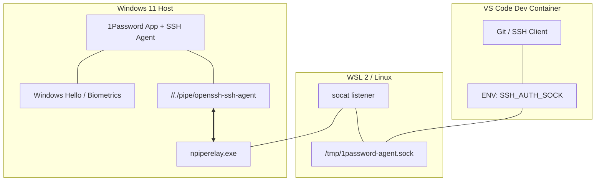
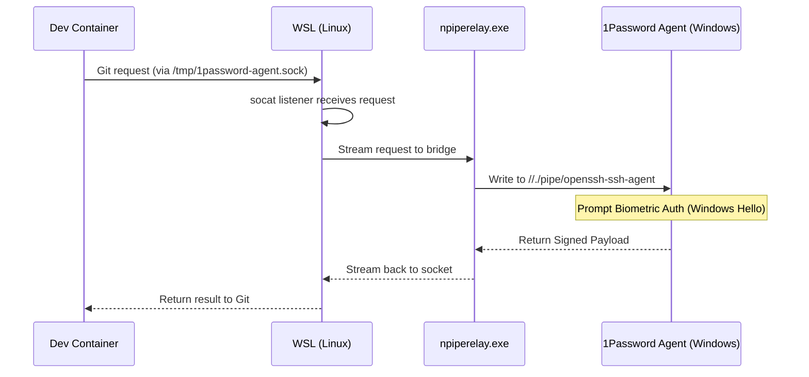

## 🎯 TL;DR

Moving your development into Dev Containers offers incredible flexibility and isolation, but it breaks the standard "WSL mount" configuration for 1Password. This guide shows you how to bridge the 1Password SSH agent from Windows into your containers using a network socket, ensuring your biometric Git signing works everywhere, without leaking private keys

Choose your path:

- 🚀 [Quick start](#quick-start) (10 min) - Jump straight to the bridge implementation
- 👀 [See results](#results) (2 min) - What "Verified" looks like in the terminal
- 🧠 [How it works](#how-it-works) (10 min) - Understanding the **npiperelay socket bridge**

## ✨ Why This Matters (30 Seconds)

Modern development on Windows has reached a "sweet spot": we get the native Linux performance of **WSL2** combined with the clean, reproducible isolation of **Dev Containers**. However, this multi-layered architecture often leaves our security credentials stranded.

By bridging 1Password into this stack, you leverage the biometric hardware of your Windows machine (Windows Hello) to authenticate inside isolated Linux environments. You gain the flexibility of a containerized workflow without the risk of scattering private keys across various virtual filesystems.

> "The best security is the one that's so easy you actually use it."

## 💡 The Problem (In 60 Seconds)

If you are working strictly in WSL2, you might be tempted to simply point your `.gitconfig` to the Windows 1Password binary via the `/mnt/c/` mount. While this "works" on the surface, it creates a brittle setup that breaks the moment you move toward a more modern, containerized workflow.

**The challenge:**

- 📝 **The "Mount" Trap**: Referencing `op-ssh-sign.exe` directly in your WSL `.gitconfig` works locally, but that path is non-existent inside a Dev Container.
- 🔍 **Dev Container Silos**: Containers are isolated by design; they don't have access to your Windows host's filesystem mounts or its Named Pipes.
- 🏢 **Path Inconsistency**: Different dev environments have different mount points, making hardcoded paths a maintenance nightmare

 Managing separate SSH keys for your host and your containers increases your attack surface and makes key rotation a nightmare. 

## ✅ The Solution

By using `socat` and `npiperelay`, we create a "wormhole" (a Unix socket) between your Linux environment and the Windows 1Password agent.

**What you get:**

- ✅ **Biometric Auth**: Sign commits and push to GitHub, GitLab, or Azure DevOps using Windows Hello.
- ✅ **Centralized Vault**: No private keys stored in `~/.ssh/` on Linux.
- ✅ **Vault Isolation**: Configure 1Password to only share specific keys (e.g., your Work vault) with the agent.
- ✅ **Universal Config**: The same Git configuration works on Windows, WSL, and inside any Dev Container.

## 🏗️ System Architecture

To understand how the bridge functions, it's helpful to visualize the physical layering of the tools.



<span id="quick-start"></span>

## 🚀 Quick Start

### Prerequisites

- Git for Windows installed and you have configured your global user name and email
- 1Password 8+ for Windows (with Windows Hello configured).
- WSL 2 with `systemd` enabled. If you have installed Ubuntu via the `wsl --install` command, you will have systemd enabled by default, otherwise you can follow the following instructions official documentation.
- `npiperelay.exe` downloaded and added to your Windows `%PATH%`. You can find the instructions in the official repo of npiperelay or download the release and unzip it, just make sure that it's located inside your Windows `%PATH%`. In this tutorial we will create a `bin` folder inside our Windows home folder and we will extract the file `npiperelay.exe` from the release zip in the `bin` folder.

### Step 1: Configure the Windows Host

In 1Password, go to **Settings > Developer** and check **Use the 1Password SSH agent**. Follow the official 1Password guide

**Security Tip**: Under the agent settings, you can restrict access to specific vaults to ensure personal keys aren't exposed to your dev environment. You can follow the official Agent config file.

Open a Windows PowerShell and verify the agent is working:

```powershell
ssh-add -l
```

_If you see your keys, the host layer is ready._

### Step 2: Create the WSL Bridge

We will now set up the bridge inside WSL. Follow these steps sequentially:

**Install Dependencies** Ensure your WSL environment has `socat` installed to handle the socket relay.

```bash
sudo apt update && sudo apt install socat -y
```

**Prepare the Systemd Directory** Create the local user directory for systemd services if it doesn't already exist.

```bash
mkdir -p ~/.config/systemd/user/
```

**Create the Bridge Service** Create the service file. This service will automatically start the bridge whenever you log into WSL. Replace `[username]` with your actual Windows username.

```text
cat <<EOT > ~/.config/systemd/user/1password-ssh-agent.service
[Unit]
Description=Bridge 1Password SSH Agent from Windows

[Service]
Type=simple
ExecStart=/usr/bin/socat -d -d UNIX-LISTEN:"/tmp/1password-agent.sock",fork EXEC:"/mnt/c/Users/[username]/bin/npiperelay.exe -ei -s //./pipe/openssh-ssh-agent",nofork
ExecStop=rm -f /tmp/1password-agent.sock
Restart=Always

[Install]
WantedBy=default.target
EOT
```

**Enable and Start the Service** Reload the systemd manager, then enable and start the bridge immediately.

```bash
systemctl --user daemon-reload
systemctl --user enable --now 1password-ssh-agent.service
```

**Verify the Socket** Confirm that the bridge service has successfully created the Unix socket.

```bash
ls -la /tmp/1password-agent.sock
```

**Export Environment Variable** for `ssh-add` and Git to find the bridge, you must set the `SSH_AUTH_SOCK` environment variable in your shell profile (`~/.bashrc` or `~/.zshrc`).

You can append the variable automatically using the command below:

```bash
# This appends the export line safely to the end of your profile
echo 'export SSH_AUTH_SOCK=/tmp/1password-agent.sock' >> ~/.bashrc
```

Alternatively, manually add this line to the end of your profile file:

```bash
export SSH_AUTH_SOCK=/tmp/1password-agent.sock
```

Finally, reload your profile:

```bash
# For Bashbash
source ~/.bashrc

# For Zsh
source ~/.zshrc
```

### Step 3: Configure Git Signing & Verification

For Git to sign and verify signatures locally (not just on GitHub), you need to configure an "Allowed Signers" file and ensure your signing key matches what 1Password provides.

**3.1 Match your Signing Key** Run `ssh-add -L` in WSL and copy the public key string (e.g., `ssh-ed25519 AAA...`). This string **must** match your Git config for signing to work.

```bash
git config --global gpg.format ssh
git config --global user.signingkey "YOUR_SSH_ED25519_PUBLIC_KEY_STRING"
git config --global commit.gpgsign true
```

**3.2 Create Allowed Signers File** This allows Git to verify your own signatures locally. Replace the email and key with your own.

```bash
# Add yourself to the allowed signers
echo "$(git config --global user.email) YOUR_SSH_ED25519_PUBLIC_KEY_STRING" > ~/.ssh/allowed_signers
git config --global gpg.ssh.allowedSignersFile ~/.ssh/allowed_signers
```

<span id="how-it-works"></span>

## 🧠 How It Works (Deep Dive)

### Authentication Flow



<span id="results"></span>

## 📊 Results & Troubleshooting

### Verifying Results

To check if your setup is signing and verifying correctly, create a commit and then run:

```bash
git log --show-signature
```





You should see: `Good "ssh" signature for [email] with key ...`

---

Photo by Bernd 📷 Dittrich on Unsplash
