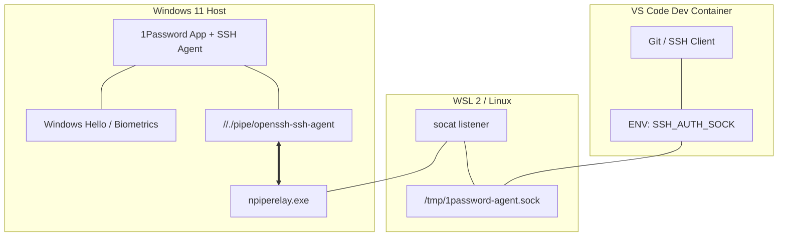
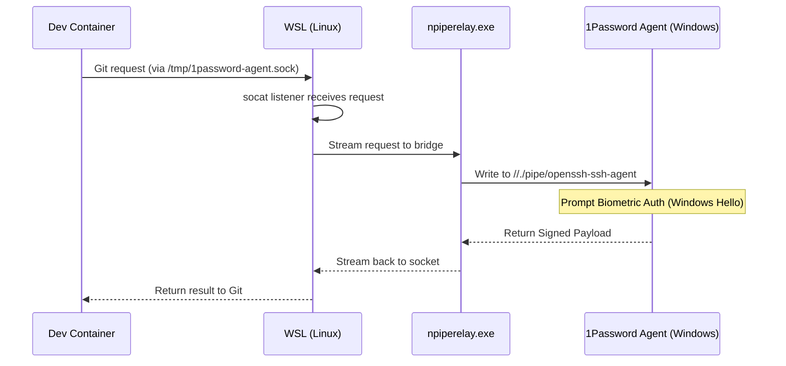

## 🎯 TL;DR

Mover tu desarrollo a Dev Containers ofrece muchísima flexibilidad y aislamiento, pero rompe la configuración estándar basada en el montaje de WSL para 1Password. Esta guía te muestra cómo tender un puente del agente SSH de 1Password desde Windows hacia tus contenedores usando un socket, para que la firma biométrica de Git funcione en todas partes, sin exponer tus llaves privadas.

Elige tu camino:

- 🚀 [Inicio rápido](#quick-start) (10 min) - Ve directo a la implementación del puente
- 👀 [Ver resultados](#results) (2 min) - Así se ve "Verified" en la terminal
- 🧠 [Cómo funciona](#how-it-works) (10 min) - Entender el **puente de sockets con npiperelay**

## ✨ Por qué importa (30 segundos)

El desarrollo moderno en Windows ha llegado a un "punto ideal": tenemos el rendimiento nativo de Linux de **WSL2** combinado con el aislamiento limpio y reproducible de **Dev Containers**. Sin embargo, esta arquitectura por capas muchas veces deja nuestras credenciales de seguridad varadas.

Al tender un puente de 1Password hacia este stack, aprovechas el hardware biométrico de tu máquina Windows (Windows Hello) para autenticarte dentro de entornos Linux aislados. Obtienes la flexibilidad de un flujo de trabajo en contenedores sin el riesgo de dispersar llaves privadas en varios sistemas de archivos virtuales.

> "La mejor seguridad es la que es tan fácil que realmente la usas."

## 💡 El problema (en 60 segundos)

Si estás trabajando estrictamente en WSL2, puede tentarte simplemente apuntar tu `.gitconfig` al binario de 1Password en Windows vía el montaje `/mnt/c/`. Aunque esto "funciona" en apariencia, crea una configuración frágil que se rompe en cuanto te mueves hacia un flujo de trabajo más moderno y basado en contenedores.

**El reto:**

- 📝 **La trampa del "mount"**: Referenciar `op-ssh-sign.exe` directamente en tu `.gitconfig` de WSL funciona localmente, pero esa ruta no existe dentro de un Dev Container.
- 🔍 **Silos de Dev Container**: Los contenedores están aislados por diseño; no tienen acceso a los montajes del sistema de archivos de tu host Windows ni a sus Named Pipes.
- 🏢 **Inconsistencia de rutas**: Distintos entornos de desarrollo tienen distintos puntos de montaje, lo cual vuelve las rutas hardcodeadas una pesadilla de mantenimiento

 Administrar llaves SSH separadas para tu host y tus contenedores aumenta tu superficie de ataque y vuelve la rotación de llaves una pesadilla. 

## ✅ La solución

Usando `socat` y `npiperelay`, creamos un "agujero de gusano" (un socket Unix) entre tu entorno Linux y el agente de 1Password en Windows.

**Lo que obtienes:**

- ✅ **Autenticación biométrica**: Firma commits y haz push a GitHub, GitLab o Azure DevOps usando Windows Hello.
- ✅ **Bóveda centralizada**: No hay llaves privadas guardadas en `~/.ssh/` en Linux.
- ✅ **Aislamiento por bóveda**: Configura 1Password para que el agente solo comparta llaves específicas (por ejemplo, tu bóveda de Trabajo).
- ✅ **Configuración universal**: La misma configuración de Git funciona en Windows, WSL y dentro de cualquier Dev Container.

## 🏗️ Arquitectura del sistema

Para entender cómo funciona el puente, ayuda visualizar el apilamiento físico de las herramientas.



<span id="quick-start"></span>

## 🚀 Inicio rápido

### Prerrequisitos

- Git for Windows instalado y ya configuraste tu nombre de usuario y correo global
- 1Password 8+ para Windows (con Windows Hello configurado).
- WSL 2 con `systemd` habilitado. Si instalaste Ubuntu con el comando `wsl --install`, tendrás systemd habilitado por defecto; de lo contrario, puedes seguir estas instrucciones en la documentación oficial.
- `npiperelay.exe` descargado y agregado a tu Windows `%PATH%`. Puedes encontrar instrucciones en el repo oficial de npiperelay o descargar el release y descomprimirlo. Solo asegúrate de que quede dentro de tu Windows `%PATH%`. En este tutorial crearemos una carpeta `bin` dentro de nuestro home de Windows y extraeremos el archivo `npiperelay.exe` del zip del release en la carpeta `bin`.

### Paso 1: Configura el host de Windows

En 1Password, ve a **Settings > Developer** y marca **Use the 1Password SSH agent**. Sigue la guía de 1Password.

**Tip de seguridad**: En la configuración del agente, puedes restringir el acceso a bóvedas específicas para asegurar que las llaves personales no queden expuestas a tu entorno de desarrollo. Puedes seguir la configuración del archivo del agente.

Abre Windows PowerShell y verifica que el agente esté funcionando:

```powershell
ssh-add -l
```

_Si ves tus llaves, la capa del host está lista._

### Paso 2: Crea el puente en WSL

Ahora configuraremos el puente dentro de WSL. Sigue estos pasos en orden:

**Instala dependencias** Asegúrate de que tu entorno WSL tenga `socat` instalado para manejar el reenvío del socket.

```bash
sudo apt update && sudo apt install socat -y
```

**Prepara el directorio de systemd** Crea el directorio local del usuario para servicios systemd si aún no existe.

```bash
mkdir -p ~/.config/systemd/user/
```

**Crea el servicio del puente** Crea el archivo del servicio. Este servicio iniciará el puente automáticamente cada vez que inicies sesión en WSL. Reemplaza `[username]` con tu usuario real de Windows.

```text
cat <<EOT > ~/.config/systemd/user/1password-ssh-agent.service
[Unit]
Description=Bridge 1Password SSH Agent from Windows

[Service]
Type=simple
ExecStart=/usr/bin/socat -d -d UNIX-LISTEN:"/tmp/1password-agent.sock",fork EXEC:"/mnt/c/Users/[username]/bin/npiperelay.exe -ei -s //./pipe/openssh-ssh-agent",nofork
ExecStop=rm -f /tmp/1password-agent.sock
Restart=Always

[Install]
WantedBy=default.target
EOT
```

**Habilita e inicia el servicio** Recarga el administrador de systemd, luego habilita e inicia el puente de inmediato.

```bash
systemctl --user daemon-reload
systemctl --user enable --now 1password-ssh-agent.service
```

**Verifica el socket** Confirma que el servicio del puente haya creado exitosamente el socket Unix.

```bash
ls -la /tmp/1password-agent.sock
```

**Exporta la variable de entorno** Para que `ssh-add` y Git encuentren el puente, debes configurar la variable de entorno `SSH_AUTH_SOCK` en el perfil de tu shell (`~/.bashrc` o `~/.zshrc`).

Puedes agregar la variable automáticamente usando el comando de abajo:

```bash
# This appends the export line safely to the end of your profile
echo 'export SSH_AUTH_SOCK=/tmp/1password-agent.sock' >> ~/.bashrc
```

Alternativamente, agrega manualmente esta línea al final de tu archivo de perfil:

```bash
export SSH_AUTH_SOCK=/tmp/1password-agent.sock
```

Por último, recarga tu perfil:

```bash
# For Bashbash
source ~/.bashrc

# For Zsh
source ~/.zshrc
```

### Paso 3: Configura la firma y verificación de Git

Para que Git firme y verifique firmas localmente (no solo en GitHub), necesitas configurar un archivo de firmantes permitidos ("Allowed Signers") y asegurarte de que tu llave de firma coincida con lo que 1Password entrega.

**3.1 Haz coincidir tu llave de firma** Ejecuta `ssh-add -L` en WSL y copia la cadena completa de la llave pública (por ejemplo, `ssh-ed25519 AAA...`). Esta cadena **debe** coincidir con tu configuración de Git para que la firma funcione.

```bash
git config --global gpg.format ssh
git config --global user.signingkey "YOUR_SSH_ED25519_PUBLIC_KEY_STRING"
git config --global commit.gpgsign true
```

**3.2 Crea el archivo Allowed Signers** Esto le permite a Git verificar tus propias firmas localmente. Reemplaza el correo y la llave por los tuyos.

```bash
# Add yourself to the allowed signers
echo "$(git config --global user.email) YOUR_SSH_ED25519_PUBLIC_KEY_STRING" > ~/.ssh/allowed_signers
git config --global gpg.ssh.allowedSignersFile ~/.ssh/allowed_signers
```

<span id="how-it-works"></span>

## 🧠 Cómo funciona (en profundidad)

### Flujo de autenticación



<span id="results"></span>

## 📊 Resultados y solución de problemas

### Verificar resultados

Para comprobar si tu configuración está firmando y verificando correctamente, crea un commit y luego ejecuta:

```bash
git log --show-signature
```





Deberías ver: `Good "ssh" signature for [email] with ED25519 key ...`
