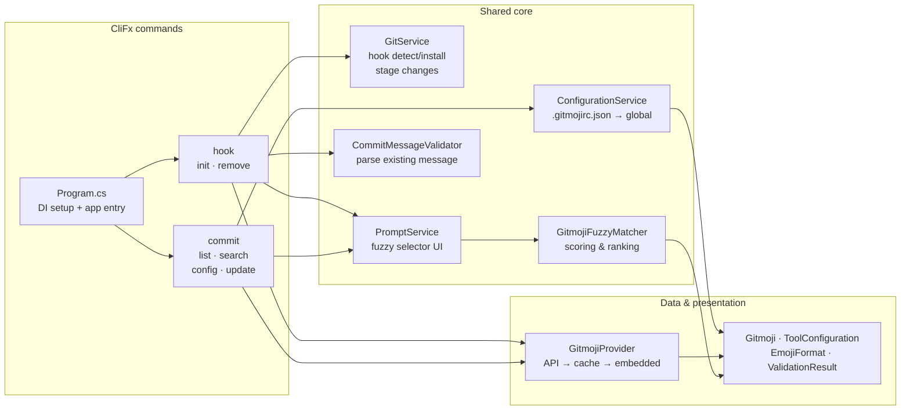
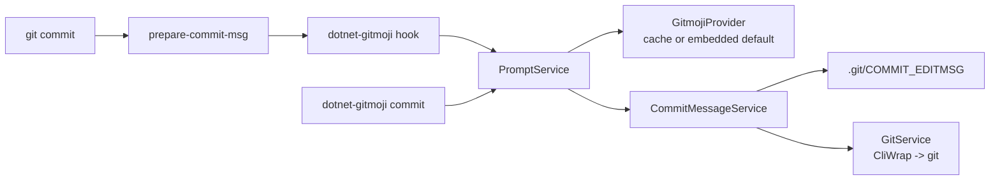

## Project Description

`dotnet-gitmoji` is a small .NET 10 global tool that brings the [gitmoji](https://gitmoji.dev) commit convention into a .NET workflow. You install it once with `dotnet tool install`, and it gives you two ways to adopt the convention: a `prepare-commit-msg` Git hook that runs on every `git commit`, or `dotnet-gitmoji commit` as a drop-in replacement for the native Git command. Either way, the tool prompts you for a gitmoji, lets you fuzzy-search the full list, and formats the final commit message.

The project exists because I wanted gitmoji-cli's experience inside .NET repos without installing Node.js on every machine that would ever touch the repo. The .NET ecosystem already has a first-class tool distribution story through NuGet, and I wanted the gitmoji convention to ride on that story instead of a second runtime.

## Technologies Used

<div class="table-container">
  <table>
    <tr>
      <th>Layer</th>
      <th>Choice</th>
      <th>Why it is in the stack</th>
    </tr>
    <tr>
      <td><strong>Runtime</strong></td>
      <td>.NET 10</td>
      <td>Modern target with first-class global tool support and a stable <code>System.Text.Json</code> baseline.</td>
    </tr>
    <tr>
      <td><strong>Packaging</strong></td>
      <td>.NET global tool</td>
      <td>Ships through NuGet as <code>dotnet-gitmoji</code>. No extra runtime if the user already has the .NET SDK.</td>
    </tr>
    <tr>
      <td><strong>CLI framework</strong></td>
      <td>CliFx</td>
      <td>Declarative command and option attributes, plays well with DI without extra ceremony.</td>
    </tr>
    <tr>
      <td><strong>Terminal UX</strong></td>
      <td>Spectre.Console</td>
      <td>Handles selection prompts, live fuzzy pickers, and colored output.</td>
    </tr>
    <tr>
      <td><strong>Process invocation</strong></td>
      <td>CliWrap</td>
      <td>Wraps every <code>git</code> and <code>dotnet</code> subprocess call with a typed, test-friendly API.</td>
    </tr>
    <tr>
      <td><strong>Composition</strong></td>
      <td>Microsoft.Extensions.DependencyInjection</td>
      <td>Keeps services, validators, and commands wired through a single container.</td>
    </tr>
    <tr>
      <td><strong>HTTP</strong></td>
      <td>Microsoft.Extensions.Http</td>
      <td>Fetches the gitmoji list from <code>gitmoji.dev</code> with a typed <code>HttpClient</code>.</td>
    </tr>
    <tr>
      <td><strong>Testing</strong></td>
      <td>xUnit, NSubstitute, coverlet</td>
      <td>Unit tests for services and validators, plus an integration fixture for the end-to-end tool.</td>
    </tr>
  </table>
</div>

## Architecture

The tool follows a standard CliFx layout. `Program.cs` wires the DI container, CliFx resolves the requested command from the service provider, and the command delegates the real work to a service. Services are interface-first, which is what makes the xUnit and NSubstitute tests cheap to write. The same commit path is reached from both entry points: Git's `prepare-commit-msg` hook and the interactive `commit` command.



The architecture diagram shows what each layer owns. The sequence diagram below shows what actually runs when you commit. Both entry points converge on `PromptService`, which drives the fuzzy selector and then hands off to `CommitMessageService` to write the result. The only difference is who calls `git commit` at the end: in hook mode Git already has control, so the tool just rewrites the message file; in client mode `GitService` shells out to Git directly.



## Key Features

**Hook mode.** `dotnet-gitmoji init` installs a `prepare-commit-msg` hook that intercepts every `git commit`. If you pass `-m "fix login"`, that message pre-fills as the title suggestion and the hook only prompts for the emoji.

**Client mode.** `dotnet-gitmoji commit` acts as a drop-in for `git commit`. It is disabled when the hook is already installed, so the emoji never gets applied twice.

**Fuzzy search.** `dotnet-gitmoji search <keyword>` and the live picker share the same fuzzy matcher, which searches by emoji name, shortcode, and description.

**Husky.Net integration.** If the repo uses Husky.Net, `init --mode shell` appends to `.husky/prepare-commit-msg`, and `init --mode task-runner` registers a task in `.husky/task-runner.json`. A standalone hook is only installed when neither mode is requested.

**Config resolution chain.** The tool reads `.gitmojirc.json` from the repo root first (walking up parent directories), then `~/.dotnet-gitmoji/config.json`, then built-in defaults. Team settings live with the repo, personal overrides stay in the home directory.

**Local and global install parity.** The tool detects whether it was installed globally or per-project, and writes the correct invocation (`dotnet-gitmoji` or `dotnet tool run dotnet-gitmoji`) into the generated hook script.

## Technical challenges



Git invokes `prepare-commit-msg` with stdin redirected away from the terminal, so Spectre.Console's interactive prompts refuse to draw. Without a fix, the hook fails on the very first commit.


I reopen stdin from the terminal device before any code reads `Console.IsInputRedirected`. The tool does this in `Program.Main` through a `TtyConsoleInput.TryReopenStdin()` helper, which is a harmless no-op when stdin is already a TTY (client mode).

```csharp
public static async Task<int> Main(string[] args)
{
    TtyConsoleInput.TryReopenStdin();
    // DI container and CliFx application follow
}
```






A .NET tool can be installed globally or per-project, and the generated hook needs a different command in each case. Hard-coding one breaks the other.


I made `InitCommand` detect the installation kind at hook-generation time and write either `dotnet-gitmoji hook` or `dotnet tool run dotnet-gitmoji hook` into the script. The same logic feeds the Husky.Net shell and task-runner modes, so the three hook paths stay consistent.

```csharp
// GitService.cs — detects local vs. global tool manifest at hook-generation time
private async Task<bool> IsLocalToolManifestAsync()
{
    var repoRoot = await GetRepositoryRootAsync();
    var manifestPath = Path.Combine(repoRoot, ".config", "dotnet-tools.json");

    if (!File.Exists(manifestPath))
        return false;

    var json = await File.ReadAllTextAsync(manifestPath);
    var node = JsonNode.Parse(json);
    var tools = node?["tools"] as JsonObject;
    return tools?.ContainsKey("dotnet-gitmoji") ?? false;
}

private async Task<string> BuildShellHookCommandAsync()
{
    var isLocal = await IsLocalToolManifestAsync();
    var invocation = isLocal ? "dotnet tool run dotnet-gitmoji" : "dotnet-gitmoji";
    return $"{invocation} \"$1\" \"$2\"";
}
```






Running both the hook and `dotnet-gitmoji commit` in the same repo would prefix the emoji twice. Detecting this late, at commit time, is fragile.


I disabled client mode whenever the hook is detected, at the very start of `CommitCommand`. The message explains why and points to `remove` as the opt-out. One tool, one place that writes the emoji.

```csharp
// CommitCommand.cs — guard at the top of ExecuteAsync
public async ValueTask ExecuteAsync(IConsole console)
{
    if (await _gitService.IsHookInstalledAsync())
    {
        await console.Error.WriteLineAsync(
            "Error: The prepare-commit-msg hook is already configured to use dotnet-gitmoji.\n" +
            "Using both hook mode and client mode would apply the emoji twice.\n\n" +
            "Either:\n" +
            "  • Use 'git commit' and let the hook handle it (hook mode)\n" +
            "  • Remove the hook from .husky/prepare-commit-msg and use 'dotnet-gitmoji commit' (client mode)");
        throw new CommandException("Cannot use client mode while hook is installed.", 1);
    }

    // ... rest of commit flow
}
```

```csharp
// Checks .config/dotnet-tools.json for a local tool manifest entry
private async Task<bool> IsLocalToolManifestAsync()
{
    var repoRoot = await GetRepositoryRootAsync();
    var manifestPath = Path.Combine(repoRoot, ".config", "dotnet-tools.json");

    if (!File.Exists(manifestPath))
        return false;

    var json = await File.ReadAllTextAsync(manifestPath);
    var node = JsonNode.Parse(json);
    var tools = node?["tools"] as JsonObject;
    return tools?.ContainsKey("dotnet-gitmoji") ?? false;
}
```






The gitmoji list lives at `gitmoji.dev/api/gitmojis`. Hitting the network on every commit would be slow and fragile, but shipping a stale list penalises teams that want the newest emojis.


I embedded `gitmojis.default.json` as a resource for the offline default, and exposed `dotnet-gitmoji update` to refresh a cached copy under `~/.dotnet-gitmoji/`. `GitmojiProvider` reads cache first, falls back to the embedded default, and only hits HTTP on `update`.



## What this project demonstrates

<div class="table-container">
  <table>
    <tr>
      <th>Area</th>
      <th>Evidence</th>
    </tr>
    <tr>
      <td><strong>.NET 10 tool packaging</strong></td>
      <td><code>PackAsTool</code>, <code>ToolCommandName</code>, and <code>PackageId</code> in <code>DotnetGitmoji.csproj</code>. Ships to NuGet as <code>dotnet-gitmoji</code>.</td>
    </tr>
    <tr>
      <td><strong>CLI architecture</strong></td>
      <td>CliFx commands resolved through DI, clean separation between <code>Commands/</code>, <code>Services/</code>, <code>Validators/</code>, and <code>Models/</code>.</td>
    </tr>
    <tr>
      <td><strong>Git interop</strong></td>
      <td>CliWrap wraps every <code>git</code> call, the tool writes <code>prepare-commit-msg</code> hook scripts, and it integrates with Husky.Net's shell and task-runner modes.</td>
    </tr>
    <tr>
      <td><strong>Terminal UX</strong></td>
      <td>Spectre.Console selection prompts, fuzzy search by name and shortcode, capitalized titles, and an optional scope prompt.</td>
    </tr>
    <tr>
      <td><strong>Testability</strong></td>
      <td>Interface-first services, xUnit unit tests, NSubstitute for doubles, and a <code>ToolIntegrationFixture</code> for end-to-end coverage.</td>
    </tr>
    <tr>
      <td><strong>Config layering</strong></td>
      <td>Repo <code>.gitmojirc.json</code>, personal global config under <code>~/.dotnet-gitmoji/</code>, and built-in defaults, resolved in that order.</td>
    </tr>
  </table>
</div>

## Results

<div class="table-container">
  <table>
    <tr>
      <th>Outcome</th>
      <th>Evidence</th>
    </tr>
    <tr>
      <td><strong>Published as a .NET global tool</strong></td>
      <td>Version 0.2.0 on NuGet at <a href="https://www.nuget.org/packages/dotnet-gitmoji">nuget.org/packages/dotnet-gitmoji</a>.</td>
    </tr>
    <tr>
      <td><strong>Removes the Node.js dependency</strong></td>
      <td>A .NET repo that wants the gitmoji convention no longer has to provision Node on every machine. The .NET SDK is enough.</td>
    </tr>
    <tr>
      <td><strong>Two adoption paths</strong></td>
      <td>Teams pick the <code>prepare-commit-msg</code> hook for a forced workflow, or <code>dotnet-gitmoji commit</code> for an opt-in one. Husky.Net users get a first-class integration.</td>
    </tr>
    <tr>
      <td><strong>Config travels with the repo</strong></td>
      <td><code>.gitmojirc.json</code> at the repo root is shared through Git. Personal preferences stay under <code>~/.dotnet-gitmoji/</code>.</td>
    </tr>
  </table>
</div>

The product read is simple: the gitmoji convention is now a one-line `dotnet tool install` away, and the whole toolchain stays inside the .NET ecosystem.

## Links

1. Repository: dotnet-gitmoji
2. NuGet package: dotnet-gitmoji
3. gitmoji convention: gitmoji.dev
4. Husky.Net: Husky.Net
