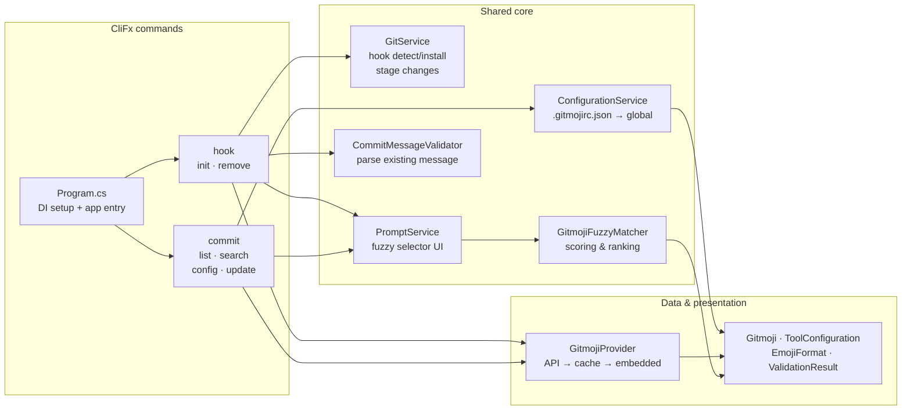
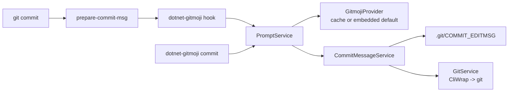

## Descripción del proyecto

`dotnet-gitmoji` es una pequeña herramienta (`dotnet tool`) que trae la convención de commits de [gitmoji](https://gitmoji.dev) a un flujo .NET. La instalas una sola vez con `dotnet tool install`, y te brinda dos maneras de adoptar la convención: un hook `prepare-commit-msg` que corre en cada `git commit`, o `dotnet-gitmoji commit` como reemplazo directo del comando nativo de Git. En cualquiera de los dos caminos, la herramienta te requiere un gitmoji, te permite hacer fuzzy search sobre la lista completa, y formatea el mensaje de commit final.

El proyecto existe porque quería la misma experiencia de gitmoji-cli dentro de proyectos de .NET, sin tener que instalar Node.js en cada máquina que fuera a tocar el repo. El ecosistema .NET distribuye herramientas de primera a través de NuGet, y quería que la convención de gitmoji viajara sobre ese canal y no sobre un segundo runtime.

## Tecnologías utilizadas

<div class="table-container">
  <table>
    <tr>
      <th>Capa</th>
      <th>Elección</th>
      <th>Por qué está en el stack</th>
    </tr>
    <tr>
      <td><strong>Runtime</strong></td>
      <td>.NET 10</td>
      <td>Target moderno con soporte de primera para global tools y una línea base estable de <code>System.Text.Json</code>.</td>
    </tr>
    <tr>
      <td><strong>Empaquetado</strong></td>
      <td>.NET global tool</td>
      <td>Se publica en NuGet como <code>dotnet-gitmoji</code>. No hay runtime extra si el usuario ya tiene el .NET SDK.</td>
    </tr>
    <tr>
      <td><strong>CLI framework</strong></td>
      <td>CliFx</td>
      <td>Atributos declarativos para comandos y opciones, y juega bien con DI sin configuración adicional.</td>
    </tr>
    <tr>
      <td><strong>UX de terminal</strong></td>
      <td>Spectre.Console</td>
      <td>Manejo de prompts de selección, pickers con fuzzy search en vivo y salida con color.</td>
    </tr>
    <tr>
      <td><strong>Invocación de procesos</strong></td>
      <td>CliWrap</td>
      <td>Envuelve cada llamada a <code>git</code> y <code>dotnet</code> con una API tipada y amigable para tests.</td>
    </tr>
    <tr>
      <td><strong>Composición</strong></td>
      <td>Microsoft.Extensions.DependencyInjection</td>
      <td>Mantiene servicios, validadores y comandos cableados a través de un solo contenedor.</td>
    </tr>
    <tr>
      <td><strong>HTTP</strong></td>
      <td>Microsoft.Extensions.Http</td>
      <td>Trae la lista de gitmoji desde <code>gitmoji.dev</code> con un <code>HttpClient</code> tipado.</td>
    </tr>
    <tr>
      <td><strong>Testing</strong></td>
      <td>xUnit, NSubstitute, coverlet</td>
      <td>Tests unitarios para servicios y validadores, además de un fixture de integración para la herramienta de extremo a extremo.</td>
    </tr>
  </table>
</div>

## Arquitectura

La herramienta sigue la estructura estándar de CliFx. `Program.cs` configura el contenedor de DI, CliFx resuelve el comando pedido desde el service provider, y el comando delega el trabajo real a un servicio. Los servicios son interface-first, y eso es lo que hace que los tests con xUnit y NSubstitute sean fáciles de escribir. Al mismo flujo de commit se accede desde dos puntos de entrada: el hook `prepare-commit-msg` de Git y el comando interactivo `commit`.



El diagrama de arquitectura muestra de qué se encarga cada capa. El diagrama de secuencia de abajo muestra qué se ejecuta realmente al hacer un commit. Ambos puntos de entrada convergen en `PromptService`, que controla el selector difuso (fuzzy) y luego delega en `CommitMessageService` la escritura del resultado. La única diferencia está en quién invoca `git commit` al final: en modo hook, Git ya tiene el control, así que la herramienta simplemente reescribe el archivo del mensaje; en modo cliente, `GitService` invoca Git directamente.



## Características clave

**Modo hook.** `dotnet-gitmoji init` instala un hook `prepare-commit-msg` que intercepta cada `git commit`. Si pasas `-m "fix login"`, ese mensaje aparece pre-cargado como sugerencia de título y el hook sólo te pide el emoji.

**Modo cliente.** `dotnet-gitmoji commit` actúa como reemplazo directo de `git commit`. Se desactiva cuando el hook ya está instalado, para que el emoji nunca se aplique dos veces.

**Fuzzy search.** `dotnet-gitmoji search <keyword>` y el picker en vivo comparten el mismo fuzzy matcher, que busca por nombre, shortcode y descripción del emoji.

**Integración con Husky.Net.** Si el repo usa Husky.Net, `init --mode shell` agrega al archivo `.husky/prepare-commit-msg`, e `init --mode task-runner` registra una tarea en `.husky/task-runner.json`. El hook independiente sólo se instala cuando no se pide ninguno de los dos modos.

**Cadena de resolución de config.** La herramienta lee primero `.gitmojirc.json` desde la raíz del repo (subiendo por los directorios padre), después `~/.dotnet-gitmoji/config.json`, y al final los defaults incluidos. Los ajustes de equipo viajan con el repo, y las preferencias personales se quedan en el home.

**Paridad entre instalación local y global.** La herramienta detecta si fue instalada de forma global o por proyecto, y escribe la invocación correcta (`dotnet-gitmoji` o `dotnet tool run dotnet-gitmoji`) dentro del script de hook generado.

## Retos técnicos



Git invoca `prepare-commit-msg` con stdin redirigido lejos de la terminal, así que los prompts interactivos de Spectre.Console se niegan a dibujarse. Sin un arreglo, el hook falla en el primer commit.


En este caso opté por reabrir stdin desde el dispositivo de terminal antes de que cualquier código lea `Console.IsInputRedirected`. La herramienta hace esto dentro de `Program.Main` a través del helper `TtyConsoleInput.TryReopenStdin()`, que es un no-op inocuo cuando stdin ya es un TTY (modo cliente).

```csharp
public static async Task<int> Main(string[] args)
{
    TtyConsoleInput.TryReopenStdin();
    // DI container and CliFx application follow
}
```






Una .NET tool se puede instalar de forma global o por proyecto, y el hook generado necesita un comando distinto en cada caso. Al establecer uno, rompe el otro.


Hice que `InitCommand` detecte el tipo de instalación al momento de generar el hook, y escriba en el script `dotnet-gitmoji hook` o `dotnet tool run dotnet-gitmoji hook`. La misma lógica alimenta los modos shell y task-runner de Husky.Net, así que las tres rutas de hook se mantienen consistentes.

```csharp
// GitService.cs — detects local vs. global tool manifest at hook-generation time
private async Task<bool> IsLocalToolManifestAsync()
{
    var repoRoot = await GetRepositoryRootAsync();
    var manifestPath = Path.Combine(repoRoot, ".config", "dotnet-tools.json");

    if (!File.Exists(manifestPath))
        return false;

    var json = await File.ReadAllTextAsync(manifestPath);
    var node = JsonNode.Parse(json);
    var tools = node?["tools"] as JsonObject;
    return tools?.ContainsKey("dotnet-gitmoji") ?? false;
}

private async Task<string> BuildShellHookCommandAsync()
{
    var isLocal = await IsLocalToolManifestAsync();
    var invocation = isLocal ? "dotnet tool run dotnet-gitmoji" : "dotnet-gitmoji";
    return $"{invocation} \"$1\" \"$2\"";
}
```






Ejecutar tanto el hook como `dotnet-gitmoji commit` en el mismo repositorio haría que el emoji se prefijara dos veces. Detectarlo tan tarde, en el momento del commit, es una solución frágil.


Desactivé el modo cliente cada vez que se detecta el hook, al inicio de `CommitCommand`. El mensaje explica por qué y apunta a `remove` como salida. Una sola herramienta, un solo lugar que escribe el emoji.

```csharp
// CommitCommand.cs — guard at the top of ExecuteAsync
public async ValueTask ExecuteAsync(IConsole console)
{
    if (await _gitService.IsHookInstalledAsync())
    {
        await console.Error.WriteLineAsync(
            "Error: The prepare-commit-msg hook is already configured to use dotnet-gitmoji.\n" +
            "Using both hook mode and client mode would apply the emoji twice.\n\n" +
            "Either:\n" +
            "  • Use 'git commit' and let the hook handle it (hook mode)\n" +
            "  • Remove the hook from .husky/prepare-commit-msg and use 'dotnet-gitmoji commit' (client mode)");
        throw new CommandException("Cannot use client mode while hook is installed.", 1);
    }

    // ... rest of commit flow
}
```

```csharp
// Checks .config/dotnet-tools.json for a local tool manifest entry
private async Task<bool> IsLocalToolManifestAsync()
{
    var repoRoot = await GetRepositoryRootAsync();
    var manifestPath = Path.Combine(repoRoot, ".config", "dotnet-tools.json");

    if (!File.Exists(manifestPath))
        return false;

    var json = await File.ReadAllTextAsync(manifestPath);
    var node = JsonNode.Parse(json);
    var tools = node?["tools"] as JsonObject;
    return tools?.ContainsKey("dotnet-gitmoji") ?? false;
}
```






La lista de gitmoji vive en `gitmoji.dev/api/gitmojis`. Pegarle a la red en cada commit sería lento y frágil, pero enviar una lista vieja castiga a los equipos que quieren los emojis más nuevos.


Opté por incluir `gitmojis.default.json` como recurso para usarlo como valor predeterminado en modo offline, y expuse `dotnet-gitmoji update` para actualizar una copia en caché en `~/.dotnet-gitmoji/`. `GitmojiProvider` primero lee la caché, recurre al recurso incrustado por defecto y solo hace una petición HTTP durante `update`.



## Lo que este proyecto demuestra

<div class="table-container">
  <table>
    <tr>
      <th>Área</th>
      <th>Evidencia</th>
    </tr>
    <tr>
      <td><strong>Empaquetado de .NET 10 tool</strong></td>
      <td><code>PackAsTool</code>, <code>ToolCommandName</code> y <code>PackageId</code> en <code>DotnetGitmoji.csproj</code>. Se publica en NuGet como <code>dotnet-gitmoji</code>.</td>
    </tr>
    <tr>
      <td><strong>Arquitectura de CLI</strong></td>
      <td>Comandos de CliFx resueltos a través de DI, con separación limpia entre <code>Commands/</code>, <code>Services/</code>, <code>Validators/</code> y <code>Models/</code>.</td>
    </tr>
    <tr>
      <td><strong>Interop con Git</strong></td>
      <td>CliWrap envuelve cada llamada a <code>git</code>, la herramienta escribe scripts de hook <code>prepare-commit-msg</code>, y se integra con los modos shell y task-runner de Husky.Net.</td>
    </tr>
    <tr>
      <td><strong>UX de terminal</strong></td>
      <td>Prompts de selección con Spectre.Console, fuzzy search por nombre y shortcode, capitalización automática del título y un scope prompt opcional.</td>
    </tr>
    <tr>
      <td><strong>Testabilidad</strong></td>
      <td>Servicios interface-first, tests unitarios con xUnit, NSubstitute para dobles y una <code>ToolIntegrationFixture</code> para cobertura de punta a punta.</td>
    </tr>
    <tr>
      <td><strong>Capas de configuración</strong></td>
      <td><code>.gitmojirc.json</code> del repo, config global personal bajo <code>~/.dotnet-gitmoji/</code> y defaults incluidos, resueltos en ese orden.</td>
    </tr>
  </table>
</div>

## Resultados

<div class="table-container">
  <table>
    <tr>
      <th>Resultado</th>
      <th>Evidencia</th>
    </tr>
    <tr>
      <td><strong>Publicada como .NET global tool</strong></td>
      <td>Versión 0.2.0 en NuGet, en <a href="https://www.nuget.org/packages/dotnet-gitmoji">nuget.org/packages/dotnet-gitmoji</a>.</td>
    </tr>
    <tr>
      <td><strong>Sin dependencia de Node.js</strong></td>
      <td>Un repositorio de .NET que quiere la convención de gitmoji ya no tiene que aprovisionar Node en cada máquina. El .NET SDK es más que suficiente.</td>
    </tr>
    <tr>
      <td><strong>Dos caminos de adopción</strong></td>
      <td>Los equipos eligen el hook <code>prepare-commit-msg</code> para un flujo forzado, o <code>dotnet-gitmoji commit</code> para uno opt-in. Los usuarios de Husky.Net tienen integración completa.</td>
    </tr>
    <tr>
      <td><strong>La configuración viaja con el repositorio</strong></td>
      <td><code>.gitmojirc.json</code> en la raíz se comparte por Git. Las preferencias personales se quedan bajo <code>~/.dotnet-gitmoji/</code>.</td>
    </tr>
  </table>
</div>

El resultado es simple: la convención de gitmoji queda a un `dotnet tool install` de distancia, y toda la cadena de herramientas se mantiene dentro del ecosistema .NET.

## Enlaces

- Repositorio: dotnet-gitmoji
- Paquete en NuGet: dotnet-gitmoji
- Convención de gitmoji: gitmoji.dev
- Husky.Net: Husky.Net

---

Foto por Tim Witzdam en Unsplash
