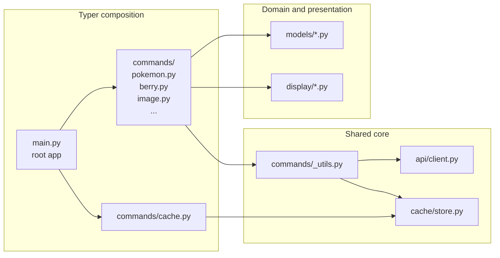
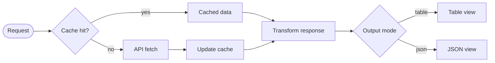

## Project Description

`pokecli` is an open source command-line tool I built to query Pokemon, Berries, Items, Moves, Abilities, Natures, Types, evolution chains, and species data from PokeAPI. It is deliberately small, and it is one of the reference implementations I point to when I talk about how I design a command line tool. The project also doubles as my implementation example for AI-native tooling: `pokecli` ships with a `SKILL.md` that an agent like Claude Code or Copilot can load to learn the command set without re-reading `--help` on every task.





## Technologies Used

<div class="table-container">
  <table>
    <tr>
      <th>Layer</th>
      <th>Choice</th>
      <th>Why it is in the stack</th>
    </tr>
    <tr>
      <td>Language</td>
      <td>Python 3.12+</td>
      <td>Modern typing, structural pattern matching</td>
    </tr>
    <tr>
      <td>CLI framework</td>
      <td>Typer</td>
      <td>Composable sub-apps, native type hints, clean context injection</td>
    </tr>
    <tr>
      <td>Data models</td>
      <td>Pydantic v2</td>
      <td>Strict validation where required, <code>extra="ignore"</code> on every model</td>
    </tr>
    <tr>
      <td>HTTP client</td>
      <td>httpx</td>
      <td>Clean context-manager lifecycle, future async path</td>
    </tr>
    <tr>
      <td>Local cache</td>
      <td>TinyDB</td>
      <td>One JSON file, table per resource, human readable</td>
    </tr>
    <tr>
      <td>Terminal UI</td>
      <td>Rich</td>
      <td>Tables, panels, JSON syntax highlighting, ASCII fallbacks</td>
    </tr>
    <tr>
      <td>Packaging</td>
      <td>uv + uv_build</td>
      <td>Fast resolver, modern <code>src/</code> layout, <code>[project.scripts]</code></td>
    </tr>
    <tr>
      <td>Testing</td>
      <td>pytest</td>
      <td><code>tmp_path</code> cache fixture, one model test file per resource</td>
    </tr>
    <tr>
      <td>Tooling</td>
      <td>ruff, pre-commit</td>
      <td>Formatting, linting, commit hygiene</td>
    </tr>
  </table>
</div>

## Architecture

`pokecli` is organised as five layers that each know about exactly one thing. Commands know Typer. The API client knows httpx. The cache knows TinyDB. The models know Pydantic. The display layer knows Rich. Nothing crosses its lane.



Every `get` command follows the same short pipeline. The module boundaries enforce it, not convention.



### Package layout at a glance

```text
src/pokecli/
├── main.py             # root Typer app, sub-apps registered here
├── config.py           # POKEAPI_BASE_URL, DEFAULT_LIMIT, CACHE_DB_PATH
├── api/client.py       # PokeAPIClient (httpx + context manager)
├── cache/store.py      # CacheStore (TinyDB, table per resource)
├── commands/
│   ├── _utils.py       # fetch_resource, fetch_list
│   ├── pokemon.py      # get / moves / species / evolution / list
│   ├── berry.py  item.py  move.py  ability.py  nature.py  type.py
│   ├── image.py        # download (sprite variants)
│   ├── cache.py        # stats / clear
│   └── install.py      # install --skills
├── display/            # Rich renderers, one file per resource
├── models/             # Pydantic v2 models, one file per resource
└── skills/pokecli/
    ├── SKILL.md
    └── references/api-fields.md
```

## Key Features

These features show the feature set of `pokecli` and the kind of command-line experience I aim to build: small, typed, scriptable, and clear at a glance.

### Resource queries with typed output

Every resource (`pokemon`, `berry`, `item`, `move`, `ability`, `nature`, `type`) has parallel `get` and `list` commands with shared flags (`--no-cache`, `--format`). Specialised Pokemon commands add `moves`, `species`, and `evolution`.






### Sprite downloads

`pokecli image download pokemon <name_or_id> -o <path>` saves sprites locally. The `--variant` flag selects between six well-known views.

### Local cache with per-resource control

First call goes to the network, every call after that is served from `~/.pokecli/cache.json`. Users can inspect or clear the cache at resource granularity.





## Technical challenges

This section shows the engineering tradeoffs behind `pokecli`. Each card highlights a problem I had to solve, the design choice I made, and what that choice says about how I build command-line tools.

### 1. Keeping each resource a self-contained Typer app



CLIs grow by resource, and a monolithic `main.py` becomes the bottleneck for every change.


Every file under `commands/` exposes its own `app = typer.Typer(...)`. `main.py` is ten lines of imports and `app.add_typer(...)` calls. Adding Abilities, Natures, and Types later cost one file and one line each.



### 2. Using the Typer context as a dependency-injection seam



Every command needs an HTTP client, but I did not want connection setup, teardown, and test wiring repeated across the entire command set.


The root callback attaches the HTTP client as a managed resource on `typer.Context`:

```python
@app.callback()
def root(ctx: typer.Context) -> None:
    ctx.ensure_object(dict)
    ctx.obj["client"] = ctx.with_resource(PokeAPIClient())
```

`ctx.with_resource` closes the client cleanly when Typer tears down the command. In tests, swapping the client for a fake is a one-liner.



### 3. Centralising the cache-then-HTTP flow in one utility



Cache lookups, 404 messages, network failures, and exit codes would drift if every command handled them independently.


`commands/_utils.py` is the one gateway. Every command calls `fetch_resource` or `fetch_list`. If I add backoff, rate limiting, or a trace flag later, I touch exactly one function.

```python
def fetch_resource(client, resource, name_or_id, no_cache, err_console):
    with CacheStore() as cache:
        key = name_or_id.lower()
        data = None if no_cache else cache.get(resource, key)
        if data is None:
            try:
                data = client.get_resource(resource, name_or_id)
            except httpx.HTTPStatusError as e:
                if e.response.status_code == 404:
                    err_console.print(f"[red]Not found: '{name_or_id}'[/red]")
                else:
                    err_console.print(f"[red]API error: {e.response.status_code}[/red]")
                raise typer.Exit(1)
            except (httpx.ConnectError, httpx.TimeoutException):
                err_console.print("[red]Network error: could not reach PokeAPI[/red]")
                raise typer.Exit(1)
            cache.set(resource, key, data)
    return data
```




### 4. Treating Pydantic as the contract with the upstream API



PokeAPI is deep, optional, and occasionally changes shape. The CLI should be resilient to new fields and loud about missing ones.


Every model uses `ConfigDict(extra="ignore")`. Required fields are strict. A missing required field raises `ValidationError`, which the command translates into a friendly message and `typer.Exit(2)`. Exit codes say which layer failed.



<div class="table-container">
  <table>
    <tr>
      <th>Exit code</th>
      <th>Meaning</th>
    </tr>
    <tr>
      <td><code>0</code></td>
      <td>Success</td>
    </tr>
    <tr>
      <td><code>1</code></td>
      <td>Expected failure (not found, network down)</td>
    </tr>
    <tr>
      <td><code>2</code></td>
      <td>Schema failure (upstream response did not match the model)</td>
    </tr>
  </table>
</div>

A shell script wrapping `pokecli` can act on this.

### 5. Choosing TinyDB over SQLite or Redis



I wanted a local cache, no infrastructure, easy to inspect.


TinyDB gives me one JSON file I can `cat`, `rm`, or diff. I would not reach for it in a server. For a CLI the cost is right, and the per-resource table layout lets `pokecli cache clear --resource pokemon` act on a slice.



### 6. Isolating Rich in the display layer



Terminal libraries leak into everything they touch. A renderer should never import the API client, and a model should never know it will be rendered.


Everything Rich-related lives under `display/`. A shared `display/common.py` hosts `METHOD_COLORS`, `TYPE_COLORS`, a `uses_unicode` sniffer, and a `get_chars` helper with ASCII fallbacks. `render_json` and `render_list` are the shared renderers. No renderer calls the API, no model imports Rich.



### 7. Shipping the SKILL.md inside the package



AI-native tooling is often an afterthought pinned to a README.


`SKILL.md` and its `references/api-fields.md` live inside the wheel under `pokecli/skills/pokecli/`. `install.py` uses `importlib.resources` to copy them into `~/.claude/skills/pokecli/`, so the agent-facing layer ships with the CLI instead of living as a separate doc.

I kept the skill small on purpose and split it into three layers an agent can load cheaply:

1. the frontmatter is the trigger layer, with the skill name, a short description, and the `allowed-tools` boundary
2. the `SKILL.md` body is the working command guide, organized around the same command groups the CLI already exposes
3. `references/api-fields.md` holds the field-level detail that only matters when an agent needs more depth

That structure makes the implementation AI-native without turning it into a second interface. The packaged skill mirrors the real command surface, installs with one command, and gives Claude Code or Copilot enough context to act on `pokecli` without re-reading `--help` on every task.



## What this project demonstrates

<div class="table-container">
  <table>
    <tr>
      <th>Area</th>
      <th>What the repo shows</th>
    </tr>
    <tr>
      <td><strong>Python packaging</strong></td>
      <td><code>src/</code> layout, <code>uv_build</code>, working <code>[project.scripts]</code> entry, <code>importlib.resources</code> to ship non-Python assets</td>
    </tr>
    <tr>
      <td><strong>CLI architecture</strong></td>
      <td>Typer composition with one sub-app per resource, context-based dependency injection, a single cache-then-HTTP gateway</td>
    </tr>
    <tr>
      <td><strong>Domain modelling</strong></td>
      <td>Pydantic v2 as an anti-corruption layer, strict-required and <code>extra="ignore"</code>, <code>model_dump()</code> as the single source of truth for JSON output</td>
    </tr>
    <tr>
      <td><strong>Error ergonomics</strong></td>
      <td>Distinct exit codes for expected failures and schema failures, human messages on <code>stderr</code>, machine-readable output on <code>stdout</code></td>
    </tr>
    <tr>
      <td><strong>Pragmatic caching</strong></td>
      <td>Zero-infrastructure TinyDB store, per-resource partitioning, opt-out via <code>--no-cache</code></td>
    </tr>
    <tr>
      <td><strong>Terminal UX</strong></td>
      <td>Rich tables and panels, Unicode stat bars with ASCII fallback, consistent colour maps across resources</td>
    </tr>
    <tr>
      <td><strong>Testing discipline</strong></td>
      <td>One model test file per resource, cache-store contract tests, a <code>tmp_cache</code> fixture, no brittle Rich assertions</td>
    </tr>
    <tr>
      <td><strong>AI-native design</strong></td>
      <td>Shipped <code>SKILL.md</code>, one-command install into <code>~/.claude/skills/pokecli/</code>, frontmatter-driven triggering</td>
    </tr>
  </table>
</div>

Taken together, these choices show why `pokecli` works well as a reference project: the packaging is clean, the boundaries are explicit, the failure modes are intentional, and the tool remains small enough to understand without losing rigor.

## Results

`pokecli` is the smallest piece of code I can point to that still shows every habit I apply to a production service with a command line interface.

<div class="table-container">
  <table>
    <tr>
      <th>Outcome</th>
      <th>Evidence in the repo</th>
    </tr>
    <tr>
      <td><strong>Agent-ready in one command</strong></td>
      <td>After <code>uv tool install</code> from the repo, or <code>uv tool install git+https://github.com/jebucaro/PokeCli</code>, <code>pokecli install --skills</code> copies <code>SKILL.md</code> into <code>~/.claude/skills/pokecli/</code>. Claude Code picks up every subcommand on the next session, no prompt tuning required.</td>
    </tr>
    <tr>
      <td><strong>Sub-second interaction after the first hit</strong></td>
      <td>The TinyDB cache turns a warm <code>pokemon get charizard</code> from a network round trip into a local JSON read, and works fully offline once populated.</td>
    </tr>
    <tr>
      <td><strong>One resource equals one file per layer</strong></td>
      <td>Adding a new PokeAPI resource is a three-file pattern: <code>commands/&lt;resource&gt;.py</code>, <code>models/&lt;resource&gt;.py</code>, <code>display/&lt;resource&gt;.py</code>. No central registry, no hidden wiring.</td>
    </tr>
    <tr>
      <td><strong>Script-friendly exit codes</strong></td>
      <td>A documented <code>0 / 1 / 2</code> contract lets shell scripts and CI pipelines consume <code>pokecli</code> without parsing <code>stderr</code>. Expected failures and schema failures are distinguishable.</td>
    </tr>
    <tr>
      <td><strong>Deterministic test suite</strong></td>
      <td>Pydantic models and the cache store are covered end to end, with a <code>tmp_path</code> fixture so the suite never touches <code>~/.pokecli/</code> or the live API.</td>
    </tr>
    <tr>
      <td><strong>Only the required infrastructure</strong></td>
      <td>No database server, no config daemon, no cloud dependency. <code>uv sync</code> inside a clone, is the entire setup on Linux, macOS, and Windows.</td>
    </tr>
    <tr>
      <td><strong>Typed contract with an external API</strong></td>
      <td>Nine resources (<code>pokemon</code>, <code>berry</code>, <code>item</code>, <code>move</code>, <code>ability</code>, <code>nature</code>, <code>type</code>, <code>image</code>, <code>cache</code>) validated through Pydantic v2, insulating callers from upstream schema drift.</td>
    </tr>
  </table>
</div>

The product read is just as important as the code read. `pokecli` turns a public API into a calm, scriptable tool, and the shipped `SKILL.md` makes that CLI AI-native by teaching an agent how to use it even when the model was never trained on `pokecli` itself. That keeps the footprint small for a human contributor and still legible to an agent in the next session.



## Links

1. Repository: pokecli

---

Photo by Jay on Unsplash

Pokémon and Pokémon character names are trademarks of Nintendo.
