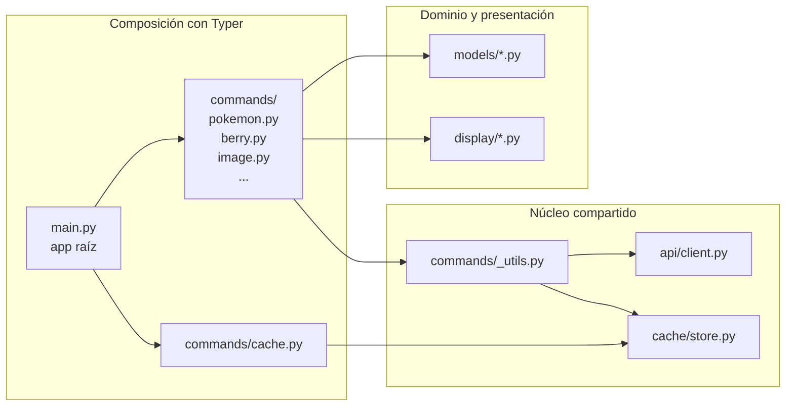
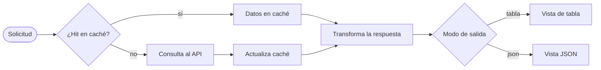

## Descripción del proyecto

`pokecli` es una herramienta de línea de comandos de código abierto que construí para consultar datos de Pokémon, bayas, objetos, movimientos, habilidades, naturalezas, tipos, cadenas de evolución y especies desde PokeAPI. Es deliberadamente pequeña y es una de las implementaciones de referencia que suelo mostrar cuando hablo de cómo diseño una herramienta de línea de comandos. El proyecto también me sirve como ejemplo de implementación para herramientas nativas para IA: `pokecli` incluye un `SKILL.md` que un agente como Claude Code o Copilot puede cargar para aprender el conjunto de comandos sin tener que releer `--help` en cada tarea.







<strong>Repositorio de GitHub</strong>: pokecli



## Tecnologías utilizadas

<div class="table-container">
  <table>
    <tr>
      <th>Capa</th>
      <th>Elección</th>
      <th>Por qué forma parte del proyecto</th>
    </tr>
    <tr>
      <td>Lenguaje</td>
      <td>Python 3.12+</td>
      <td>Tipado moderno y pattern matching estructural</td>
    </tr>
    <tr>
      <td>Framework de CLI</td>
      <td>Typer</td>
      <td>Subaplicaciones modulares, anotaciones de tipo nativas e inyección de contexto limpia</td>
    </tr>
    <tr>
      <td>Modelos de datos</td>
      <td>Pydantic v2</td>
      <td>Validación estricta cuando hace falta y <code>extra="ignore"</code> en todos los modelos</td>
    </tr>
    <tr>
      <td>Cliente HTTP</td>
      <td>httpx</td>
      <td>Un ciclo de vida claro con context manager y margen para una versión async más adelante</td>
    </tr>
    <tr>
      <td>Caché local</td>
      <td>TinyDB</td>
      <td>Un único archivo JSON, una tabla por recurso y un formato fácil de inspeccionar</td>
    </tr>
    <tr>
      <td>Interfaz de terminal</td>
      <td>Rich</td>
      <td>Tablas, paneles, resaltado de sintaxis para JSON y alternativas en ASCII</td>
    </tr>
    <tr>
      <td>Empaquetado</td>
      <td>uv + uv_build</td>
      <td>Resolución rápida de dependencias, estructura moderna con <code>src/</code> y <code>[project.scripts]</code></td>
    </tr>
    <tr>
      <td>Pruebas</td>
      <td>pytest</td>
      <td>Fixture <code>tmp_path</code> para la caché y un archivo de pruebas de modelos por recurso</td>
    </tr>
    <tr>
      <td>Herramientas de desarrollo</td>
      <td>ruff, pre-commit</td>
      <td>Formato, linting y una base mínima de higiene para los commits</td>
    </tr>
  </table>
</div>

## Arquitectura

`pokecli` está organizado en cinco capas, cada una a cargo de exactamente una cosa. Los comandos conocen Typer. El cliente del API conoce httpx. El caché conoce TinyDB. Los modelos conocen Pydantic. La capa de presentación conoce Rich. Ninguna capa invade el carril de otra.



Cada comando `get` sigue el mismo flujo corto. Lo imponen los límites entre módulos, no una convención informal.



### Estructura del paquete de un vistazo

```text
src/pokecli/
├── main.py             # root Typer app, sub-apps registered here
├── config.py           # POKEAPI_BASE_URL, DEFAULT_LIMIT, CACHE_DB_PATH
├── api/client.py       # PokeAPIClient (httpx + context manager)
├── cache/store.py      # CacheStore (TinyDB, table per resource)
├── commands/
│   ├── _utils.py       # fetch_resource, fetch_list
│   ├── pokemon.py      # get / moves / species / evolution / list
│   ├── berry.py  item.py  move.py  ability.py  nature.py  type.py
│   ├── image.py        # download (sprite variants)
│   ├── cache.py        # stats / clear
│   └── install.py      # install --skills
├── display/            # Rich renderers, one file per resource
├── models/             # Pydantic v2 models, one file per resource
└── skills/pokecli/
    ├── SKILL.md
    └── references/api-fields.md
```

## Funcionalidades clave

Estas funcionalidades muestran el conjunto de capacidades de `pokecli` y el tipo de experiencia de línea de comandos que busco construir: pequeña, tipada, scriptable y clara de entender a primera vista.

### Consultas de recursos con salida tipada

Cada recurso (`pokemon`, `berry`, `item`, `move`, `ability`, `nature`, `type`) tiene comandos `get` y `list` paralelos con flags compartidos (`--no-cache`, `--format`). Los comandos especializados de Pokémon agregan `moves`, `species` y `evolution`.






### Descarga de sprites

`pokecli image download pokemon <name_or_id> -o <path>` guarda los sprites localmente. El flag `--variant` selecciona entre seis vistas conocidas.

### Caché local con control por recurso

La primera llamada va a la red; a partir de ahí, cada consulta se sirve desde `~/.pokecli/cache.json`. Puedes inspeccionar o limpiar la caché con granularidad por recurso.





## Desafíos técnicos

Esta sección muestra las decisiones y compensaciones de ingeniería detrás de `pokecli`. Cada tarjeta destaca un problema que tuve que resolver, la decisión de diseño que tomé y lo que esa decisión dice sobre cómo construyo herramientas de línea de comandos.

### 1. Hacer que cada recurso sea una aplicación autocontenida de Typer



Los CLIs suelen crecer por recurso, y un `main.py` monolítico termina convirtiéndose en el cuello de botella de cualquier cambio.


Cada archivo dentro de `commands/` expone su propio `app = typer.Typer(...)`. `main.py` se reduce a diez líneas de imports y llamadas a `app.add_typer(...)`. Cuando después agregué Habilidades, Naturalezas y Tipos, el coste fue un archivo nuevo y una línea más por cada recurso.



### 2. Usar el contexto de Typer como punto de apoyo para inyectar dependencias



Todos los comandos necesitan un cliente HTTP, pero no quería repetir en cada uno la apertura de conexiones, el cierre del cliente y el cableado necesario para las pruebas.



El callback raíz guarda el cliente HTTP como un recurso administrado dentro de `typer.Context`:

```python
@app.callback()
def root(ctx: typer.Context) -> None:
    ctx.ensure_object(dict)
    ctx.obj["client"] = ctx.with_resource(PokeAPIClient())
```

`ctx.with_resource` se encarga de cerrar el cliente correctamente cuando Typer termina de ejecutar el comando. En las pruebas, sustituirlo por un cliente falso requiere una sola línea.




### 3. Centralizar en una sola utilidad el flujo de caché primero y red después



Las consultas a la caché, los mensajes de 404, los fallos de red y los códigos de salida acabarían divergiendo si cada comando resolviera todo por su cuenta.


`commands/_utils.py` concentra ese flujo en un solo punto. Todos los comandos llaman a `fetch_resource` o `fetch_list`. Si más adelante añado reintentos, límites de ritmo o una opción de trazas, sé que lo resolveré tocando una única función.

```python
def fetch_resource(client, resource, name_or_id, no_cache, err_console):
    with CacheStore() as cache:
        key = name_or_id.lower()
        data = None if no_cache else cache.get(resource, key)
        if data is None:
            try:
                data = client.get_resource(resource, name_or_id)
            except httpx.HTTPStatusError as e:
                if e.response.status_code == 404:
                    err_console.print(f"[red]Not found: '{name_or_id}'[/red]")
                else:
                    err_console.print(f"[red]API error: {e.response.status_code}[/red]")
                raise typer.Exit(1)
            except (httpx.ConnectError, httpx.TimeoutException):
                err_console.print("[red]Network error: could not reach PokeAPI[/red]")
                raise typer.Exit(1)
            cache.set(resource, key, data)
    return data
```




### 4. Usar Pydantic como contrato frente a la API externa



PokeAPI devuelve estructuras anidadas, muchos campos opcionales y cambios ocasionales en la forma de sus respuestas. El CLI tiene que tolerar campos nuevos, pero dejar claro cuando falta uno de los que realmente importan.


Todos los modelos usan `ConfigDict(extra="ignore")`. Los campos obligatorios se validan de forma estricta. Si falta uno, se lanza un `ValidationError` y el comando lo traduce a un mensaje claro junto con `typer.Exit(2)`. Los códigos de salida ayudan a identificar en qué capa ocurrió el fallo.



<div class="table-container">
  <table>
    <tr>
      <th>Código de salida</th>
      <th>Significado</th>
    </tr>
    <tr>
      <td><code>0</code></td>
      <td>Éxito</td>
    </tr>
    <tr>
      <td><code>1</code></td>
      <td>Fallo esperado (no encontrado, red caída)</td>
    </tr>
    <tr>
      <td><code>2</code></td>
      <td>Fallo de esquema (la respuesta del API no coincidió con el modelo)</td>
    </tr>
  </table>
</div>

Un script de shell que envuelva `pokecli` puede actuar sobre esto.

### 5. Elegir TinyDB en lugar de SQLite o Redis



Quería un caché local, sin infraestructura adicional y fácil de inspeccionar.


TinyDB me da un único archivo JSON que puedo inspeccionar con `cat`, borrar con `rm` o comparar con un diff. No sería mi elección para un servicio, pero en un CLI el coste encaja bien, y la separación por recurso permite que `pokecli cache clear --resource pokemon` actúe solo sobre esa parte.



### 6. Dejar Rich aislado en la capa de presentación



Las librerías de terminal tienden a filtrarse a todo lo que tocan. Un renderizador no debería importar nunca el cliente del API, y un modelo no debería saber que luego se va a mostrar en pantalla.


Todo lo relacionado con Rich vive bajo `display/`. `display/common.py` reúne `METHOD_COLORS`, `TYPE_COLORS`, la detección de `uses_unicode` y el helper `get_chars` con alternativa en ASCII. `render_json` y `render_list` resuelven lo común. Ningún renderizador llama al API y ningún modelo importa Rich.



### 7. Incluir el SKILL.md dentro del paquete



Las herramientas pensadas para agentes suelen aparecer al final, añadidas deprisa y relegadas a un README.


`SKILL.md` y su `references/api-fields.md` viajan dentro del wheel, en `pokecli/skills/pokecli/`. `install.py` usa `importlib.resources` para copiarlos a `~/.claude/skills/pokecli/`, así que la capa pensada para agentes se entrega junto con el CLI y no como documentación separada.

Mantengo el skill pequeño a propósito y lo separé en tres capas que un agente puede cargar con poco contexto:

1. el frontmatter es la capa de disparo, con el nombre del skill, una descripción corta y el límite de `allowed-tools`
2. el cuerpo de `SKILL.md` es la guía de comandos de trabajo, organizada alrededor de los mismos grupos de comandos que ya expone el CLI
3. `references/api-fields.md` guarda el detalle a nivel de campos que solo hace falta cuando un agente necesita más profundidad

Esa estructura hace que la implementación sea nativa para IA sin convertirla en una segunda interfaz. El skill empaquetado refleja la superficie real de comandos, se instala con un solo comando y les da a Claude Code o Copilot el contexto suficiente para actuar sobre `pokecli` sin releer `--help` en cada tarea.



## Qué demuestra este proyecto

<div class="table-container">
  <table>
    <tr>
      <th>Área</th>
      <th>Lo que muestra el repositorio</th>
    </tr>
    <tr>
      <td><strong>Empaquetado de Python</strong></td>
      <td>Estructura <code>src/</code>, <code>uv_build</code>, una entrada funcional en <code>[project.scripts]</code> y <code>importlib.resources</code> para incluir archivos auxiliares en el paquete</td>
    </tr>
    <tr>
      <td><strong>Arquitectura de CLI</strong></td>
      <td>Una composición con Typer donde cada recurso vive en su propia subaplicación, la inyección de dependencias pasa por el contexto y el acceso a la caché y a HTTP se resuelve en un único punto</td>
    </tr>
    <tr>
      <td><strong>Modelado de dominio</strong></td>
      <td>Pydantic v2 como capa de protección frente al API, campos obligatorios estrictos con <code>extra="ignore"</code> y <code>model_dump()</code> como base única para la salida en JSON</td>
    </tr>
    <tr>
      <td><strong>Manejo de errores</strong></td>
      <td>Códigos de salida distintos según el tipo de fallo, mensajes claros en <code>stderr</code> y una salida en <code>stdout</code> que sigue siendo fácil de consumir desde scripts</td>
    </tr>
    <tr>
      <td><strong>Caché simple y útil</strong></td>
      <td>Un caché local con TinyDB que no requiere infraestructura extra, organizado por recurso y que se puede omitir cuando hace falta con <code>--no-cache</code></td>
    </tr>
    <tr>
      <td><strong>UX en terminal</strong></td>
      <td>Tablas y paneles de Rich, barras de estadísticas en Unicode con alternativa en ASCII y un uso consistente del color entre recursos</td>
    </tr>
    <tr>
      <td><strong>Criterio para las pruebas</strong></td>
      <td>Un archivo de pruebas de modelos por recurso, pruebas de contrato para la caché, un fixture <code>tmp_cache</code> y sin depender de asserts frágiles sobre la capa de Rich</td>
    </tr>
    <tr>
      <td><strong>Diseño nativo para IA</strong></td>
      <td>Un <code>SKILL.md</code> que viaja dentro del paquete, se instala con un solo comando en <code>~/.claude/skills/pokecli/</code> y se activa desde el frontmatter</td>
    </tr>
  </table>
</div>

En conjunto, estas decisiones muestran por qué `pokecli` funciona bien como proyecto de referencia: el empaquetado es claro, los límites entre capas están bien definidos, los fallos están pensados y la herramienta sigue siendo lo bastante pequeña como para entenderse rápido sin perder rigor.

## Resultados

`pokecli` es la pieza de código más pequeña que puedo mostrar y que aun así refleja todos los hábitos que aplico en un servicio de producción con interfaz de línea de comandos.

<div class="table-container">
  <table>
    <tr>
      <th>Resultado</th>
      <th>Evidencia en el repositorio</th>
    </tr>
    <tr>
      <td><strong>Listo para agentes en un solo comando</strong></td>
      <td>Después de instalarlo con <code>uv tool install</code> desde el repositorio, o con <code>uv tool install git+https://github.com/jebucaro/pokecli</code>, <code>pokecli install --skills</code> copia <code>SKILL.md</code> a <code>~/.claude/skills/pokecli/</code>. En la siguiente sesión, Claude Code ya reconoce los subcomandos sin depender de prompts afinados a mano.</td>
    </tr>
    <tr>
      <td><strong>Respuestas casi instantáneas después de la primera consulta</strong></td>
      <td>Con la caché de TinyDB ya cargada, un comando como <code>pokemon get charizard</code> deja de depender de una petición a la red y pasa a resolverse leyendo JSON local. Una vez cargada, también puede usarse sin conexión.</td>
    </tr>
    <tr>
      <td><strong>Un recurso equivale a un archivo por capa</strong></td>
      <td>Agregar un nuevo recurso de PokeAPI sigue un patrón claro de tres archivos: <code>commands/&lt;resource&gt;.py</code>, <code>models/&lt;resource&gt;.py</code> y <code>display/&lt;resource&gt;.py</code>. No hace falta tocar un registro central ni descubrir dependencias escondidas.</td>
    </tr>
    <tr>
      <td><strong>Códigos de salida pensados para automatización</strong></td>
      <td>El contrato documentado de <code>0 / 1 / 2</code> permite usar <code>pokecli</code> desde scripts de shell o pipelines de CI sin tener que interpretar <code>stderr</code>. Los errores esperados y los problemas de esquema quedan claramente diferenciados.</td>
    </tr>
    <tr>
      <td><strong>Suite de pruebas determinista</strong></td>
      <td>Los modelos de Pydantic y la capa de caché están cubiertos de extremo a extremo, con un fixture <code>tmp_path</code> que evita tocar tanto <code>~/.pokecli/</code> como el API real durante las pruebas.</td>
    </tr>
    <tr>
      <td><strong>Sin infraestructura innecesaria</strong></td>
      <td>No hace falta un servidor de base de datos, un daemon de configuración ni depender de servicios en la nube. Con <code>uv tool install</code> desde Git, o con <code>uv sync</code> dentro de un clon del repo, queda listo para Linux, macOS y Windows.</td>
    </tr>
    <tr>
      <td><strong>Contrato tipado con un API externo</strong></td>
      <td>Nueve recursos (<code>pokemon</code>, <code>berry</code>, <code>item</code>, <code>move</code>, <code>ability</code>, <code>nature</code>, <code>type</code>, <code>image</code> y <code>cache</code>) se validan con Pydantic v2, lo que protege a quien lo usa frente a cambios inesperados en el esquema del API.</td>
    </tr>
  </table>
</div>

Tan importante como leer el código es entender la experiencia que produce. `pokecli` toma una API pública y la convierte en una herramienta serena y automatizable, y el `SKILL.md` que acompaña al proyecto hace que ese CLI sea nativo para IA al enseñarle a un agente cómo usarlo incluso si el modelo nunca fue entrenado específicamente con `pokecli`. Así, el proyecto mantiene una huella pequeña para quien llega por primera vez y, al mismo tiempo, sigue siendo legible para un agente desde la siguiente sesión.



---

Foto de Jay en Unsplash

Pokémon y los nombres de los personajes de Pokémon son marcas registradas de Nintendo.
